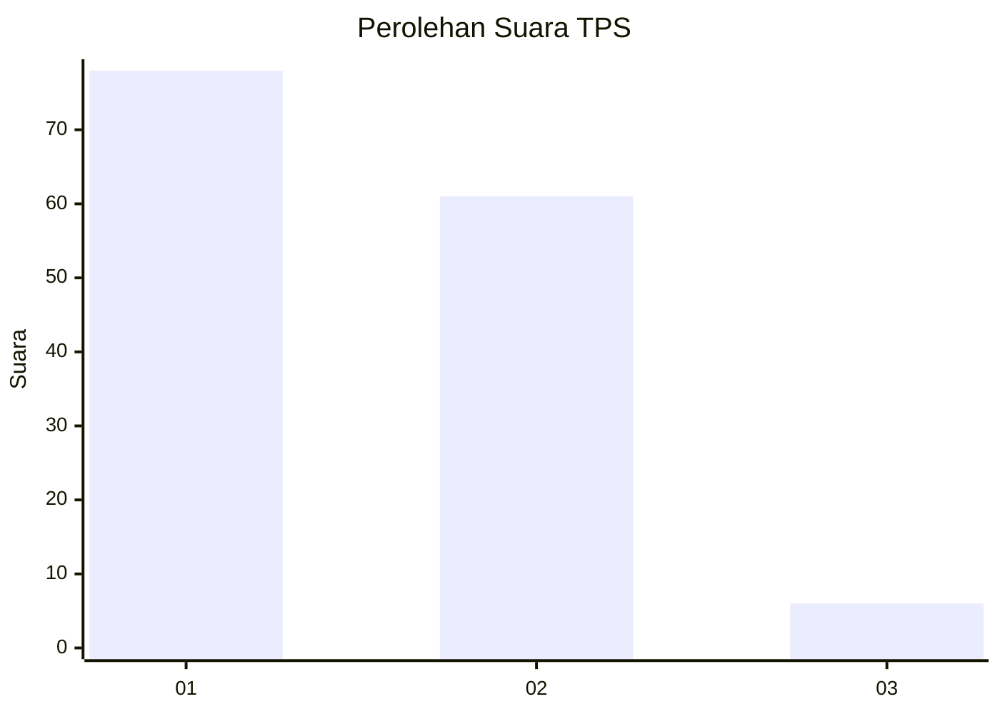
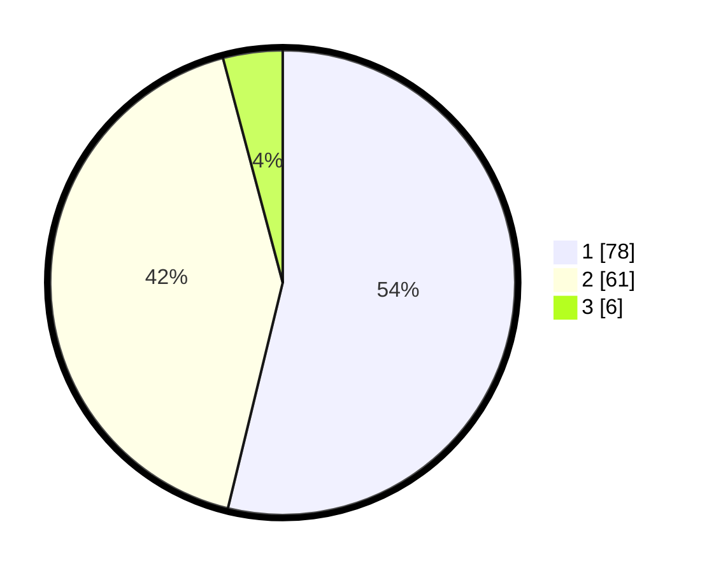

# Hasil

## Grafik

## Tabel

| No. | Nama Paslon    | Suara | Suara (raw) | Persentase |
|:--- |:-------------- | -----:| -----------:| ----------:|
| 1   | ANIES MUHAIMIN | 78    | [78][p-1]   | 53,79      |
| 2   | PRABOWO GIBRAN | 61    | [61][p-2]   | 42,07      |
| 3   | GANJAR MAHFUD  | 6     | [6][p-3]    | 4,14       |

[p-1]: https://github.com/gigit-pemilu/pemilu-2024-62-kalimantan-tengah/blob/main/pilpres/hitung-suara/sub/62-kalimantan-tengah/sub/03-kapuas/sub/03-kapuas-timur/sub/2001-anjir-serapat-timur/sub/003-tps/sub/paslon-1.txt
[p-2]: https://github.com/gigit-pemilu/pemilu-2024-62-kalimantan-tengah/blob/main/pilpres/hitung-suara/sub/62-kalimantan-tengah/sub/03-kapuas/sub/03-kapuas-timur/sub/2001-anjir-serapat-timur/sub/003-tps/sub/paslon-2.txt
[p-3]: https://github.com/gigit-pemilu/pemilu-2024-62-kalimantan-tengah/blob/main/pilpres/hitung-suara/sub/62-kalimantan-tengah/sub/03-kapuas/sub/03-kapuas-timur/sub/2001-anjir-serapat-timur/sub/003-tps/sub/paslon-3.txt

## Foto C Plano

https://sirekap-obj-formc.kpu.go.id/801e/pemilu/ppwp/62/03/03/20/01/6203032001003-20240214-221801--efec4425-c4d6-4830-8efe-a945db04cea7.jpg

https://sirekap-obj-formc.kpu.go.id/801e/pemilu/ppwp/62/03/03/20/01/6203032001003-20240214-222032--efa9c30c-7f94-445e-9867-73e91897cf9f.jpg

https://sirekap-obj-formc.kpu.go.id/801e/pemilu/ppwp/62/03/03/20/01/6203032001003-20240214-222707--4db6d98d-0601-4d5f-8875-585f2a3dc710.jpg

## Metadata

| Key        | Value               |
| ---------- | ------------------- |
| Time Stamp | 2024-02-15 19:30:26 |

