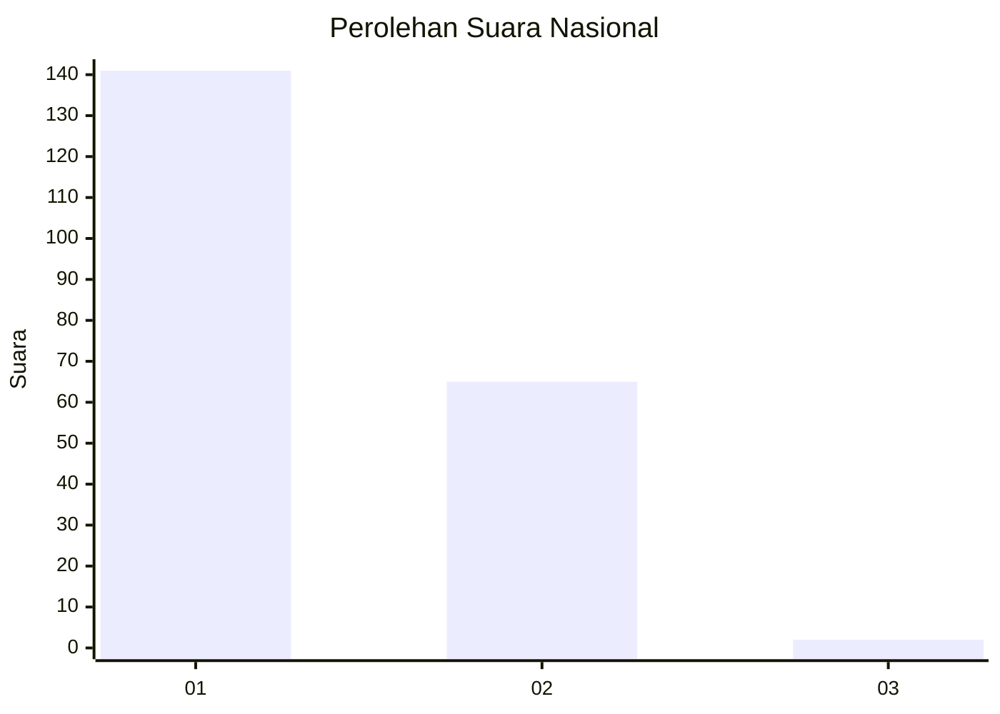
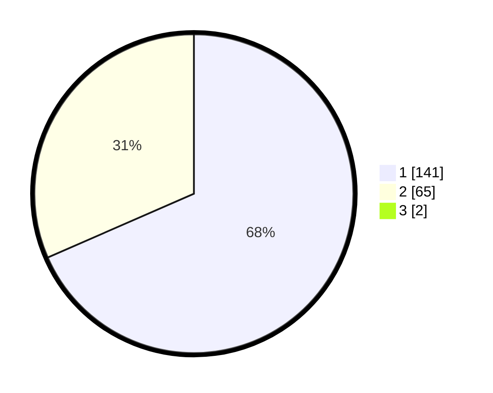

# Hasil

## Grafik

## Tabel

| No. | Nama Paslon    | Suara | Suara (raw) | Persentase |
|:--- |:-------------- | -----:| -----------:| ----------:|
| 1   | ANIES MUHAIMIN | 141   | [141][p-1]  | 67,79      |
| 2   | PRABOWO GIBRAN | 65    | [65][p-2]   | 31,25      |
| 3   | GANJAR MAHFUD  | 2     | [2][p-3]    | 0,96       |

[p-1]: https://github.com/gigit-pemilu/pemilu-2024/blob/main/pilpres/hitung-suara/sub/62-kalimantan-tengah/sub/03-kapuas/sub/03-kapuas-timur/sub/2001-anjir-serapat-timur/sub/005-tps/sub/paslon-1.txt
[p-2]: https://github.com/gigit-pemilu/pemilu-2024/blob/main/pilpres/hitung-suara/sub/62-kalimantan-tengah/sub/03-kapuas/sub/03-kapuas-timur/sub/2001-anjir-serapat-timur/sub/005-tps/sub/paslon-2.txt
[p-3]: https://github.com/gigit-pemilu/pemilu-2024/blob/main/pilpres/hitung-suara/sub/62-kalimantan-tengah/sub/03-kapuas/sub/03-kapuas-timur/sub/2001-anjir-serapat-timur/sub/005-tps/sub/paslon-3.txt

## Foto C Plano

https://sirekap-obj-formc.kpu.go.id/af67/pemilu/ppwp/62/03/03/20/01/6203032001005-20240220-095447--7f7466fe-7ef1-4385-b4f0-73f926e2af5b.jpg

https://sirekap-obj-formc.kpu.go.id/af67/pemilu/ppwp/62/03/03/20/01/6203032001005-20240220-095518--25155b05-c0e8-4541-89a3-0d8f305c8c4f.jpg

https://sirekap-obj-formc.kpu.go.id/af67/pemilu/ppwp/62/03/03/20/01/6203032001005-20240220-095548--81cb385c-28e5-47f7-91c5-4b34595af4af.jpg

## Metadata

| Key        | Value               |
| ---------- | ------------------- |
| Time Stamp | 2024-02-25 14:00:00 |

