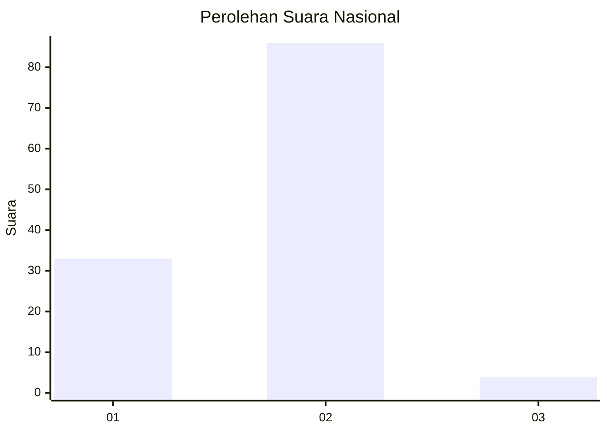
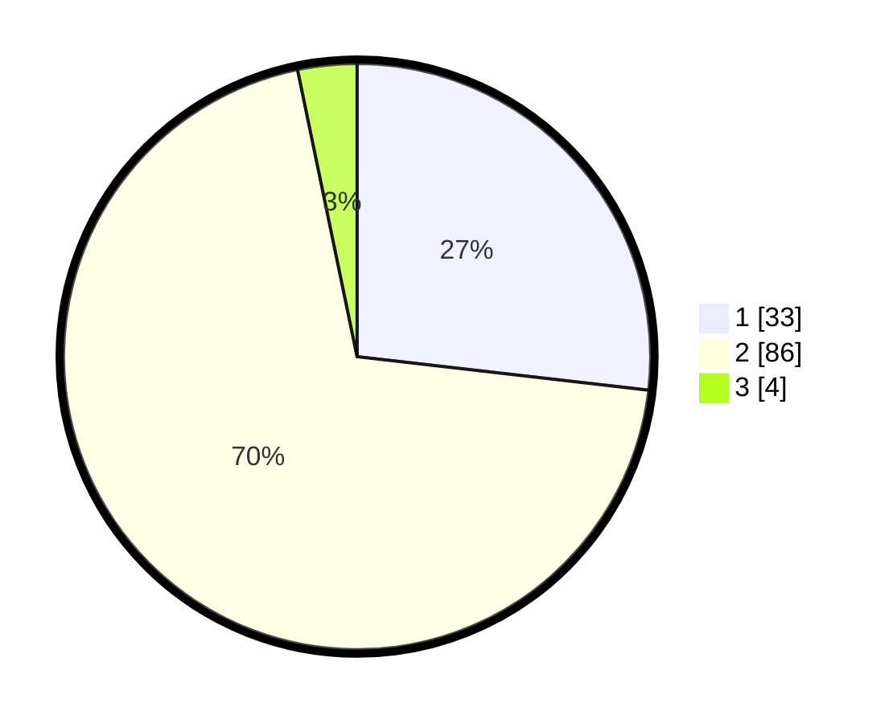

# Hasil

## Grafik

## Tabel

| No. | Nama Paslon    | Suara | Suara (raw) | Persentase |
|:--- |:-------------- | -----:| -----------:| ----------:|
| 1   | ANIES MUHAIMIN | 33    | [33][p-1]   | 26,83      |
| 2   | PRABOWO GIBRAN | 86    | [86][p-2]   | 69,92      |
| 3   | GANJAR MAHFUD  | 4     | [4][p-3]    | 3,25       |

[p-1]: https://github.com/gigit-pemilu/pemilu-2024/blob/main/pilpres/hitung-suara/sub/62-kalimantan-tengah/sub/03-kapuas/sub/03-kapuas-timur/sub/2001-anjir-serapat-timur/sub/011-tps/sub/paslon-1.txt
[p-2]: https://github.com/gigit-pemilu/pemilu-2024/blob/main/pilpres/hitung-suara/sub/62-kalimantan-tengah/sub/03-kapuas/sub/03-kapuas-timur/sub/2001-anjir-serapat-timur/sub/011-tps/sub/paslon-2.txt
[p-3]: https://github.com/gigit-pemilu/pemilu-2024/blob/main/pilpres/hitung-suara/sub/62-kalimantan-tengah/sub/03-kapuas/sub/03-kapuas-timur/sub/2001-anjir-serapat-timur/sub/011-tps/sub/paslon-3.txt

## Foto C Plano

https://sirekap-obj-formc.kpu.go.id/4b46/pemilu/ppwp/62/03/03/20/01/6203032001011-20240221-085403--25b0e232-55c9-455b-8ca4-9d8569e448dc.jpg

https://sirekap-obj-formc.kpu.go.id/4b46/pemilu/ppwp/62/03/03/20/01/6203032001011-20240221-085526--93e09203-dcf6-4123-80bd-2101a7ca5334.jpg

https://sirekap-obj-formc.kpu.go.id/4b46/pemilu/ppwp/62/03/03/20/01/6203032001011-20240221-085849--881ec2f4-f0dc-4422-ad68-401a985b6a44.jpg

## Metadata

| Key        | Value               |
| ---------- | ------------------- |
| Time Stamp | 2024-02-24 22:31:28 |

