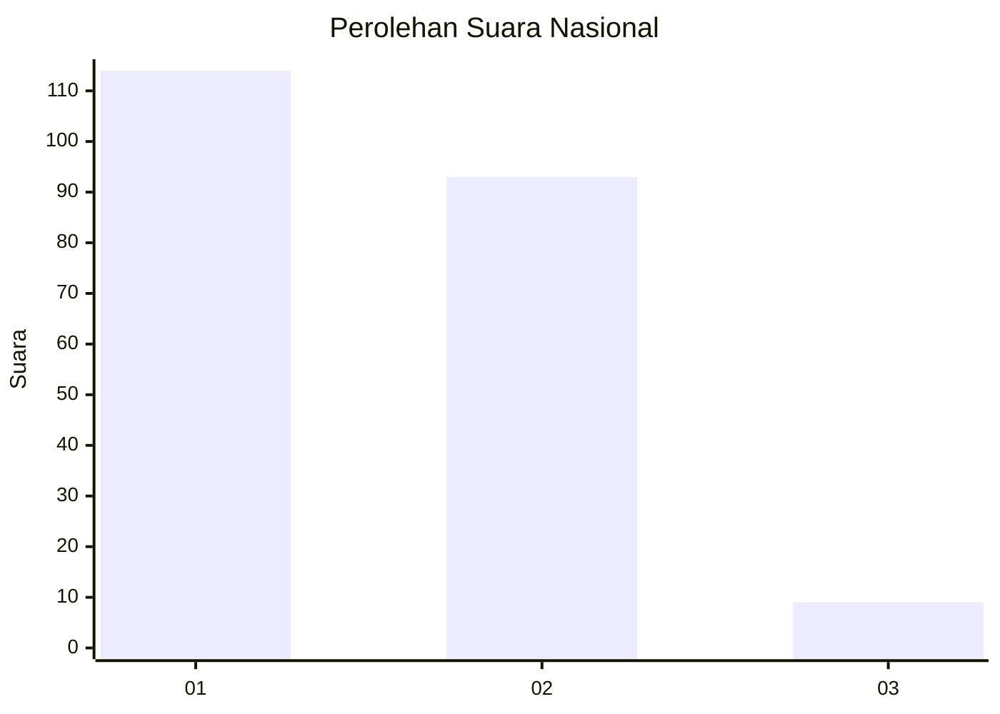
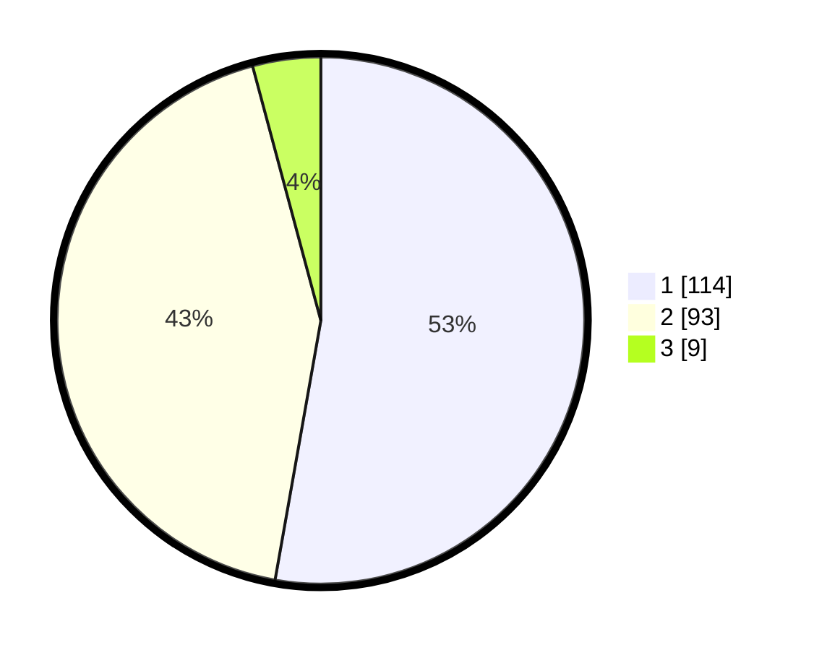

# Hasil

## Grafik

## Tabel

| No. | Nama Paslon    | Suara | Suara (raw) | Persentase |
|:--- |:-------------- | -----:| -----------:| ----------:|
| 1   | ANIES MUHAIMIN | 114   | [114][p-1]  | 52,78      |
| 2   | PRABOWO GIBRAN | 93    | [93][p-2]   | 43,06      |
| 3   | GANJAR MAHFUD  | 9     | [9][p-3]    | 4,17       |

[p-1]: https://github.com/gigit-pemilu/pemilu-2024/blob/main/pilpres/hitung-suara/sub/62-kalimantan-tengah/sub/03-kapuas/sub/03-kapuas-timur/sub/2002-anjir-serapat-tengah/sub/001-tps/sub/paslon-1.txt
[p-2]: https://github.com/gigit-pemilu/pemilu-2024/blob/main/pilpres/hitung-suara/sub/62-kalimantan-tengah/sub/03-kapuas/sub/03-kapuas-timur/sub/2002-anjir-serapat-tengah/sub/001-tps/sub/paslon-2.txt
[p-3]: https://github.com/gigit-pemilu/pemilu-2024/blob/main/pilpres/hitung-suara/sub/62-kalimantan-tengah/sub/03-kapuas/sub/03-kapuas-timur/sub/2002-anjir-serapat-tengah/sub/001-tps/sub/paslon-3.txt

## Foto C Plano

https://sirekap-obj-formc.kpu.go.id/7a40/pemilu/ppwp/62/03/03/20/02/6203032002001-20240215-001137--2ff3172a-4229-4f1e-986e-fa6adb8b8841.jpg

https://sirekap-obj-formc.kpu.go.id/7a40/pemilu/ppwp/62/03/03/20/02/6203032002001-20240215-030053--5b084df2-8c7b-4c46-9cc1-c4fd1ce6291c.jpg

https://sirekap-obj-formc.kpu.go.id/7a40/pemilu/ppwp/62/03/03/20/02/6203032002001-20240215-030020--753a9ec8-c50b-4210-816d-9aa8f3743c6c.jpg

## Metadata

| Key        | Value               |
| ---------- | ------------------- |
| Time Stamp | 2024-02-15 15:00:29 |

