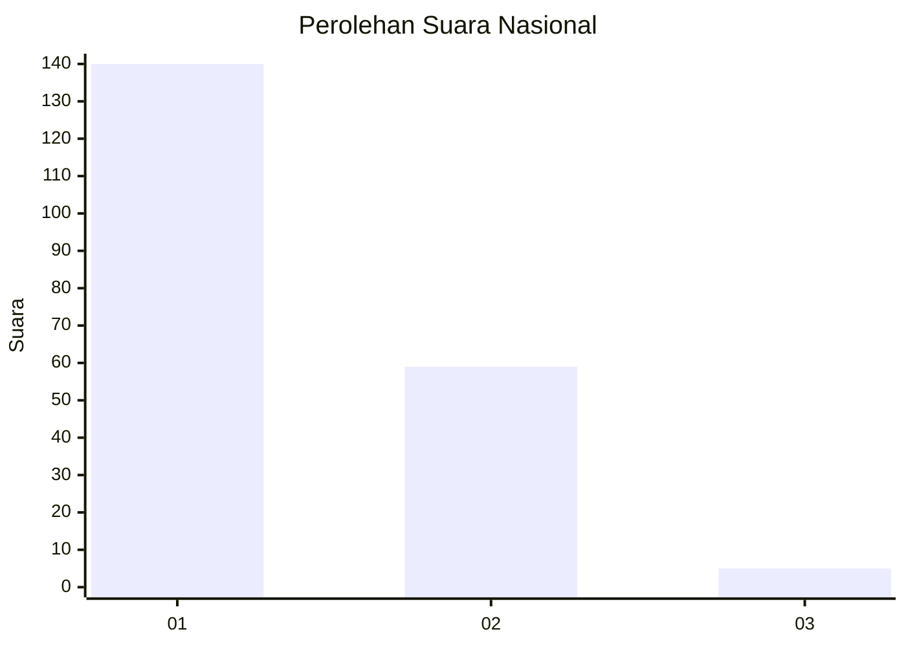
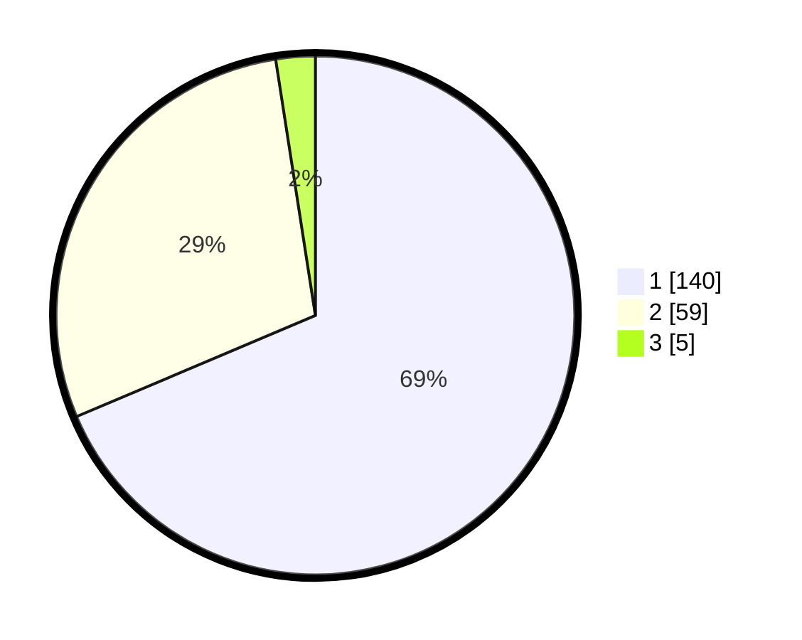

# Hasil

## Grafik

## Tabel

| No. | Nama Paslon    | Suara | Suara (raw) | Persentase |
|:--- |:-------------- | -----:| -----------:| ----------:|
| 1   | ANIES MUHAIMIN | 140   | [140][p-1]  | 68,63      |
| 2   | PRABOWO GIBRAN | 59    | [59][p-2]   | 28,92      |
| 3   | GANJAR MAHFUD  | 5     | [5][p-3]    | 2,45       |

[p-1]: https://github.com/gigit-pemilu/pemilu-2024/blob/main/pilpres/hitung-suara/sub/62-kalimantan-tengah/sub/03-kapuas/sub/03-kapuas-timur/sub/2002-anjir-serapat-tengah/sub/002-tps/sub/paslon-1.txt
[p-2]: https://github.com/gigit-pemilu/pemilu-2024/blob/main/pilpres/hitung-suara/sub/62-kalimantan-tengah/sub/03-kapuas/sub/03-kapuas-timur/sub/2002-anjir-serapat-tengah/sub/002-tps/sub/paslon-2.txt
[p-3]: https://github.com/gigit-pemilu/pemilu-2024/blob/main/pilpres/hitung-suara/sub/62-kalimantan-tengah/sub/03-kapuas/sub/03-kapuas-timur/sub/2002-anjir-serapat-tengah/sub/002-tps/sub/paslon-3.txt

## Foto C Plano

https://sirekap-obj-formc.kpu.go.id/2598/pemilu/ppwp/62/03/03/20/02/6203032002002-20240220-223806--6b7c245a-bb4a-41f4-b608-5b80f328dd55.jpg

https://sirekap-obj-formc.kpu.go.id/2598/pemilu/ppwp/62/03/03/20/02/6203032002002-20240220-094755--3f6f311c-98dd-456e-b4ee-594ad6facf90.jpg

https://sirekap-obj-formc.kpu.go.id/2598/pemilu/ppwp/62/03/03/20/02/6203032002002-20240220-094910--335bb420-8f96-4b90-85f3-cbdde524d63f.jpg

## Metadata

| Key        | Value               |
| ---------- | ------------------- |
| Time Stamp | 2024-02-25 13:00:00 |

