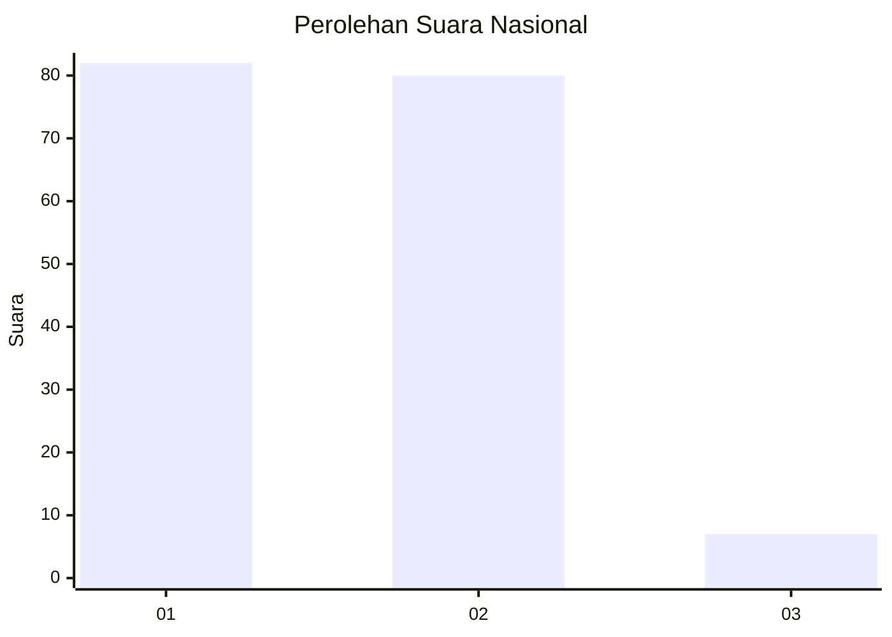
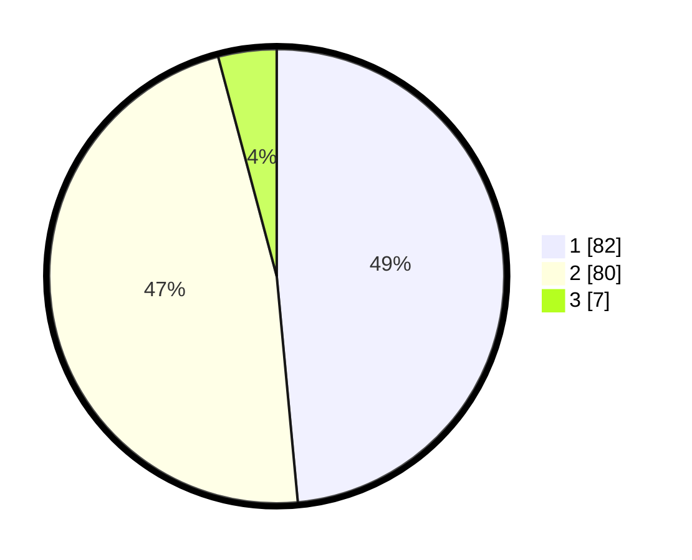

# Hasil

## Grafik

## Tabel

| No. | Nama Paslon    | Suara | Suara (raw) | Persentase |
|:--- |:-------------- | -----:| -----------:| ----------:|
| 1   | ANIES MUHAIMIN | 82    | [82][p-1]   | 48,52      |
| 2   | PRABOWO GIBRAN | 80    | [80][p-2]   | 47,34      |
| 3   | GANJAR MAHFUD  | 7     | [7][p-3]    | 4,14       |

[p-1]: https://github.com/gigit-pemilu/pemilu-2024/blob/main/pilpres/hitung-suara/sub/62-kalimantan-tengah/sub/03-kapuas/sub/03-kapuas-timur/sub/2002-anjir-serapat-tengah/sub/003-tps/sub/paslon-1.txt
[p-2]: https://github.com/gigit-pemilu/pemilu-2024/blob/main/pilpres/hitung-suara/sub/62-kalimantan-tengah/sub/03-kapuas/sub/03-kapuas-timur/sub/2002-anjir-serapat-tengah/sub/003-tps/sub/paslon-2.txt
[p-3]: https://github.com/gigit-pemilu/pemilu-2024/blob/main/pilpres/hitung-suara/sub/62-kalimantan-tengah/sub/03-kapuas/sub/03-kapuas-timur/sub/2002-anjir-serapat-tengah/sub/003-tps/sub/paslon-3.txt

## Foto C Plano

https://sirekap-obj-formc.kpu.go.id/964e/pemilu/ppwp/62/03/03/20/02/6203032002003-20240220-224111--e549fd97-d27e-49b4-bf1d-0ed1d53f5743.jpg

https://sirekap-obj-formc.kpu.go.id/964e/pemilu/ppwp/62/03/03/20/02/6203032002003-20240222-162959--cb7bc3a4-0eb7-48ee-b59c-985b36d9448e.jpg

https://sirekap-obj-formc.kpu.go.id/964e/pemilu/ppwp/62/03/03/20/02/6203032002003-20240222-163024--a57f7501-60b2-44bb-b2eb-89346d78f821.jpg

## Metadata

| Key        | Value               |
| ---------- | ------------------- |
| Time Stamp | 2024-02-25 14:00:00 |

