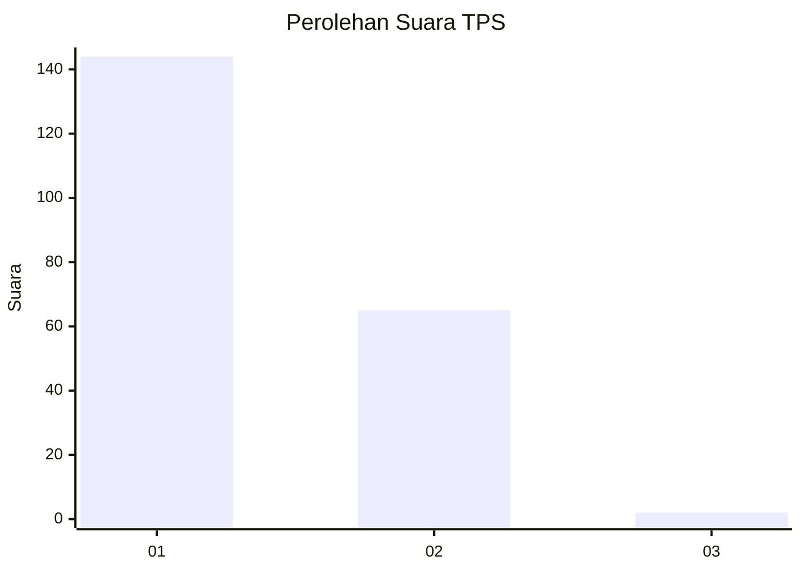
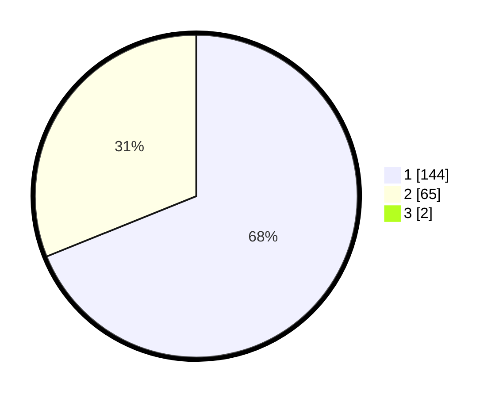

# Hasil

## Grafik

## Tabel

| No. | Nama Paslon    | Suara | Suara (raw) | Persentase |
|:--- |:-------------- | -----:| -----------:| ----------:|
| 1   | ANIES MUHAIMIN | 144   | [144][p-1]  | 68,25      |
| 2   | PRABOWO GIBRAN | 65    | [65][p-2]   | 30,81      |
| 3   | GANJAR MAHFUD  | 2     | [2][p-3]    | 0,95       |

[p-1]: https://github.com/gigit-pemilu/pemilu-2024-62-kalimantan-tengah/blob/main/pilpres/hitung-suara/sub/62-kalimantan-tengah/sub/03-kapuas/sub/03-kapuas-timur/sub/2002-anjir-serapat-tengah/sub/005-tps/sub/paslon-1.txt
[p-2]: https://github.com/gigit-pemilu/pemilu-2024-62-kalimantan-tengah/blob/main/pilpres/hitung-suara/sub/62-kalimantan-tengah/sub/03-kapuas/sub/03-kapuas-timur/sub/2002-anjir-serapat-tengah/sub/005-tps/sub/paslon-2.txt
[p-3]: https://github.com/gigit-pemilu/pemilu-2024-62-kalimantan-tengah/blob/main/pilpres/hitung-suara/sub/62-kalimantan-tengah/sub/03-kapuas/sub/03-kapuas-timur/sub/2002-anjir-serapat-tengah/sub/005-tps/sub/paslon-3.txt

## Foto C Plano

https://sirekap-obj-formc.kpu.go.id/c77b/pemilu/ppwp/62/03/03/20/02/6203032002005-20240220-100650--76e32847-fd40-45f7-a5c8-31853b17aa2a.jpg

https://sirekap-obj-formc.kpu.go.id/c77b/pemilu/ppwp/62/03/03/20/02/6203032002005-20240220-100101--05b95356-8dc1-44cb-b9ed-f38abac20674.jpg

https://sirekap-obj-formc.kpu.go.id/c77b/pemilu/ppwp/62/03/03/20/02/6203032002005-20240220-100122--06854108-3bd2-4849-81ba-0455e2a16eb5.jpg

## Metadata

| Key        | Value               |
| ---------- | ------------------- |
| Time Stamp | 2024-02-25 12:00:00 |

