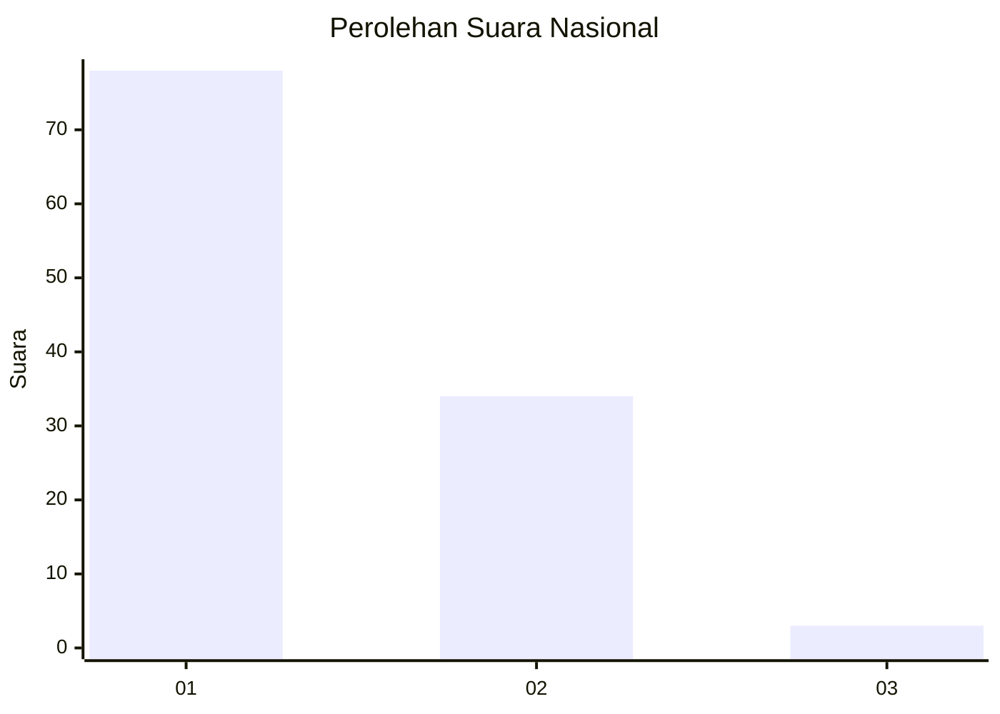
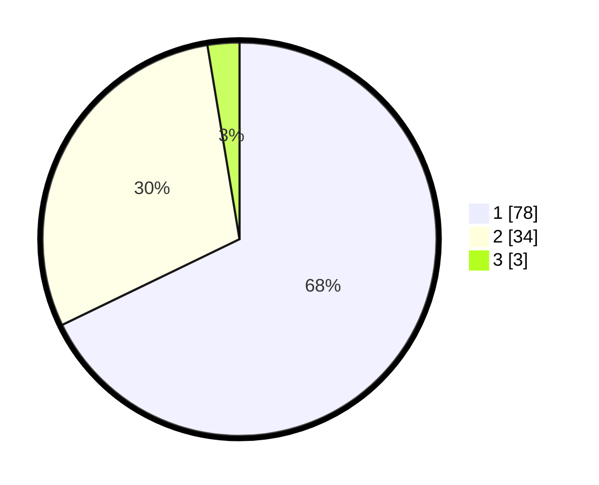

# Hasil

## Grafik

## Tabel

| No. | Nama Paslon    | Suara | Suara (raw) | Persentase |
|:--- |:-------------- | -----:| -----------:| ----------:|
| 1   | ANIES MUHAIMIN | 78    | [78][p-1]   | 67,83      |
| 2   | PRABOWO GIBRAN | 34    | [34][p-2]   | 29,57      |
| 3   | GANJAR MAHFUD  | 3     | [3][p-3]    | 2,61       |

[p-1]: https://github.com/gigit-pemilu/pemilu-2024/blob/main/pilpres/hitung-suara/sub/62-kalimantan-tengah/sub/03-kapuas/sub/03-kapuas-timur/sub/2003-anjir-serapat-barat/sub/003-tps/sub/paslon-1.txt
[p-2]: https://github.com/gigit-pemilu/pemilu-2024/blob/main/pilpres/hitung-suara/sub/62-kalimantan-tengah/sub/03-kapuas/sub/03-kapuas-timur/sub/2003-anjir-serapat-barat/sub/003-tps/sub/paslon-2.txt
[p-3]: https://github.com/gigit-pemilu/pemilu-2024/blob/main/pilpres/hitung-suara/sub/62-kalimantan-tengah/sub/03-kapuas/sub/03-kapuas-timur/sub/2003-anjir-serapat-barat/sub/003-tps/sub/paslon-3.txt

## Foto C Plano

https://sirekap-obj-formc.kpu.go.id/8d11/pemilu/ppwp/62/03/03/20/03/6203032003003-20240219-135655--b8aefa9d-8c33-4fa8-ad23-ec26f1f0badc.jpg

https://sirekap-obj-formc.kpu.go.id/8d11/pemilu/ppwp/62/03/03/20/03/6203032003003-20240219-135716--442d7663-2d76-4c40-8af2-f170ef8fc17e.jpg

https://sirekap-obj-formc.kpu.go.id/8d11/pemilu/ppwp/62/03/03/20/03/6203032003003-20240219-135822--963352b9-bca1-4df6-bccd-f1b704f2ae43.jpg

## Metadata

| Key        | Value               |
| ---------- | ------------------- |
| Time Stamp | 2024-02-25 14:00:00 |

