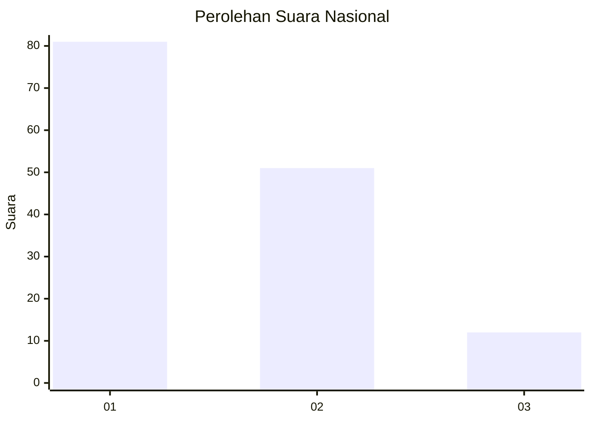
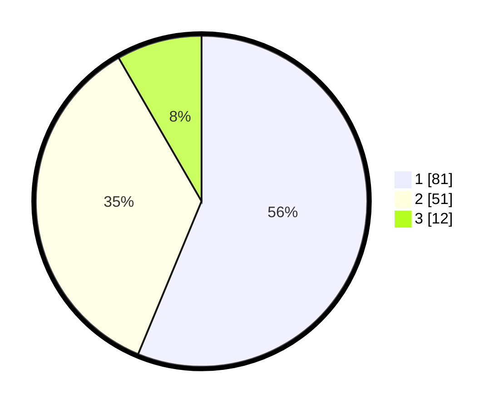

# Hasil

## Grafik

## Tabel

| No. | Nama Paslon    | Suara | Suara (raw) | Persentase |
|:--- |:-------------- | -----:| -----------:| ----------:|
| 1   | ANIES MUHAIMIN | 81    | [81][p-1]   | 56,25      |
| 2   | PRABOWO GIBRAN | 51    | [51][p-2]   | 35,42      |
| 3   | GANJAR MAHFUD  | 12    | [12][p-3]   | 8,33       |

[p-1]: https://github.com/gigit-pemilu/pemilu-2024/blob/main/pilpres/hitung-suara/sub/62-kalimantan-tengah/sub/03-kapuas/sub/03-kapuas-timur/sub/2003-anjir-serapat-barat/sub/004-tps/sub/paslon-1.txt
[p-2]: https://github.com/gigit-pemilu/pemilu-2024/blob/main/pilpres/hitung-suara/sub/62-kalimantan-tengah/sub/03-kapuas/sub/03-kapuas-timur/sub/2003-anjir-serapat-barat/sub/004-tps/sub/paslon-2.txt
[p-3]: https://github.com/gigit-pemilu/pemilu-2024/blob/main/pilpres/hitung-suara/sub/62-kalimantan-tengah/sub/03-kapuas/sub/03-kapuas-timur/sub/2003-anjir-serapat-barat/sub/004-tps/sub/paslon-3.txt

## Foto C Plano

https://sirekap-obj-formc.kpu.go.id/99fd/pemilu/ppwp/62/03/03/20/03/6203032003004-20240219-135850--e85439a3-0984-4393-a484-cdad56d2d794.jpg

https://sirekap-obj-formc.kpu.go.id/99fd/pemilu/ppwp/62/03/03/20/03/6203032003004-20240219-135910--811ae186-93a9-40d4-986d-5ccc51da9d83.jpg

https://sirekap-obj-formc.kpu.go.id/99fd/pemilu/ppwp/62/03/03/20/03/6203032003004-20240219-140012--4c800216-2b3e-4fc1-afff-b592c47eb6d2.jpg

## Metadata

| Key        | Value               |
| ---------- | ------------------- |
| Time Stamp | 2024-02-24 22:31:28 |

