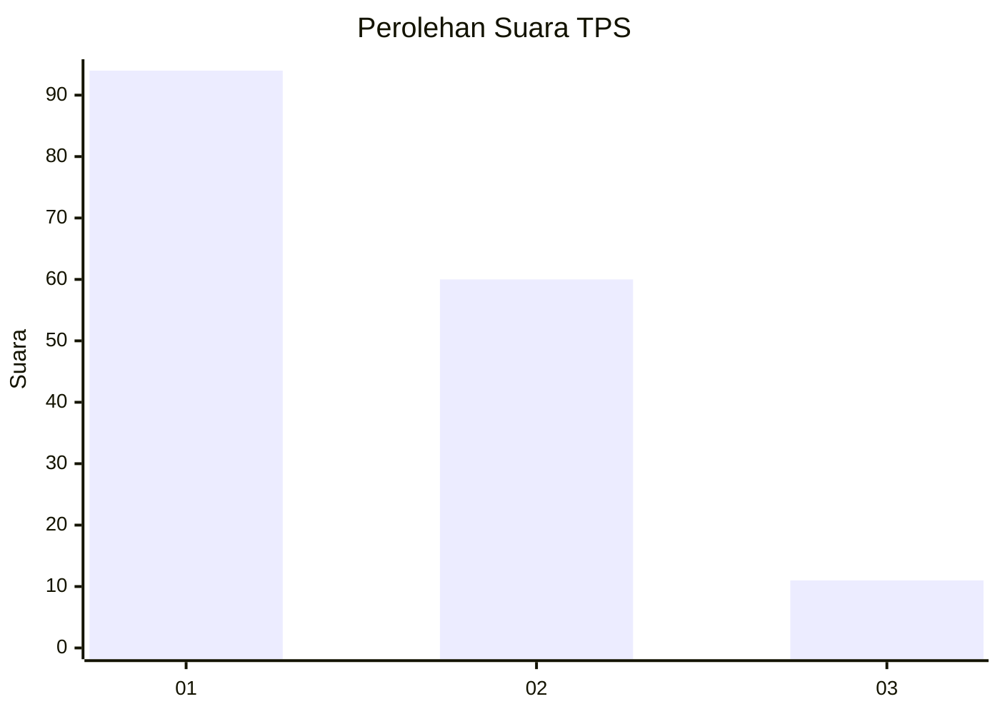
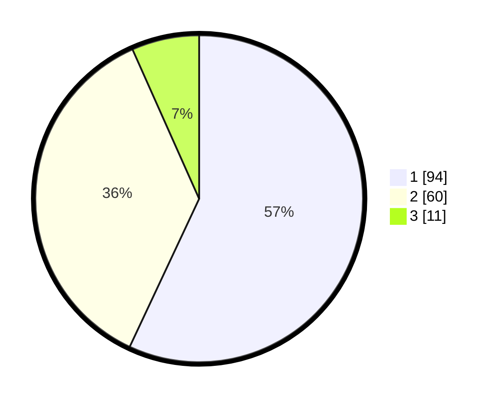

# Hasil

## Grafik

## Tabel

| No. | Nama Paslon    | Suara | Suara (raw) | Persentase |
|:--- |:-------------- | -----:| -----------:| ----------:|
| 1   | ANIES MUHAIMIN | 94    | [94][p-1]   | 56,97      |
| 2   | PRABOWO GIBRAN | 60    | [60][p-2]   | 36,36      |
| 3   | GANJAR MAHFUD  | 11    | [11][p-3]   | 6,67       |

[p-1]: https://github.com/gigit-pemilu/pemilu-2024-62-kalimantan-tengah/blob/main/pilpres/hitung-suara/sub/62-kalimantan-tengah/sub/03-kapuas/sub/03-kapuas-timur/sub/2003-anjir-serapat-barat/sub/005-tps/sub/paslon-1.txt
[p-2]: https://github.com/gigit-pemilu/pemilu-2024-62-kalimantan-tengah/blob/main/pilpres/hitung-suara/sub/62-kalimantan-tengah/sub/03-kapuas/sub/03-kapuas-timur/sub/2003-anjir-serapat-barat/sub/005-tps/sub/paslon-2.txt
[p-3]: https://github.com/gigit-pemilu/pemilu-2024-62-kalimantan-tengah/blob/main/pilpres/hitung-suara/sub/62-kalimantan-tengah/sub/03-kapuas/sub/03-kapuas-timur/sub/2003-anjir-serapat-barat/sub/005-tps/sub/paslon-3.txt

## Foto C Plano

https://sirekap-obj-formc.kpu.go.id/f777/pemilu/ppwp/62/03/03/20/03/6203032003005-20240219-140045--3a807877-c2d9-4b9a-afb0-a901b30abfd9.jpg

https://sirekap-obj-formc.kpu.go.id/f777/pemilu/ppwp/62/03/03/20/03/6203032003005-20240219-140115--0f021aea-cf7c-4e29-b447-b62784dee15d.jpg

https://sirekap-obj-formc.kpu.go.id/f777/pemilu/ppwp/62/03/03/20/03/6203032003005-20240219-140135--5ef5f2ba-0358-46d9-8611-946b70d9cf95.jpg

## Metadata

| Key        | Value               |
| ---------- | ------------------- |
| Time Stamp | 2024-02-24 22:31:28 |

