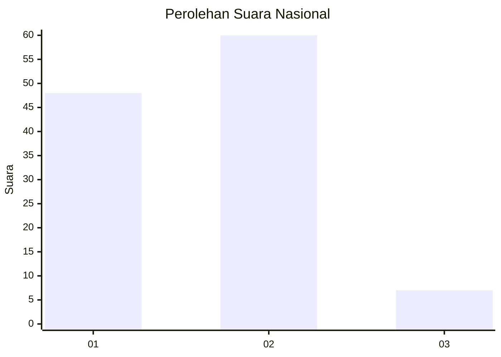
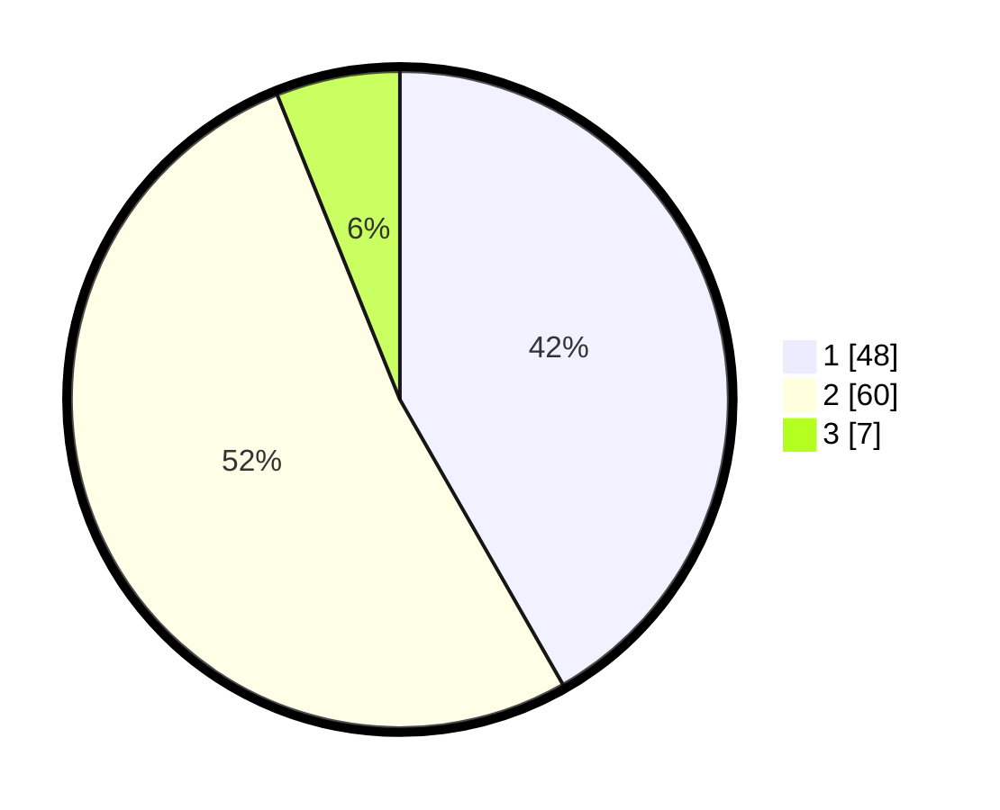

# Hasil

## Grafik

## Tabel

| No. | Nama Paslon    | Suara | Suara (raw) | Persentase |
|:--- |:-------------- | -----:| -----------:| ----------:|
| 1   | ANIES MUHAIMIN | 48    | [48][p-1]   | 41,74      |
| 2   | PRABOWO GIBRAN | 60    | [60][p-2]   | 52,17      |
| 3   | GANJAR MAHFUD  | 7     | [7][p-3]    | 6,09       |

[p-1]: https://github.com/gigit-pemilu/pemilu-2024/blob/main/pilpres/hitung-suara/sub/62-kalimantan-tengah/sub/03-kapuas/sub/03-kapuas-timur/sub/2003-anjir-serapat-barat/sub/014-tps/sub/paslon-1.txt
[p-2]: https://github.com/gigit-pemilu/pemilu-2024/blob/main/pilpres/hitung-suara/sub/62-kalimantan-tengah/sub/03-kapuas/sub/03-kapuas-timur/sub/2003-anjir-serapat-barat/sub/014-tps/sub/paslon-2.txt
[p-3]: https://github.com/gigit-pemilu/pemilu-2024/blob/main/pilpres/hitung-suara/sub/62-kalimantan-tengah/sub/03-kapuas/sub/03-kapuas-timur/sub/2003-anjir-serapat-barat/sub/014-tps/sub/paslon-3.txt

## Foto C Plano

https://sirekap-obj-formc.kpu.go.id/fcf2/pemilu/ppwp/62/03/03/20/03/6203032003014-20240219-144637--c613e62d-1471-45b6-bf95-67b64c91de62.jpg

https://sirekap-obj-formc.kpu.go.id/fcf2/pemilu/ppwp/62/03/03/20/03/6203032003014-20240219-144726--d9f877a4-524f-472d-a025-adab53445cd0.jpg

https://sirekap-obj-formc.kpu.go.id/fcf2/pemilu/ppwp/62/03/03/20/03/6203032003014-20240219-144755--e96a0c2f-8852-4776-b210-2638927f40cd.jpg

## Metadata

| Key        | Value               |
| ---------- | ------------------- |
| Time Stamp | 2024-02-24 22:31:28 |

