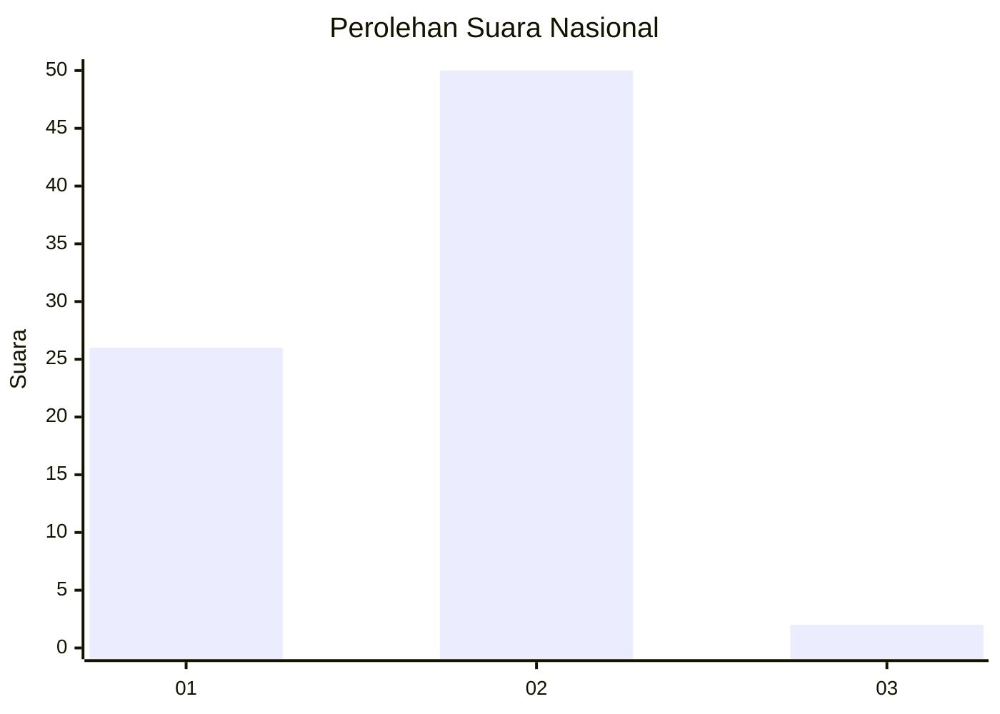
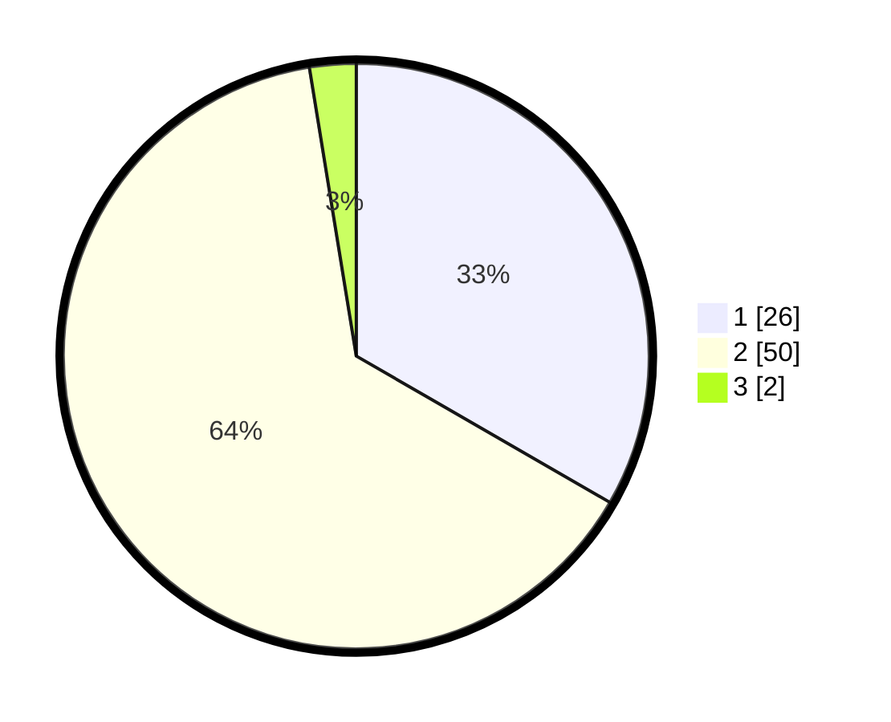

# Hasil

## Grafik

## Tabel

| No. | Nama Paslon    | Suara | Suara (raw) | Persentase |
|:--- |:-------------- | -----:| -----------:| ----------:|
| 1   | ANIES MUHAIMIN | 26    | [26][p-1]   | 33,33      |
| 2   | PRABOWO GIBRAN | 50    | [50][p-2]   | 64,10      |
| 3   | GANJAR MAHFUD  | 2     | [2][p-3]    | 2,56       |

[p-1]: https://github.com/gigit-pemilu/pemilu-2024/blob/main/pilpres/hitung-suara/sub/62-kalimantan-tengah/sub/03-kapuas/sub/03-kapuas-timur/sub/2004-anjir-mambulau-timur/sub/001-tps/sub/paslon-1.txt
[p-2]: https://github.com/gigit-pemilu/pemilu-2024/blob/main/pilpres/hitung-suara/sub/62-kalimantan-tengah/sub/03-kapuas/sub/03-kapuas-timur/sub/2004-anjir-mambulau-timur/sub/001-tps/sub/paslon-2.txt
[p-3]: https://github.com/gigit-pemilu/pemilu-2024/blob/main/pilpres/hitung-suara/sub/62-kalimantan-tengah/sub/03-kapuas/sub/03-kapuas-timur/sub/2004-anjir-mambulau-timur/sub/001-tps/sub/paslon-3.txt

## Foto C Plano

https://sirekap-obj-formc.kpu.go.id/3e6d/pemilu/ppwp/62/03/03/20/04/6203032004001-20240218-125829--a695574a-2841-4a83-9a7d-08f0a6c8e4a9.jpg

https://sirekap-obj-formc.kpu.go.id/3e6d/pemilu/ppwp/62/03/03/20/04/6203032004001-20240218-125856--d479792e-61e7-4d8c-a8ce-5a871b7e8bcf.jpg

https://sirekap-obj-formc.kpu.go.id/3e6d/pemilu/ppwp/62/03/03/20/04/6203032004001-20240218-130012--1dc54049-d4a4-4d6f-a0b3-c3860d0fe1ba.jpg

## Metadata

| Key        | Value               |
| ---------- | ------------------- |
| Time Stamp | 2024-02-25 14:00:00 |

