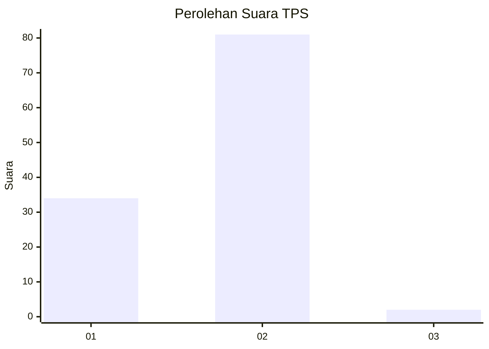
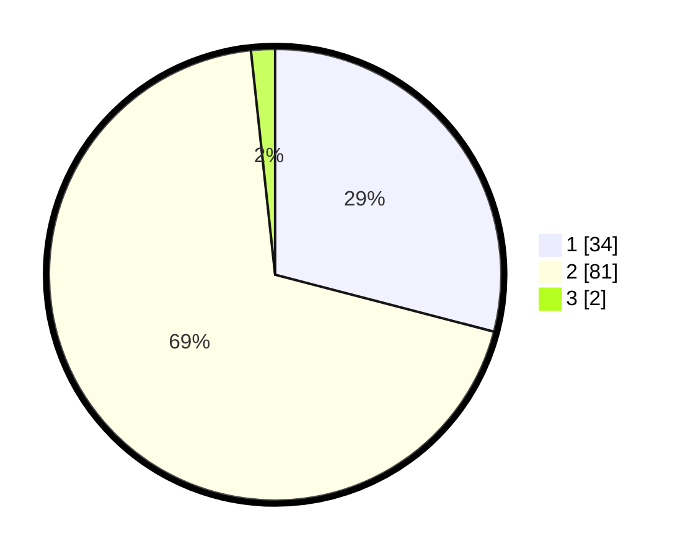

# Hasil

## Grafik

## Tabel

| No. | Nama Paslon    | Suara | Suara (raw) | Persentase |
|:--- |:-------------- | -----:| -----------:| ----------:|
| 1   | ANIES MUHAIMIN | 34    | [34][p-1]   | 29,06      |
| 2   | PRABOWO GIBRAN | 81    | [81][p-2]   | 69,23      |
| 3   | GANJAR MAHFUD  | 2     | [2][p-3]    | 1,71       |

[p-1]: https://github.com/gigit-pemilu/pemilu-2024-62-kalimantan-tengah/blob/main/pilpres/hitung-suara/sub/62-kalimantan-tengah/sub/03-kapuas/sub/03-kapuas-timur/sub/2004-anjir-mambulau-timur/sub/009-tps/sub/paslon-1.txt
[p-2]: https://github.com/gigit-pemilu/pemilu-2024-62-kalimantan-tengah/blob/main/pilpres/hitung-suara/sub/62-kalimantan-tengah/sub/03-kapuas/sub/03-kapuas-timur/sub/2004-anjir-mambulau-timur/sub/009-tps/sub/paslon-2.txt
[p-3]: https://github.com/gigit-pemilu/pemilu-2024-62-kalimantan-tengah/blob/main/pilpres/hitung-suara/sub/62-kalimantan-tengah/sub/03-kapuas/sub/03-kapuas-timur/sub/2004-anjir-mambulau-timur/sub/009-tps/sub/paslon-3.txt

## Foto C Plano

https://sirekap-obj-formc.kpu.go.id/35b7/pemilu/ppwp/62/03/03/20/04/6203032004009-20240218-132922--b779a490-a5a2-47ae-afa0-29c95329f252.jpg

https://sirekap-obj-formc.kpu.go.id/35b7/pemilu/ppwp/62/03/03/20/04/6203032004009-20240218-132946--5dd4d2f9-5098-4357-a584-9e3570ab1c58.jpg

https://sirekap-obj-formc.kpu.go.id/35b7/pemilu/ppwp/62/03/03/20/04/6203032004009-20240218-133014--9801182f-033a-4888-8a05-592d468c4965.jpg

## Metadata

| Key        | Value               |
| ---------- | ------------------- |
| Time Stamp | 2024-02-25 14:00:00 |

