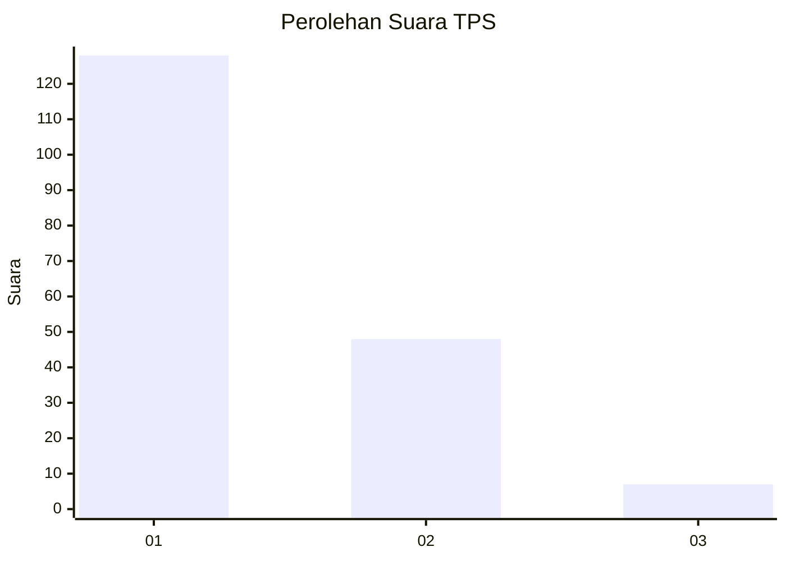
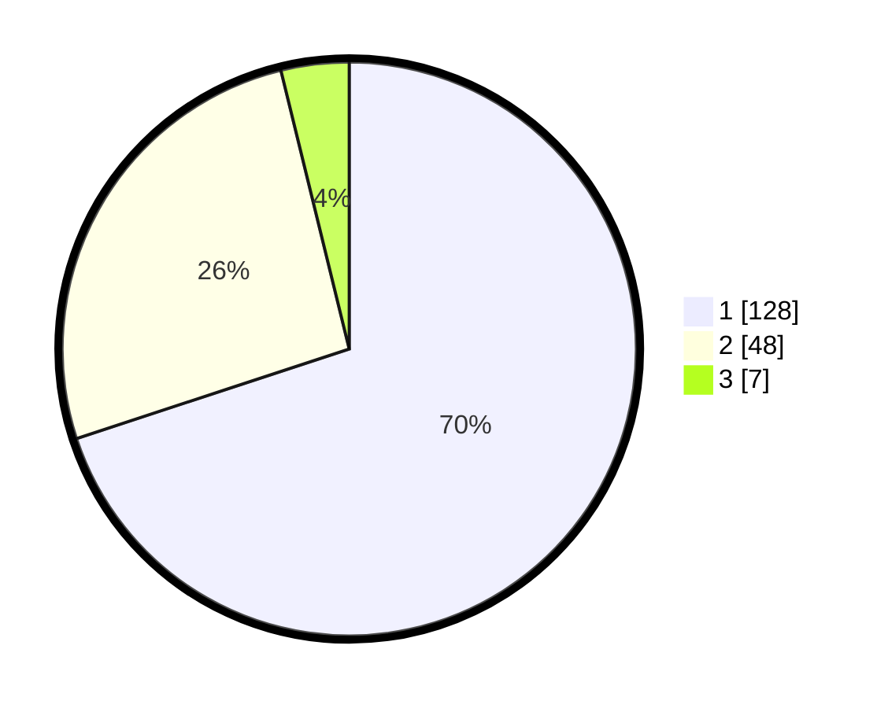

# Hasil

## Grafik

## Tabel

| No. | Nama Paslon    | Suara | Suara (raw) | Persentase |
|:--- |:-------------- | -----:| -----------:| ----------:|
| 1   | ANIES MUHAIMIN | 128   | [128][p-1]  | 69,95      |
| 2   | PRABOWO GIBRAN | 48    | [48][p-2]   | 26,23      |
| 3   | GANJAR MAHFUD  | 7     | [7][p-3]    | 3,83       |

[p-1]: https://github.com/gigit-pemilu/pemilu-2024-62-kalimantan-tengah/blob/main/pilpres/hitung-suara/sub/62-kalimantan-tengah/sub/03-kapuas/sub/03-kapuas-timur/sub/2004-anjir-mambulau-timur/sub/012-tps/sub/paslon-1.txt
[p-2]: https://github.com/gigit-pemilu/pemilu-2024-62-kalimantan-tengah/blob/main/pilpres/hitung-suara/sub/62-kalimantan-tengah/sub/03-kapuas/sub/03-kapuas-timur/sub/2004-anjir-mambulau-timur/sub/012-tps/sub/paslon-2.txt
[p-3]: https://github.com/gigit-pemilu/pemilu-2024-62-kalimantan-tengah/blob/main/pilpres/hitung-suara/sub/62-kalimantan-tengah/sub/03-kapuas/sub/03-kapuas-timur/sub/2004-anjir-mambulau-timur/sub/012-tps/sub/paslon-3.txt

## Foto C Plano

https://sirekap-obj-formc.kpu.go.id/6462/pemilu/ppwp/62/03/03/20/04/6203032004012-20240218-133848--6428c911-3f61-4574-8ddd-76ddba3e23fa.jpg

https://sirekap-obj-formc.kpu.go.id/6462/pemilu/ppwp/62/03/03/20/04/6203032004012-20240218-133919--b9182439-b84b-43a3-a3f9-63ca90007565.jpg

https://sirekap-obj-formc.kpu.go.id/6462/pemilu/ppwp/62/03/03/20/04/6203032004012-20240218-133955--6a573f7b-d238-4d2f-a900-36d2ebfb65c9.jpg

## Metadata

| Key        | Value               |
| ---------- | ------------------- |
| Time Stamp | 2024-02-24 22:31:28 |

