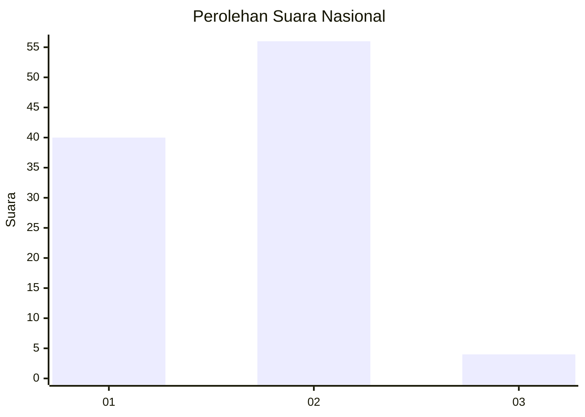
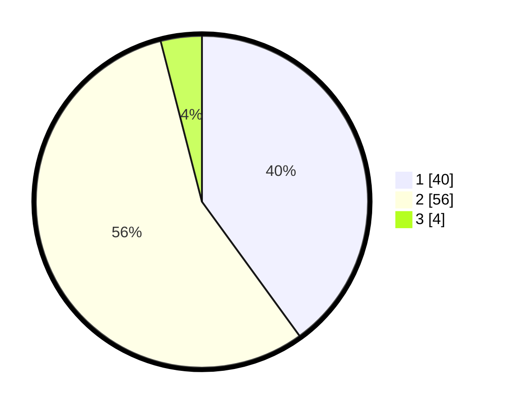

# Hasil

## Grafik

## Tabel

| No. | Nama Paslon    | Suara | Suara (raw) | Persentase |
|:--- |:-------------- | -----:| -----------:| ----------:|
| 1   | ANIES MUHAIMIN | 40    | [40][p-1]   | 40,00      |
| 2   | PRABOWO GIBRAN | 56    | [56][p-2]   | 56,00      |
| 3   | GANJAR MAHFUD  | 4     | [4][p-3]    | 4,00       |

[p-1]: https://github.com/gigit-pemilu/pemilu-2024/blob/main/pilpres/hitung-suara/sub/62-kalimantan-tengah/sub/03-kapuas/sub/03-kapuas-timur/sub/2004-anjir-mambulau-timur/sub/014-tps/sub/paslon-1.txt
[p-2]: https://github.com/gigit-pemilu/pemilu-2024/blob/main/pilpres/hitung-suara/sub/62-kalimantan-tengah/sub/03-kapuas/sub/03-kapuas-timur/sub/2004-anjir-mambulau-timur/sub/014-tps/sub/paslon-2.txt
[p-3]: https://github.com/gigit-pemilu/pemilu-2024/blob/main/pilpres/hitung-suara/sub/62-kalimantan-tengah/sub/03-kapuas/sub/03-kapuas-timur/sub/2004-anjir-mambulau-timur/sub/014-tps/sub/paslon-3.txt

## Foto C Plano

https://sirekap-obj-formc.kpu.go.id/41aa/pemilu/ppwp/62/03/03/20/04/6203032004014-20240218-134345--6f2fc6c5-1220-4285-a666-bcbe4d732b0f.jpg

https://sirekap-obj-formc.kpu.go.id/41aa/pemilu/ppwp/62/03/03/20/04/6203032004014-20240218-134413--46c34304-b576-44fc-b8ee-10dfff912b71.jpg

https://sirekap-obj-formc.kpu.go.id/41aa/pemilu/ppwp/62/03/03/20/04/6203032004014-20240218-134434--e2a4d694-f9a0-4fe0-92aa-0ba7c3f8bc76.jpg

## Metadata

| Key        | Value               |
| ---------- | ------------------- |
| Time Stamp | 2024-02-24 22:31:28 |

