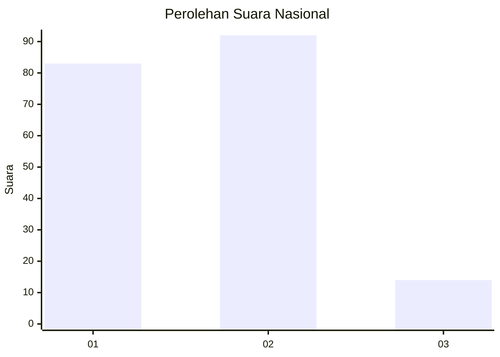
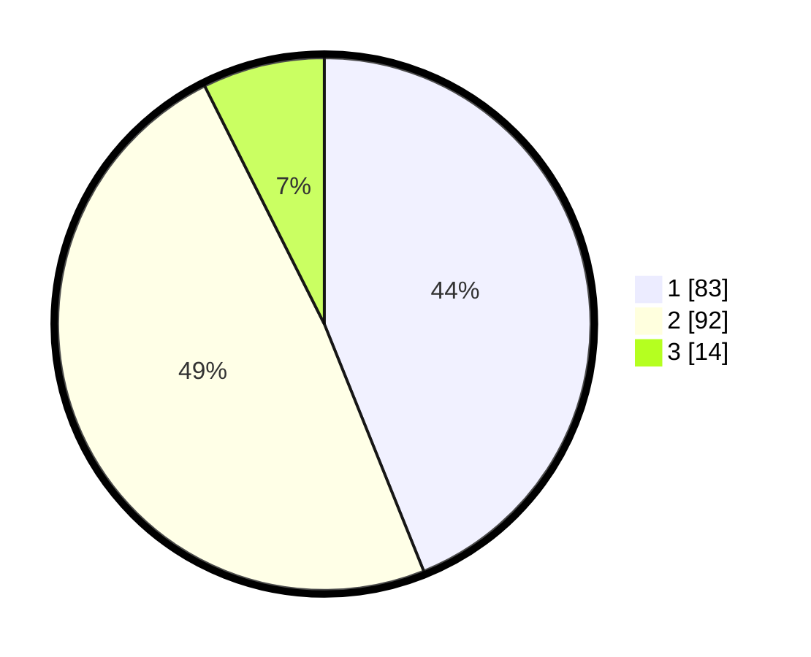

# Hasil

## Grafik

## Tabel

| No. | Nama Paslon    | Suara | Suara (raw) | Persentase |
|:--- |:-------------- | -----:| -----------:| ----------:|
| 1   | ANIES MUHAIMIN | 83    | [83][p-1]   | 43,92      |
| 2   | PRABOWO GIBRAN | 92    | [92][p-2]   | 48,68      |
| 3   | GANJAR MAHFUD  | 14    | [14][p-3]   | 7,41       |

[p-1]: https://github.com/gigit-pemilu/pemilu-2024/blob/main/pilpres/hitung-suara/sub/62-kalimantan-tengah/sub/03-kapuas/sub/03-kapuas-timur/sub/2005-anjir-mambulau-tengah/sub/003-tps/sub/paslon-1.txt
[p-2]: https://github.com/gigit-pemilu/pemilu-2024/blob/main/pilpres/hitung-suara/sub/62-kalimantan-tengah/sub/03-kapuas/sub/03-kapuas-timur/sub/2005-anjir-mambulau-tengah/sub/003-tps/sub/paslon-2.txt
[p-3]: https://github.com/gigit-pemilu/pemilu-2024/blob/main/pilpres/hitung-suara/sub/62-kalimantan-tengah/sub/03-kapuas/sub/03-kapuas-timur/sub/2005-anjir-mambulau-tengah/sub/003-tps/sub/paslon-3.txt

## Foto C Plano

https://sirekap-obj-formc.kpu.go.id/9094/pemilu/ppwp/62/03/03/20/05/6203032005003-20240214-234217--840bdde4-65b8-4e93-b0d5-3d1dbb4a1577.jpg

https://sirekap-obj-formc.kpu.go.id/9094/pemilu/ppwp/62/03/03/20/05/6203032005003-20240214-234732--c5501c11-e785-4c3f-81a2-d8a152257e29.jpg

https://sirekap-obj-formc.kpu.go.id/9094/pemilu/ppwp/62/03/03/20/05/6203032005003-20240214-235056--97d5538f-bd10-4c0c-a081-ad3f3918cc5c.jpg

## Metadata

| Key        | Value               |
| ---------- | ------------------- |
| Time Stamp | 2024-02-15 21:30:27 |

