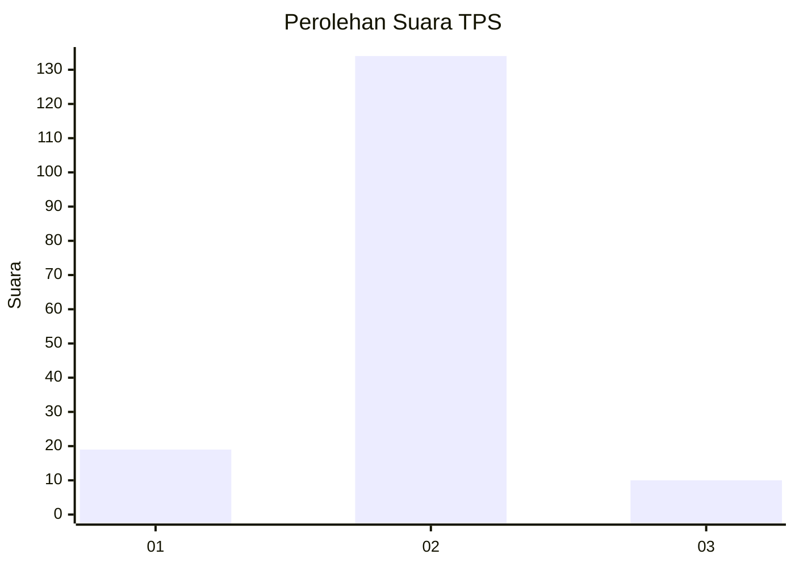
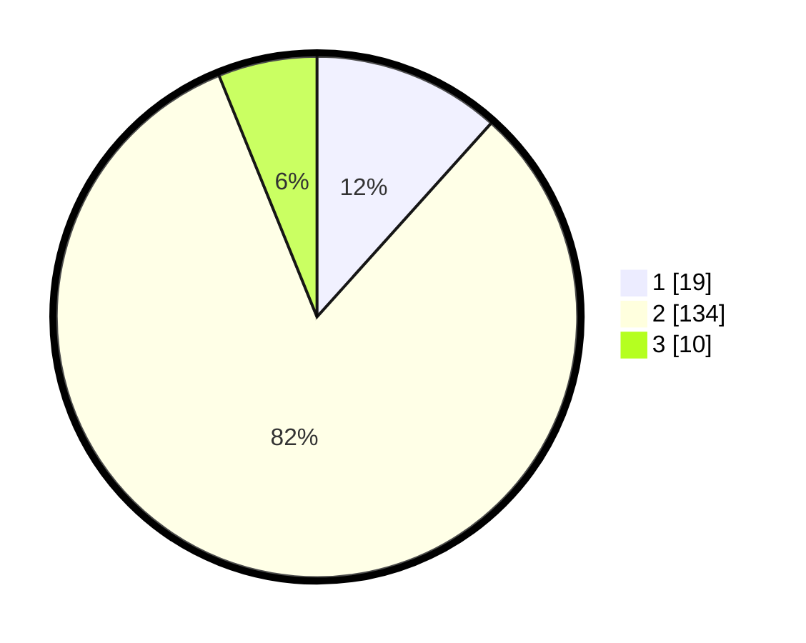

# Hasil

## Grafik

## Tabel

| No. | Nama Paslon    | Suara | Suara (raw) | Persentase |
|:--- |:-------------- | -----:| -----------:| ----------:|
| 1   | ANIES MUHAIMIN | 19    | [19][p-1]   | 11,66      |
| 2   | PRABOWO GIBRAN | 134   | [134][p-2]  | 82,21      |
| 3   | GANJAR MAHFUD  | 10    | [10][p-3]   | 6,13       |

[p-1]: https://github.com/gigit-pemilu/pemilu-2024-62-kalimantan-tengah/blob/main/pilpres/hitung-suara/sub/62-kalimantan-tengah/sub/03-kapuas/sub/03-kapuas-timur/sub/2005-anjir-mambulau-tengah/sub/005-tps/sub/paslon-1.txt
[p-2]: https://github.com/gigit-pemilu/pemilu-2024-62-kalimantan-tengah/blob/main/pilpres/hitung-suara/sub/62-kalimantan-tengah/sub/03-kapuas/sub/03-kapuas-timur/sub/2005-anjir-mambulau-tengah/sub/005-tps/sub/paslon-2.txt
[p-3]: https://github.com/gigit-pemilu/pemilu-2024-62-kalimantan-tengah/blob/main/pilpres/hitung-suara/sub/62-kalimantan-tengah/sub/03-kapuas/sub/03-kapuas-timur/sub/2005-anjir-mambulau-tengah/sub/005-tps/sub/paslon-3.txt

## Foto C Plano

https://sirekap-obj-formc.kpu.go.id/97f4/pemilu/ppwp/62/03/03/20/05/6203032005005-20240218-131128--2e4f4d16-a7f8-4520-b4d9-9804ba577fc4.jpg

https://sirekap-obj-formc.kpu.go.id/97f4/pemilu/ppwp/62/03/03/20/05/6203032005005-20240218-131213--0475f3bb-7581-4370-a583-4d5e42e68166.jpg

https://sirekap-obj-formc.kpu.go.id/97f4/pemilu/ppwp/62/03/03/20/05/6203032005005-20240218-131810--0e90aa06-c731-43df-bd7a-8c850c863865.jpg

## Metadata

| Key        | Value               |
| ---------- | ------------------- |
| Time Stamp | 2024-02-25 14:00:00 |

