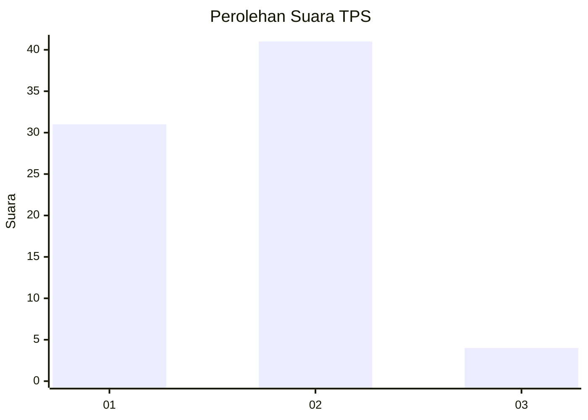
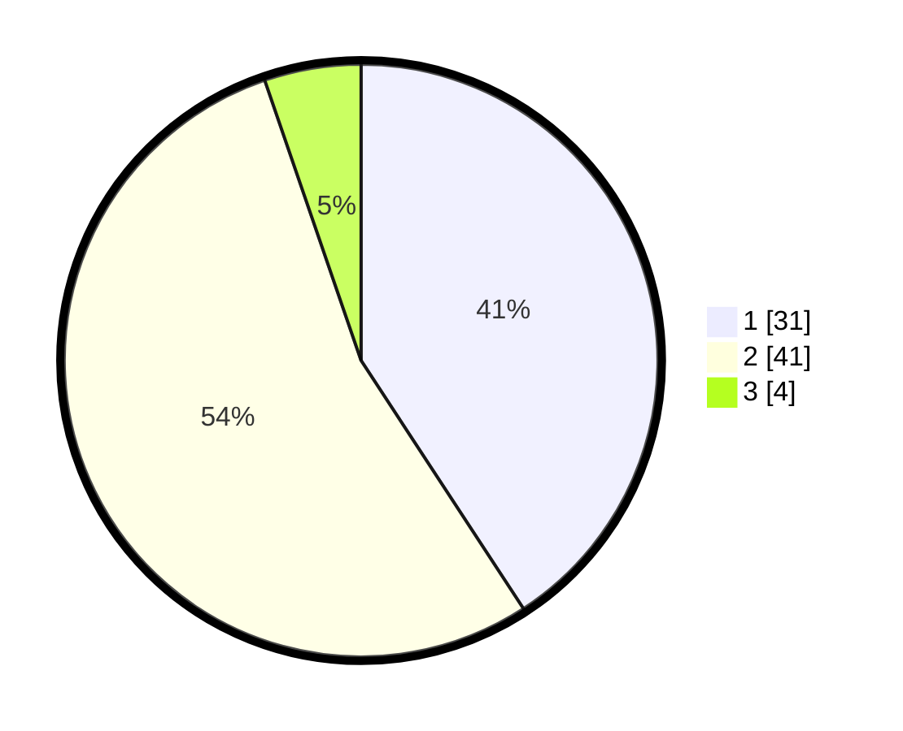

# Hasil

## Grafik

## Tabel

| No. | Nama Paslon    | Suara | Suara (raw) | Persentase |
|:--- |:-------------- | -----:| -----------:| ----------:|
| 1   | ANIES MUHAIMIN | 31    | [31][p-1]   | 40,79      |
| 2   | PRABOWO GIBRAN | 41    | [41][p-2]   | 53,95      |
| 3   | GANJAR MAHFUD  | 4     | [4][p-3]    | 5,26       |

[p-1]: https://github.com/gigit-pemilu/pemilu-2024-62-kalimantan-tengah/blob/main/pilpres/hitung-suara/sub/62-kalimantan-tengah/sub/03-kapuas/sub/03-kapuas-timur/sub/2006-anjir-mambulau-barat/sub/013-tps/sub/paslon-1.txt
[p-2]: https://github.com/gigit-pemilu/pemilu-2024-62-kalimantan-tengah/blob/main/pilpres/hitung-suara/sub/62-kalimantan-tengah/sub/03-kapuas/sub/03-kapuas-timur/sub/2006-anjir-mambulau-barat/sub/013-tps/sub/paslon-2.txt
[p-3]: https://github.com/gigit-pemilu/pemilu-2024-62-kalimantan-tengah/blob/main/pilpres/hitung-suara/sub/62-kalimantan-tengah/sub/03-kapuas/sub/03-kapuas-timur/sub/2006-anjir-mambulau-barat/sub/013-tps/sub/paslon-3.txt

## Foto C Plano

https://sirekap-obj-formc.kpu.go.id/a0d6/pemilu/ppwp/62/03/03/20/06/6203032006013-20240217-122214--bd6defac-f710-430d-bc68-30248ec9a490.jpg

https://sirekap-obj-formc.kpu.go.id/a0d6/pemilu/ppwp/62/03/03/20/06/6203032006013-20240217-121018--e2b6fdb8-2bde-4102-96e4-383bbf0d8cdd.jpg

https://sirekap-obj-formc.kpu.go.id/a0d6/pemilu/ppwp/62/03/03/20/06/6203032006013-20240217-120919--e73e494f-bc26-49c1-ab74-ce6a98bc5e04.jpg

## Metadata

| Key        | Value               |
| ---------- | ------------------- |
| Time Stamp | 2024-02-17 16:00:02 |

