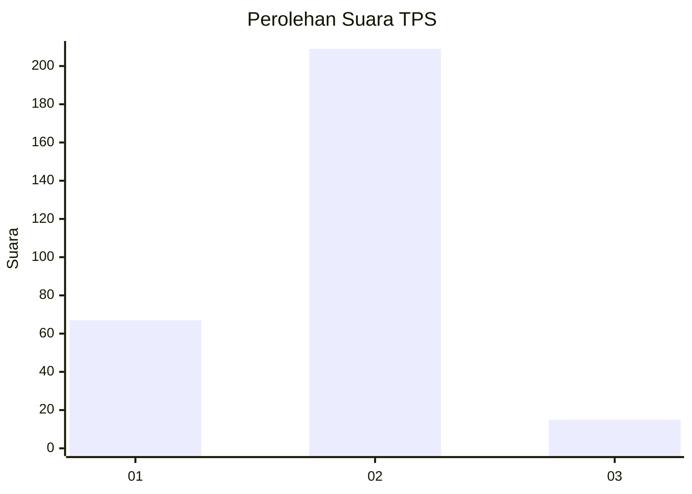
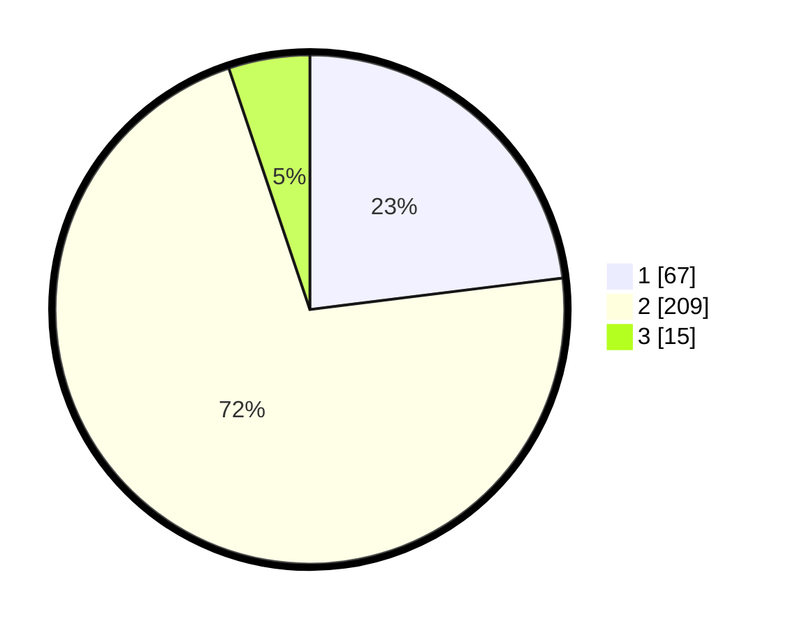

# Hasil

## Grafik

## Tabel

| No. | Nama Paslon    | Suara | Suara (raw) | Persentase |
|:--- |:-------------- | -----:| -----------:| ----------:|
| 1   | ANIES MUHAIMIN | 67    | [67][p-1]   | 23,02      |
| 2   | PRABOWO GIBRAN | 209   | [209][p-2]  | 71,82      |
| 3   | GANJAR MAHFUD  | 15    | [15][p-3]   | 5,15       |

[p-1]: https://github.com/gigit-pemilu/pemilu-2024-62-kalimantan-tengah/blob/main/pilpres/hitung-suara/sub/62-kalimantan-tengah/sub/03-kapuas/sub/04-kapuas-kuala/sub/2001-batanjung/sub/003-tps/sub/paslon-1.txt
[p-2]: https://github.com/gigit-pemilu/pemilu-2024-62-kalimantan-tengah/blob/main/pilpres/hitung-suara/sub/62-kalimantan-tengah/sub/03-kapuas/sub/04-kapuas-kuala/sub/2001-batanjung/sub/003-tps/sub/paslon-2.txt
[p-3]: https://github.com/gigit-pemilu/pemilu-2024-62-kalimantan-tengah/blob/main/pilpres/hitung-suara/sub/62-kalimantan-tengah/sub/03-kapuas/sub/04-kapuas-kuala/sub/2001-batanjung/sub/003-tps/sub/paslon-3.txt

## Foto C Plano

https://sirekap-obj-formc.kpu.go.id/fd9d/pemilu/ppwp/62/03/04/20/01/6203042001003-20240215-104440--d654d1a0-89a5-4ac9-8494-22aa14295bf4.jpg

https://sirekap-obj-formc.kpu.go.id/fd9d/pemilu/ppwp/62/03/04/20/01/6203042001003-20240216-144258--11c06651-dd47-4657-8457-a2bbf7fea829.jpg

https://sirekap-obj-formc.kpu.go.id/fd9d/pemilu/ppwp/62/03/04/20/01/6203042001003-20240215-105544--f3136219-d98f-4dc8-8e6a-43cc2e5a3d89.jpg

## Metadata

| Key        | Value               |
| ---------- | ------------------- |
| Time Stamp | 2024-02-16 16:25:10 |

