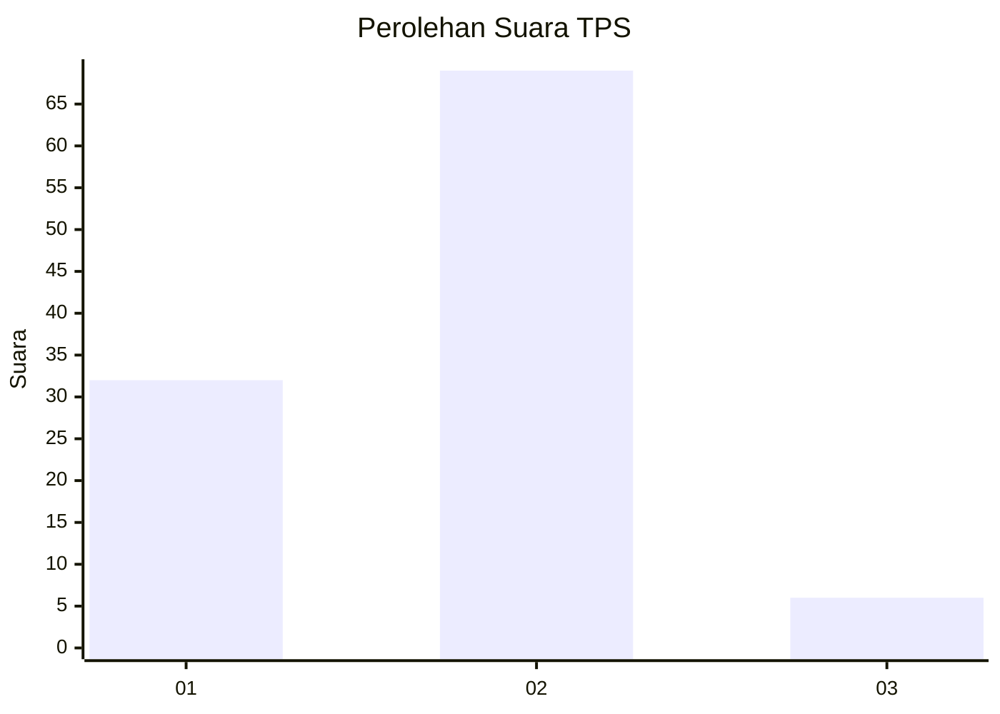
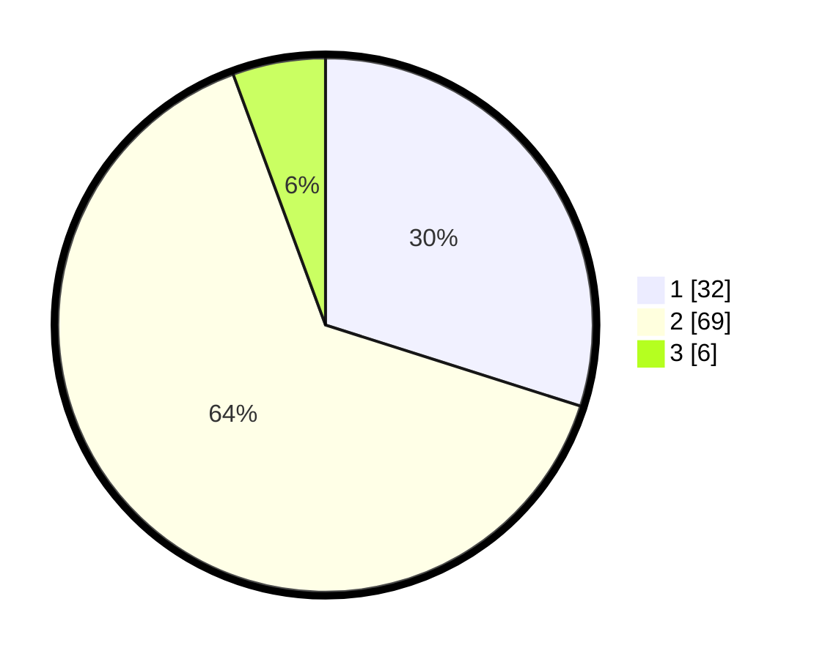

# Hasil

## Grafik

## Tabel

| No. | Nama Paslon    | Suara | Suara (raw) | Persentase |
|:--- |:-------------- | -----:| -----------:| ----------:|
| 1   | ANIES MUHAIMIN | 32    | [32][p-1]   | 29,91      |
| 2   | PRABOWO GIBRAN | 69    | [69][p-2]   | 64,49      |
| 3   | GANJAR MAHFUD  | 6     | [6][p-3]    | 5,61       |

[p-1]: https://github.com/gigit-pemilu/pemilu-2024-62-kalimantan-tengah/blob/main/pilpres/hitung-suara/sub/62-kalimantan-tengah/sub/03-kapuas/sub/04-kapuas-kuala/sub/2018-pematang/sub/005-tps/sub/paslon-1.txt
[p-2]: https://github.com/gigit-pemilu/pemilu-2024-62-kalimantan-tengah/blob/main/pilpres/hitung-suara/sub/62-kalimantan-tengah/sub/03-kapuas/sub/04-kapuas-kuala/sub/2018-pematang/sub/005-tps/sub/paslon-2.txt
[p-3]: https://github.com/gigit-pemilu/pemilu-2024-62-kalimantan-tengah/blob/main/pilpres/hitung-suara/sub/62-kalimantan-tengah/sub/03-kapuas/sub/04-kapuas-kuala/sub/2018-pematang/sub/005-tps/sub/paslon-3.txt

## Foto C Plano

https://sirekap-obj-formc.kpu.go.id/f872/pemilu/ppwp/62/03/04/20/18/6203042018005-20240214-231146--7a58c789-ac7c-4e1b-a6d9-9cf8f020eced.jpg

https://sirekap-obj-formc.kpu.go.id/f872/pemilu/ppwp/62/03/04/20/18/6203042018005-20240215-000037--5a7d3342-535f-47d7-b372-fbf2ae287375.jpg

https://sirekap-obj-formc.kpu.go.id/f872/pemilu/ppwp/62/03/04/20/18/6203042018005-20240215-000049--092e3335-c63d-4eea-9ea9-da628a3eb403.jpg

## Metadata

| Key        | Value               |
| ---------- | ------------------- |
| Time Stamp | 2024-02-15 19:00:26 |

