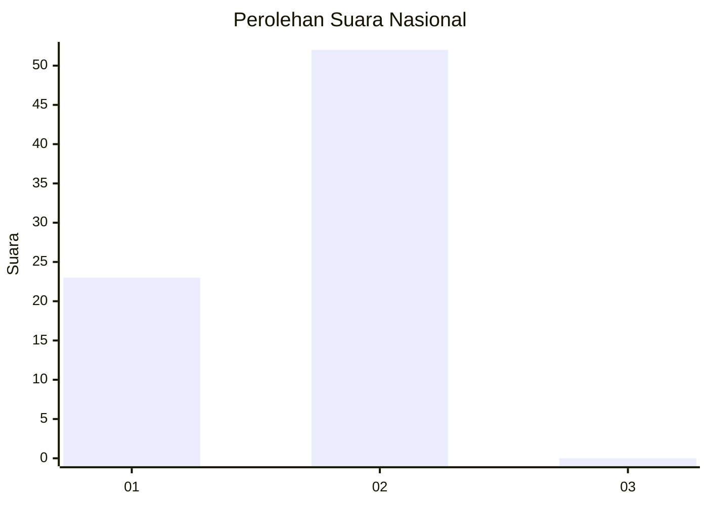
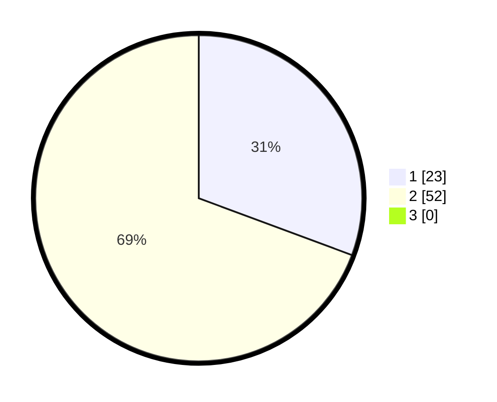

# Hasil

## Grafik

## Tabel

| No. | Nama Paslon    | Suara | Suara (raw) | Persentase |
|:--- |:-------------- | -----:| -----------:| ----------:|
| 1   | ANIES MUHAIMIN | 23    | [23][p-1]   | 30,67      |
| 2   | PRABOWO GIBRAN | 52    | [52][p-2]   | 69,33      |
| 3   | GANJAR MAHFUD  | 0     | [0][p-3]    | 0,00       |

[p-1]: https://github.com/gigit-pemilu/pemilu-2024/blob/main/pilpres/hitung-suara/sub/62-kalimantan-tengah/sub/03-kapuas/sub/04-kapuas-kuala/sub/2019-simpang-bunga-tanjung/sub/003-tps/sub/paslon-1.txt
[p-2]: https://github.com/gigit-pemilu/pemilu-2024/blob/main/pilpres/hitung-suara/sub/62-kalimantan-tengah/sub/03-kapuas/sub/04-kapuas-kuala/sub/2019-simpang-bunga-tanjung/sub/003-tps/sub/paslon-2.txt
[p-3]: https://github.com/gigit-pemilu/pemilu-2024/blob/main/pilpres/hitung-suara/sub/62-kalimantan-tengah/sub/03-kapuas/sub/04-kapuas-kuala/sub/2019-simpang-bunga-tanjung/sub/003-tps/sub/paslon-3.txt

## Foto C Plano

https://sirekap-obj-formc.kpu.go.id/e73f/pemilu/ppwp/62/03/04/20/19/6203042019003-20240215-094706--e783dff7-8886-44dd-8755-75cd1ff91541.jpg

https://sirekap-obj-formc.kpu.go.id/e73f/pemilu/ppwp/62/03/04/20/19/6203042019003-20240215-104554--5d60b1f7-bc3c-4eba-a977-fc9beb346d0d.jpg

https://sirekap-obj-formc.kpu.go.id/e73f/pemilu/ppwp/62/03/04/20/19/6203042019003-20240215-104722--dd8c9fe1-f518-4f7b-85cb-ab0a641d686b.jpg

## Metadata

| Key        | Value               |
| ---------- | ------------------- |
| Time Stamp | 2024-02-15 15:00:29 |

