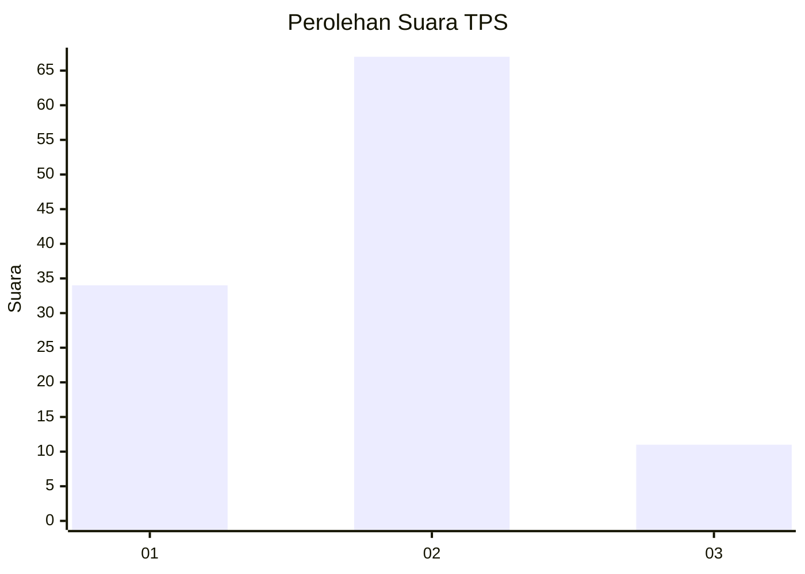
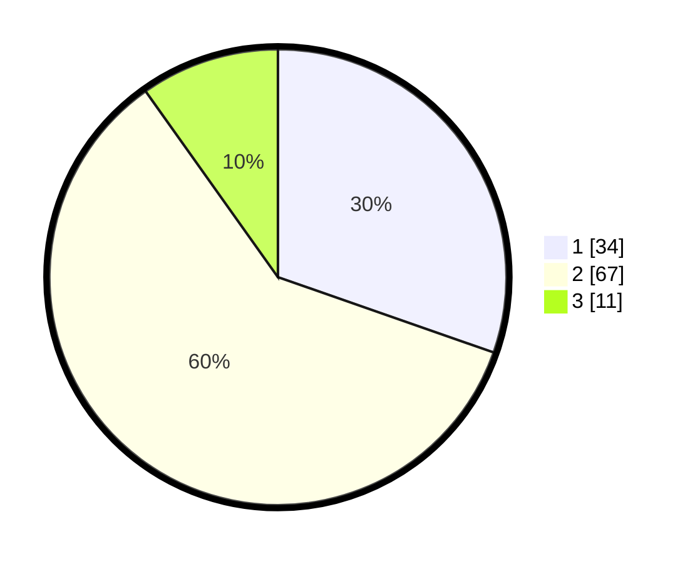

# Hasil

## Grafik

## Tabel

| No. | Nama Paslon    | Suara | Suara (raw) | Persentase |
|:--- |:-------------- | -----:| -----------:| ----------:|
| 1   | ANIES MUHAIMIN | 34    | [34][p-1]   | 30,36      |
| 2   | PRABOWO GIBRAN | 67    | [67][p-2]   | 59,82      |
| 3   | GANJAR MAHFUD  | 11    | [11][p-3]   | 9,82       |

[p-1]: https://github.com/gigit-pemilu/pemilu-2024-62-kalimantan-tengah/blob/main/pilpres/hitung-suara/sub/62-kalimantan-tengah/sub/03-kapuas/sub/04-kapuas-kuala/sub/2019-simpang-bunga-tanjung/sub/004-tps/sub/paslon-1.txt
[p-2]: https://github.com/gigit-pemilu/pemilu-2024-62-kalimantan-tengah/blob/main/pilpres/hitung-suara/sub/62-kalimantan-tengah/sub/03-kapuas/sub/04-kapuas-kuala/sub/2019-simpang-bunga-tanjung/sub/004-tps/sub/paslon-2.txt
[p-3]: https://github.com/gigit-pemilu/pemilu-2024-62-kalimantan-tengah/blob/main/pilpres/hitung-suara/sub/62-kalimantan-tengah/sub/03-kapuas/sub/04-kapuas-kuala/sub/2019-simpang-bunga-tanjung/sub/004-tps/sub/paslon-3.txt

## Foto C Plano

https://sirekap-obj-formc.kpu.go.id/8393/pemilu/ppwp/62/03/04/20/19/6203042019004-20240217-085223--a872b865-04e0-4985-9b8d-0c2485fa20d4.jpg

https://sirekap-obj-formc.kpu.go.id/8393/pemilu/ppwp/62/03/04/20/19/6203042019004-20240215-121411--ee152bc7-84c7-403e-bf87-e142a2d52a1c.jpg

https://sirekap-obj-formc.kpu.go.id/8393/pemilu/ppwp/62/03/04/20/19/6203042019004-20240215-121705--674ff944-2c89-4256-9431-3794e17d5423.jpg

## Metadata

| Key        | Value               |
| ---------- | ------------------- |
| Time Stamp | 2024-02-17 09:00:02 |

