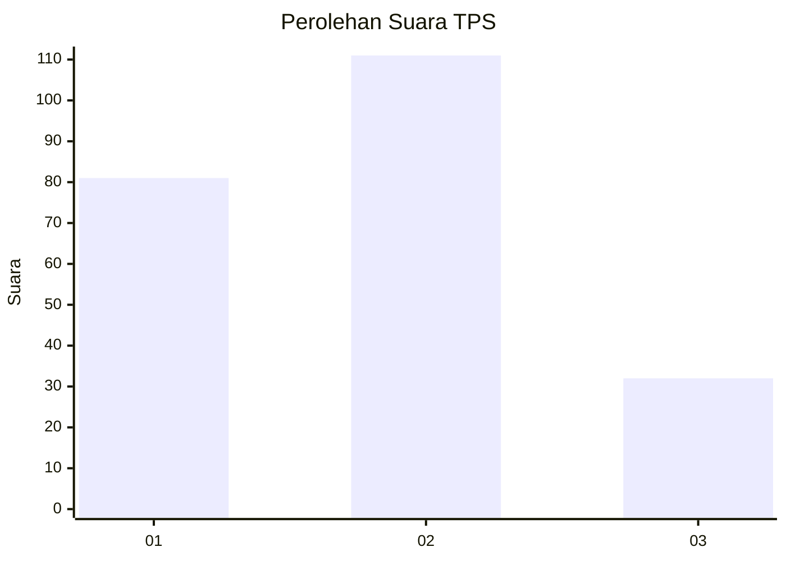
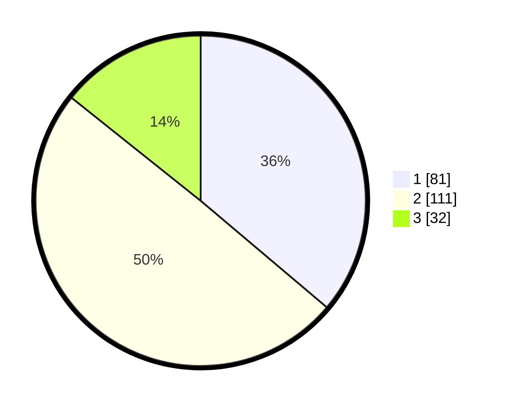

# Hasil

## Grafik

## Tabel

| No. | Nama Paslon    | Suara | Suara (raw) | Persentase |
|:--- |:-------------- | -----:| -----------:| ----------:|
| 1   | ANIES MUHAIMIN | 81    | [81][p-1]   | 36,16      |
| 2   | PRABOWO GIBRAN | 111   | [111][p-2]  | 49,55      |
| 3   | GANJAR MAHFUD  | 32    | [32][p-3]   | 14,29      |

[p-1]: https://github.com/gigit-pemilu/pemilu-2024-62-kalimantan-tengah/blob/main/pilpres/hitung-suara/sub/62-kalimantan-tengah/sub/03-kapuas/sub/06-pulau-petak/sub/2001-saka-lagon/sub/002-tps/sub/paslon-1.txt
[p-2]: https://github.com/gigit-pemilu/pemilu-2024-62-kalimantan-tengah/blob/main/pilpres/hitung-suara/sub/62-kalimantan-tengah/sub/03-kapuas/sub/06-pulau-petak/sub/2001-saka-lagon/sub/002-tps/sub/paslon-2.txt
[p-3]: https://github.com/gigit-pemilu/pemilu-2024-62-kalimantan-tengah/blob/main/pilpres/hitung-suara/sub/62-kalimantan-tengah/sub/03-kapuas/sub/06-pulau-petak/sub/2001-saka-lagon/sub/002-tps/sub/paslon-3.txt

## Foto C Plano

https://sirekap-obj-formc.kpu.go.id/f155/pemilu/ppwp/62/03/06/20/01/6203062001002-20240218-111709--ce667c2b-ba59-469d-9ff6-53dcfaf06828.jpg

https://sirekap-obj-formc.kpu.go.id/f155/pemilu/ppwp/62/03/06/20/01/6203062001002-20240215-171201--508b4643-b668-445e-af7c-d5dbd8cfc1c9.jpg

https://sirekap-obj-formc.kpu.go.id/f155/pemilu/ppwp/62/03/06/20/01/6203062001002-20240215-171345--3be2bfc0-f5d3-44c1-a12b-e727f24a2393.jpg

## Metadata

| Key        | Value               |
| ---------- | ------------------- |
| Time Stamp | 2024-02-19 06:16:00 |

