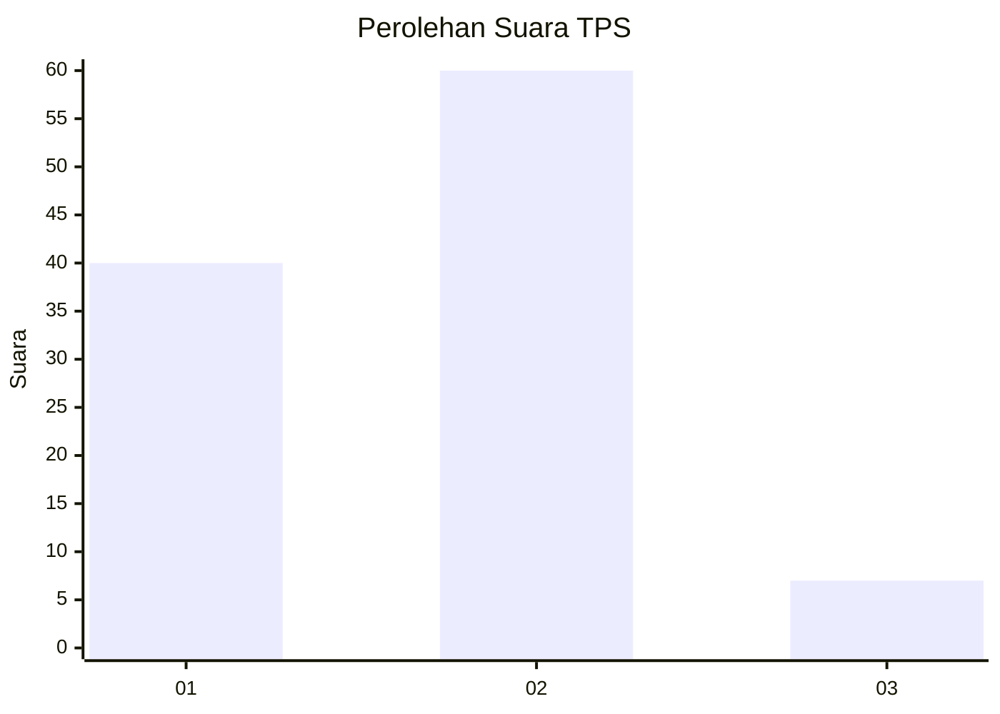
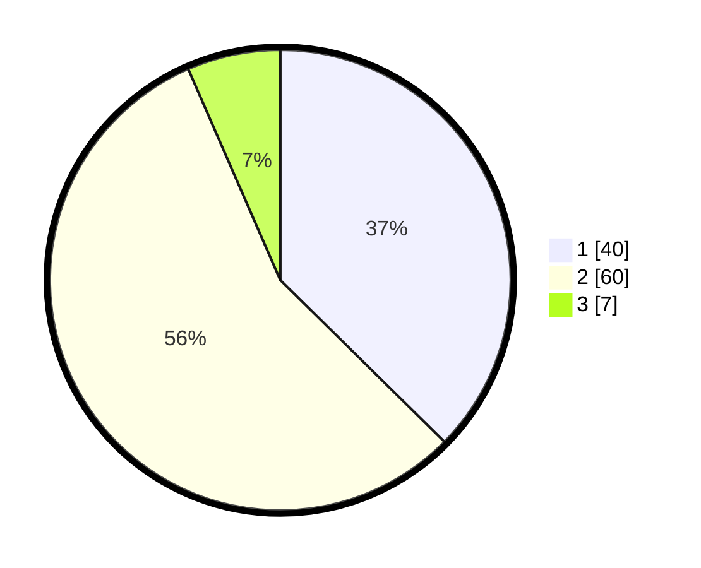

# Hasil

## Grafik

## Tabel

| No. | Nama Paslon    | Suara | Suara (raw) | Persentase |
|:--- |:-------------- | -----:| -----------:| ----------:|
| 1   | ANIES MUHAIMIN | 40    | [40][p-1]   | 37,38      |
| 2   | PRABOWO GIBRAN | 60    | [60][p-2]   | 56,07      |
| 3   | GANJAR MAHFUD  | 7     | [7][p-3]    | 6,54       |

[p-1]: https://github.com/gigit-pemilu/pemilu-2024-62-kalimantan-tengah/blob/main/pilpres/hitung-suara/sub/62-kalimantan-tengah/sub/03-kapuas/sub/06-pulau-petak/sub/2001-saka-lagon/sub/004-tps/sub/paslon-1.txt
[p-2]: https://github.com/gigit-pemilu/pemilu-2024-62-kalimantan-tengah/blob/main/pilpres/hitung-suara/sub/62-kalimantan-tengah/sub/03-kapuas/sub/06-pulau-petak/sub/2001-saka-lagon/sub/004-tps/sub/paslon-2.txt
[p-3]: https://github.com/gigit-pemilu/pemilu-2024-62-kalimantan-tengah/blob/main/pilpres/hitung-suara/sub/62-kalimantan-tengah/sub/03-kapuas/sub/06-pulau-petak/sub/2001-saka-lagon/sub/004-tps/sub/paslon-3.txt

## Foto C Plano

https://sirekap-obj-formc.kpu.go.id/1f94/pemilu/ppwp/62/03/06/20/01/6203062001004-20240216-145001--01b84693-c2cc-45f5-a597-960d5b405bc9.jpg

https://sirekap-obj-formc.kpu.go.id/1f94/pemilu/ppwp/62/03/06/20/01/6203062001004-20240216-145003--6a59a861-cb9e-4d9c-8636-709494fe6a55.jpg

https://sirekap-obj-formc.kpu.go.id/1f94/pemilu/ppwp/62/03/06/20/01/6203062001004-20240216-145002--bbf33dd9-eb4e-4761-9d41-70ca570fba13.jpg

## Metadata

| Key        | Value               |
| ---------- | ------------------- |
| Time Stamp | 2024-02-16 16:25:10 |

## DATA PEMILIH TETAP

Jumlah pemilih dalam DPT: **177**.
 * L: **91**.
 * P: **86**.

## DATA PENGGUNA HAK PILIH

Jumlah pengguna hak pilih dalam DPT: **122**.
 * L: **54**.
 * P: **68**.

Jumlah pengguna hak pilih dalam DPTb: **0**.
 * L: **0**.
 * P: **0**.

Jumlah pengguna hak pilih dalam DPK: **2**.
 * L: **1**.
 * P: **1**.

Jumlah pengguna hak pilih: **124**.
 * L: **55**.
 * P: **69**.

## JUMLAH SUARA SAH DAN TIDAK SAH

JUMLAH SELURUH SUARA SAH: **107**.

JUMLAH SUARA TIDAK SAH: **17**.

JUMLAH SELURUH SUARA SAH DAN SUARA TIDAK SAH: **124**.

