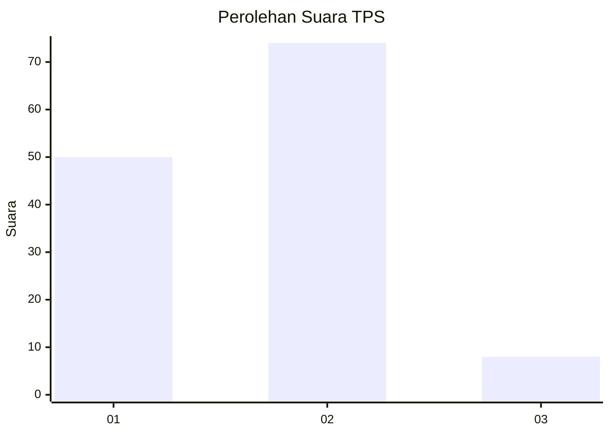
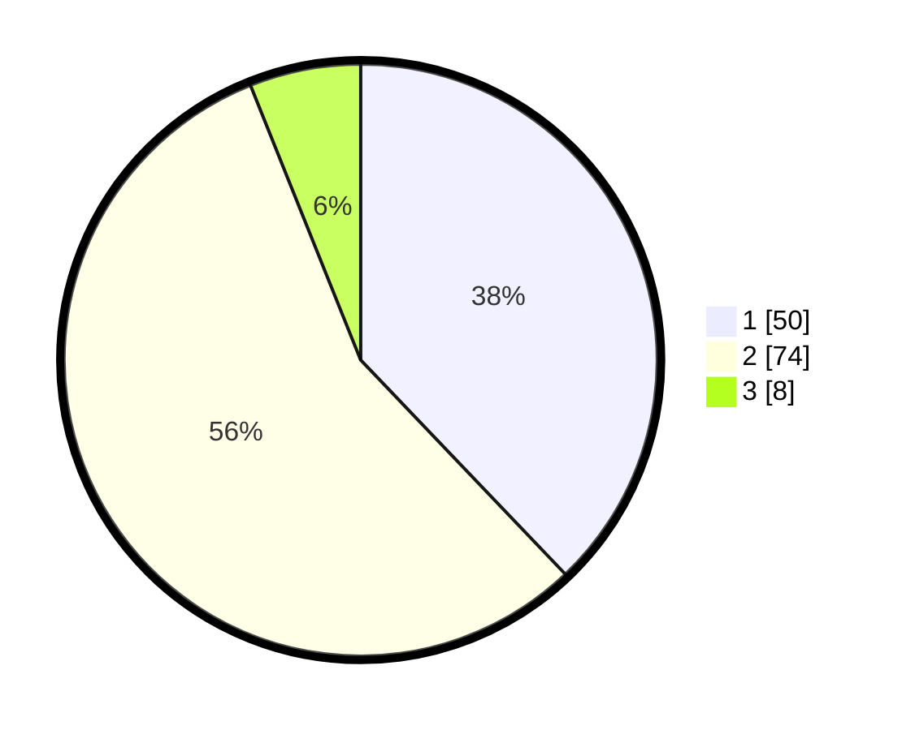

# Hasil

## Grafik

## Tabel

| No. | Nama Paslon    | Suara | Suara (raw) | Persentase |
|:--- |:-------------- | -----:| -----------:| ----------:|
| 1   | ANIES MUHAIMIN | 50    | [50][p-1]   | 37,88      |
| 2   | PRABOWO GIBRAN | 74    | [74][p-2]   | 56,06      |
| 3   | GANJAR MAHFUD  | 8     | [8][p-3]    | 6,06       |

[p-1]: https://github.com/gigit-pemilu/pemilu-2024-62-kalimantan-tengah/blob/main/pilpres/hitung-suara/sub/62-kalimantan-tengah/sub/03-kapuas/sub/06-pulau-petak/sub/2001-saka-lagon/sub/005-tps/sub/paslon-1.txt
[p-2]: https://github.com/gigit-pemilu/pemilu-2024-62-kalimantan-tengah/blob/main/pilpres/hitung-suara/sub/62-kalimantan-tengah/sub/03-kapuas/sub/06-pulau-petak/sub/2001-saka-lagon/sub/005-tps/sub/paslon-2.txt
[p-3]: https://github.com/gigit-pemilu/pemilu-2024-62-kalimantan-tengah/blob/main/pilpres/hitung-suara/sub/62-kalimantan-tengah/sub/03-kapuas/sub/06-pulau-petak/sub/2001-saka-lagon/sub/005-tps/sub/paslon-3.txt

## Foto C Plano

https://sirekap-obj-formc.kpu.go.id/2559/pemilu/ppwp/62/03/06/20/01/6203062001005-20240215-183854--24aa2c62-f5cc-4b1c-b78b-a1c81eeb5067.jpg

https://sirekap-obj-formc.kpu.go.id/2559/pemilu/ppwp/62/03/06/20/01/6203062001005-20240215-190136--ab6027c7-a75f-4581-ba2b-559d5a09f2cb.jpg

https://sirekap-obj-formc.kpu.go.id/2559/pemilu/ppwp/62/03/06/20/01/6203062001005-20240215-190635--c0abfa71-7f6c-4abf-9767-bf2dba197ebb.jpg

## Metadata

| Key        | Value               |
| ---------- | ------------------- |
| Time Stamp | 2024-02-16 04:00:27 |

