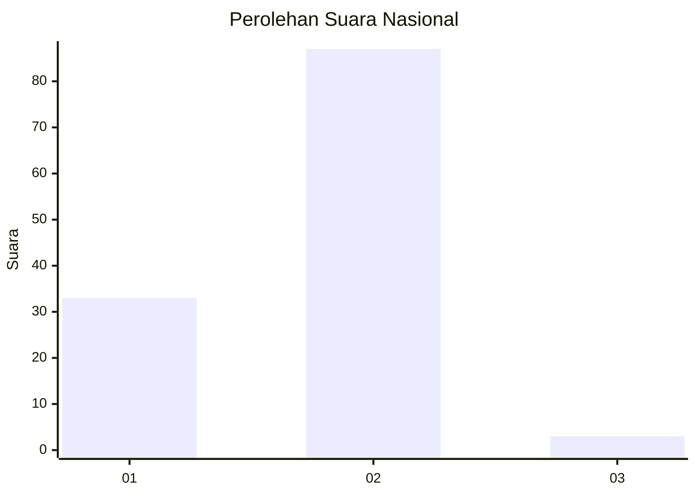
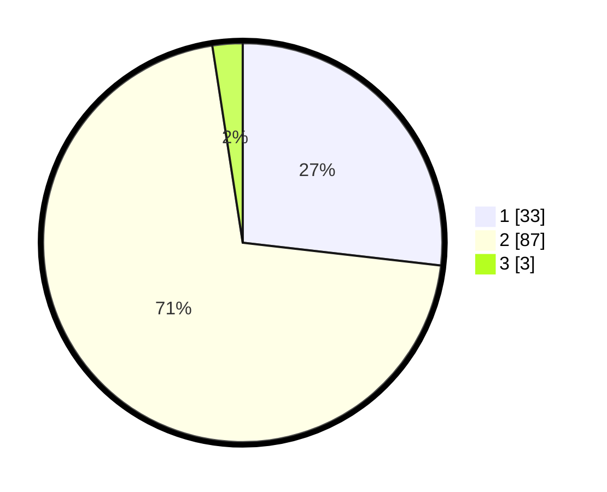

# Hasil

## Grafik

## Tabel

| No. | Nama Paslon    | Suara | Suara (raw) | Persentase |
|:--- |:-------------- | -----:| -----------:| ----------:|
| 1   | ANIES MUHAIMIN | 33    | [33][p-1]   | 26,83      |
| 2   | PRABOWO GIBRAN | 87    | [87][p-2]   | 70,73      |
| 3   | GANJAR MAHFUD  | 3     | [3][p-3]    | 2,44       |

[p-1]: https://github.com/gigit-pemilu/pemilu-2024/blob/main/pilpres/hitung-suara/sub/62-kalimantan-tengah/sub/03-kapuas/sub/06-pulau-petak/sub/2006-anjir-palambang/sub/005-tps/sub/paslon-1.txt
[p-2]: https://github.com/gigit-pemilu/pemilu-2024/blob/main/pilpres/hitung-suara/sub/62-kalimantan-tengah/sub/03-kapuas/sub/06-pulau-petak/sub/2006-anjir-palambang/sub/005-tps/sub/paslon-2.txt
[p-3]: https://github.com/gigit-pemilu/pemilu-2024/blob/main/pilpres/hitung-suara/sub/62-kalimantan-tengah/sub/03-kapuas/sub/06-pulau-petak/sub/2006-anjir-palambang/sub/005-tps/sub/paslon-3.txt

## Foto C Plano

https://sirekap-obj-formc.kpu.go.id/8763/pemilu/ppwp/62/03/06/20/06/6203062006005-20240215-082107--c7d34540-6442-497a-8aae-064feb03b6cf.jpg

https://sirekap-obj-formc.kpu.go.id/8763/pemilu/ppwp/62/03/06/20/06/6203062006005-20240215-082232--0414e6b8-0cd0-4a4c-93a8-1caca0bbc87a.jpg

https://sirekap-obj-formc.kpu.go.id/8763/pemilu/ppwp/62/03/06/20/06/6203062006005-20240215-082220--fd62b2b9-ca92-42b5-b6d4-bcbdffe5b151.jpg

## Metadata

| Key        | Value               |
| ---------- | ------------------- |
| Time Stamp | 2024-02-15 21:01:18 |

