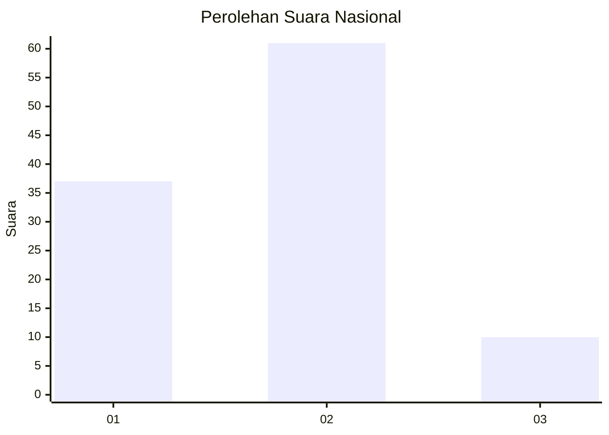
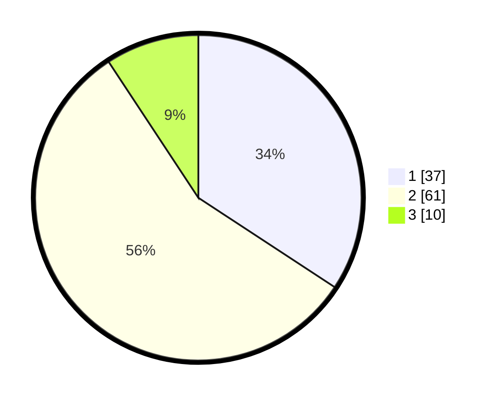

# Hasil

## Grafik

## Tabel

| No. | Nama Paslon    | Suara | Suara (raw) | Persentase |
|:--- |:-------------- | -----:| -----------:| ----------:|
| 1   | ANIES MUHAIMIN | 37    | [37][p-1]   | 34,26      |
| 2   | PRABOWO GIBRAN | 61    | [61][p-2]   | 56,48      |
| 3   | GANJAR MAHFUD  | 10    | [10][p-3]   | 9,26       |

[p-1]: https://github.com/gigit-pemilu/pemilu-2024/blob/main/pilpres/hitung-suara/sub/62-kalimantan-tengah/sub/03-kapuas/sub/06-pulau-petak/sub/2009-sei-tatas-hilir/sub/006-tps/sub/paslon-1.txt
[p-2]: https://github.com/gigit-pemilu/pemilu-2024/blob/main/pilpres/hitung-suara/sub/62-kalimantan-tengah/sub/03-kapuas/sub/06-pulau-petak/sub/2009-sei-tatas-hilir/sub/006-tps/sub/paslon-2.txt
[p-3]: https://github.com/gigit-pemilu/pemilu-2024/blob/main/pilpres/hitung-suara/sub/62-kalimantan-tengah/sub/03-kapuas/sub/06-pulau-petak/sub/2009-sei-tatas-hilir/sub/006-tps/sub/paslon-3.txt

## Foto C Plano

https://sirekap-obj-formc.kpu.go.id/bb00/pemilu/ppwp/62/03/06/20/09/6203062009006-20240215-075637--667c2901-32fa-4d1a-b1c5-301f18a0f5e5.jpg

https://sirekap-obj-formc.kpu.go.id/bb00/pemilu/ppwp/62/03/06/20/09/6203062009006-20240215-083601--93a4a288-1038-4d08-9944-0c08a81b74a6.jpg

https://sirekap-obj-formc.kpu.go.id/bb00/pemilu/ppwp/62/03/06/20/09/6203062009006-20240215-080006--ed1e191f-909d-4f63-95e5-83f817b47164.jpg

## Metadata

| Key        | Value               |
| ---------- | ------------------- |
| Time Stamp | 2024-02-15 21:01:18 |

