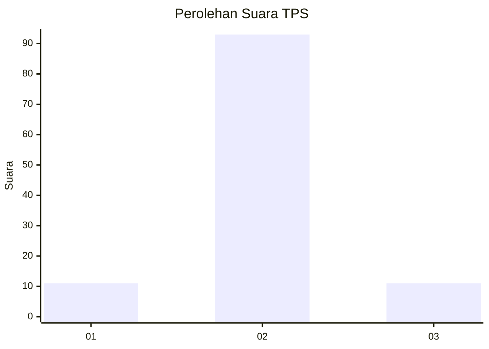
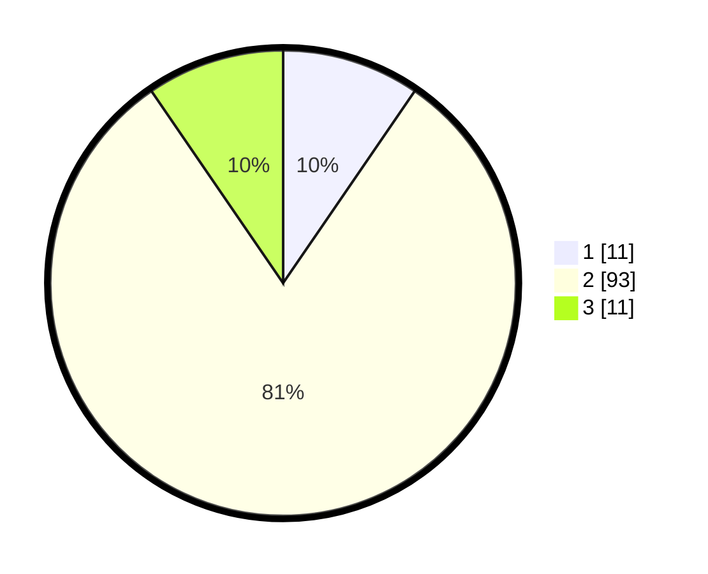

# Hasil

## Grafik

## Tabel

| No. | Nama Paslon    | Suara | Suara (raw) | Persentase |
|:--- |:-------------- | -----:| -----------:| ----------:|
| 1   | ANIES MUHAIMIN | 11    | [11][p-1]   | 9,57       |
| 2   | PRABOWO GIBRAN | 93    | [93][p-2]   | 80,87      |
| 3   | GANJAR MAHFUD  | 11    | [11][p-3]   | 9,57       |

[p-1]: https://github.com/gigit-pemilu/pemilu-2024-62-kalimantan-tengah/blob/main/pilpres/hitung-suara/sub/62-kalimantan-tengah/sub/03-kapuas/sub/07-kapuas-murung/sub/2014-talekung-punei/sub/002-tps/sub/paslon-1.txt
[p-2]: https://github.com/gigit-pemilu/pemilu-2024-62-kalimantan-tengah/blob/main/pilpres/hitung-suara/sub/62-kalimantan-tengah/sub/03-kapuas/sub/07-kapuas-murung/sub/2014-talekung-punei/sub/002-tps/sub/paslon-2.txt
[p-3]: https://github.com/gigit-pemilu/pemilu-2024-62-kalimantan-tengah/blob/main/pilpres/hitung-suara/sub/62-kalimantan-tengah/sub/03-kapuas/sub/07-kapuas-murung/sub/2014-talekung-punei/sub/002-tps/sub/paslon-3.txt

## Foto C Plano

https://sirekap-obj-formc.kpu.go.id/7317/pemilu/ppwp/62/03/07/20/14/6203072014002-20240215-135518--dea625be-8aff-4cd0-9bb6-13fce4b6536a.jpg

https://sirekap-obj-formc.kpu.go.id/7317/pemilu/ppwp/62/03/07/20/14/6203072014002-20240215-135358--9bbb98c2-f03f-4c73-ae51-1f7398034d09.jpg

https://sirekap-obj-formc.kpu.go.id/7317/pemilu/ppwp/62/03/07/20/14/6203072014002-20240215-135447--679c784f-5221-45be-908f-d455ff9a1e7f.jpg

## Metadata

| Key        | Value               |
| ---------- | ------------------- |
| Time Stamp | 2024-02-15 22:00:27 |

