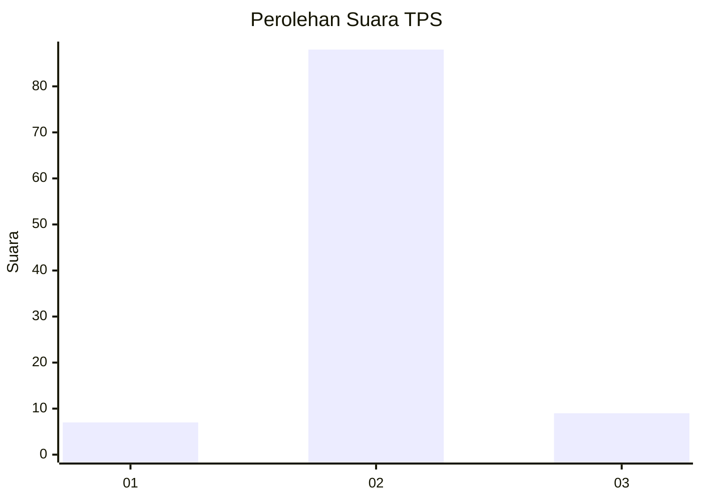
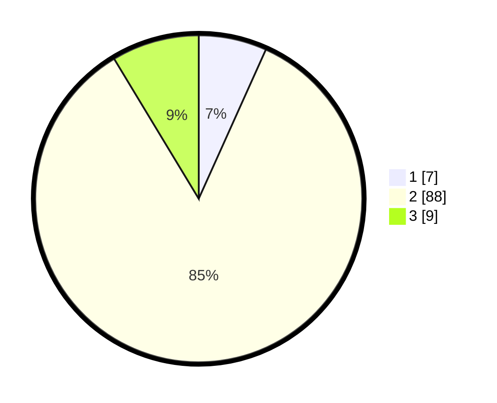

# Hasil

## Grafik

## Tabel

| No. | Nama Paslon    | Suara | Suara (raw) | Persentase |
|:--- |:-------------- | -----:| -----------:| ----------:|
| 1   | ANIES MUHAIMIN | 7     | [7][p-1]    | 6,73       |
| 2   | PRABOWO GIBRAN | 88    | [88][p-2]   | 84,62      |
| 3   | GANJAR MAHFUD  | 9     | [9][p-3]    | 8,65       |

[p-1]: https://github.com/gigit-pemilu/pemilu-2024-62-kalimantan-tengah/blob/main/pilpres/hitung-suara/sub/62-kalimantan-tengah/sub/03-kapuas/sub/07-kapuas-murung/sub/2018-palingkau-sejahtera/sub/003-tps/sub/paslon-1.txt
[p-2]: https://github.com/gigit-pemilu/pemilu-2024-62-kalimantan-tengah/blob/main/pilpres/hitung-suara/sub/62-kalimantan-tengah/sub/03-kapuas/sub/07-kapuas-murung/sub/2018-palingkau-sejahtera/sub/003-tps/sub/paslon-2.txt
[p-3]: https://github.com/gigit-pemilu/pemilu-2024-62-kalimantan-tengah/blob/main/pilpres/hitung-suara/sub/62-kalimantan-tengah/sub/03-kapuas/sub/07-kapuas-murung/sub/2018-palingkau-sejahtera/sub/003-tps/sub/paslon-3.txt

## Foto C Plano

https://sirekap-obj-formc.kpu.go.id/5177/pemilu/ppwp/62/03/07/20/18/6203072018003-20240214-162236--155c5918-244a-4f1d-9807-769f827f87a2.jpg

https://sirekap-obj-formc.kpu.go.id/5177/pemilu/ppwp/62/03/07/20/18/6203072018003-20240214-160122--df951aba-0443-4eab-a676-39c3b631755c.jpg

https://sirekap-obj-formc.kpu.go.id/5177/pemilu/ppwp/62/03/07/20/18/6203072018003-20240214-184854--99551d7c-d39c-42cd-8e99-d98e2ef035b8.jpg

## Metadata

| Key        | Value               |
| ---------- | ------------------- |
| Time Stamp | 2024-02-15 22:00:27 |

