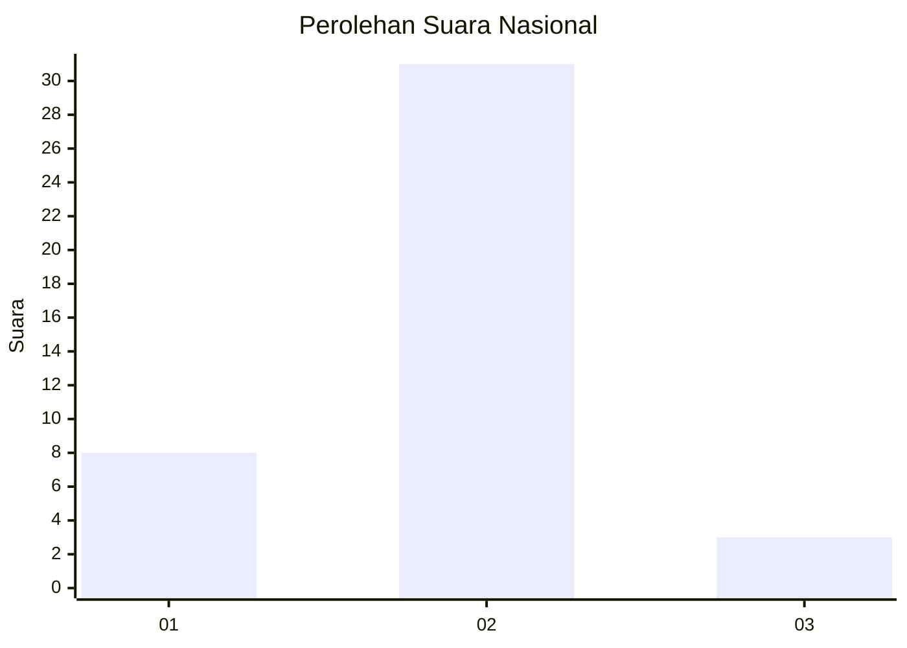
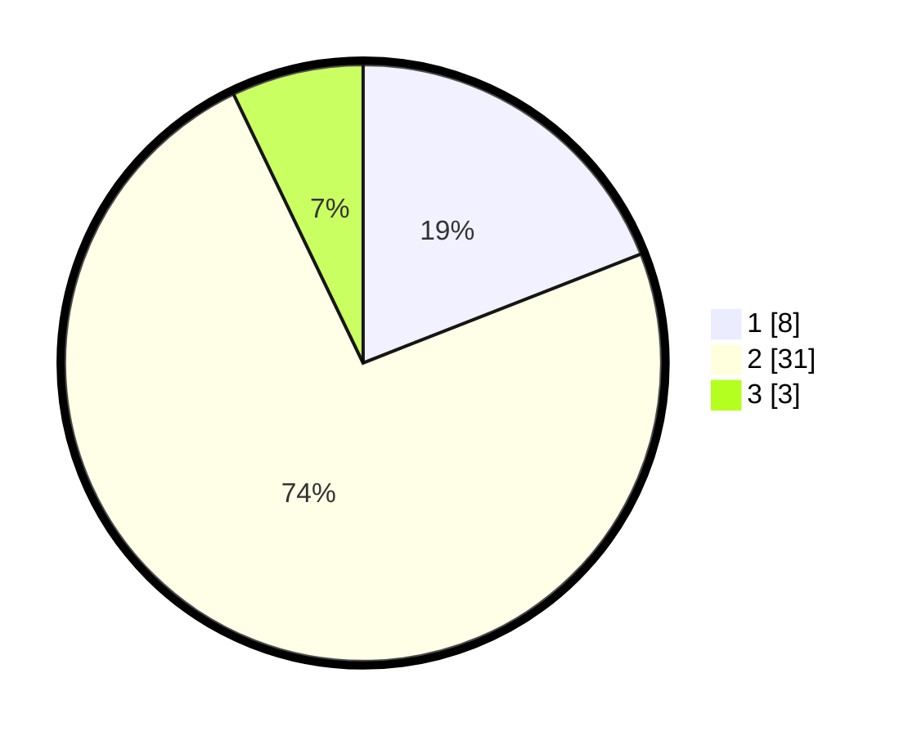

# Hasil

## Grafik

## Tabel

| No. | Nama Paslon    | Suara | Suara (raw) | Persentase |
|:--- |:-------------- | -----:| -----------:| ----------:|
| 1   | ANIES MUHAIMIN | 8     | [8][p-1]    | 19,05      |
| 2   | PRABOWO GIBRAN | 31    | [31][p-2]   | 73,81      |
| 3   | GANJAR MAHFUD  | 3     | [3][p-3]    | 7,14       |

[p-1]: https://github.com/gigit-pemilu/pemilu-2024/blob/main/pilpres/hitung-suara/sub/62-kalimantan-tengah/sub/03-kapuas/sub/07-kapuas-murung/sub/2023-bina-karya/sub/002-tps/sub/paslon-1.txt
[p-2]: https://github.com/gigit-pemilu/pemilu-2024/blob/main/pilpres/hitung-suara/sub/62-kalimantan-tengah/sub/03-kapuas/sub/07-kapuas-murung/sub/2023-bina-karya/sub/002-tps/sub/paslon-2.txt
[p-3]: https://github.com/gigit-pemilu/pemilu-2024/blob/main/pilpres/hitung-suara/sub/62-kalimantan-tengah/sub/03-kapuas/sub/07-kapuas-murung/sub/2023-bina-karya/sub/002-tps/sub/paslon-3.txt

## Foto C Plano

https://sirekap-obj-formc.kpu.go.id/c59e/pemilu/ppwp/62/03/07/20/23/6203072023002-20240214-204544--a045ee49-266d-428d-b318-3bd2517c5ce5.jpg

https://sirekap-obj-formc.kpu.go.id/c59e/pemilu/ppwp/62/03/07/20/23/6203072023002-20240215-031033--4cd98a7f-7f8b-438d-8fd0-120905ff6b2e.jpg

https://sirekap-obj-formc.kpu.go.id/c59e/pemilu/ppwp/62/03/07/20/23/6203072023002-20240215-031039--0730bb97-20c7-4e8b-8413-14852308ab7c.jpg

## Metadata

| Key        | Value               |
| ---------- | ------------------- |
| Time Stamp | 2024-02-15 17:00:25 |

## DATA PEMILIH TETAP

Jumlah pemilih dalam DPT: **214**.
 * L: **108**.
 * P: **106**.

## DATA PENGGUNA HAK PILIH

Jumlah pengguna hak pilih dalam DPT: **35**.
 * L: **722**.
 * P: **13**.

Jumlah pengguna hak pilih dalam DPTb: **8**.
 * L: **6**.
 * P: **402**.

Jumlah pengguna hak pilih dalam DPK: **0**.
 * L: **720**.
 * P: **0**.

Jumlah pengguna hak pilih: **43**.
 * L: **22**.
 * P: **15**.

## JUMLAH SUARA SAH DAN TIDAK SAH

JUMLAH SELURUH SUARA SAH: **42**.

JUMLAH SUARA TIDAK SAH: **1**.

JUMLAH SELURUH SUARA SAH DAN SUARA TIDAK SAH: **43**.

