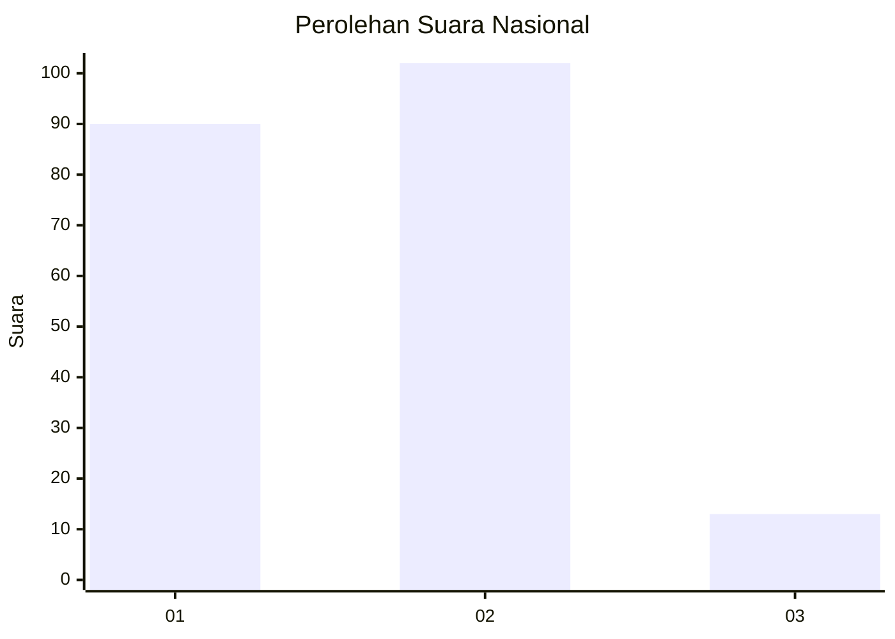
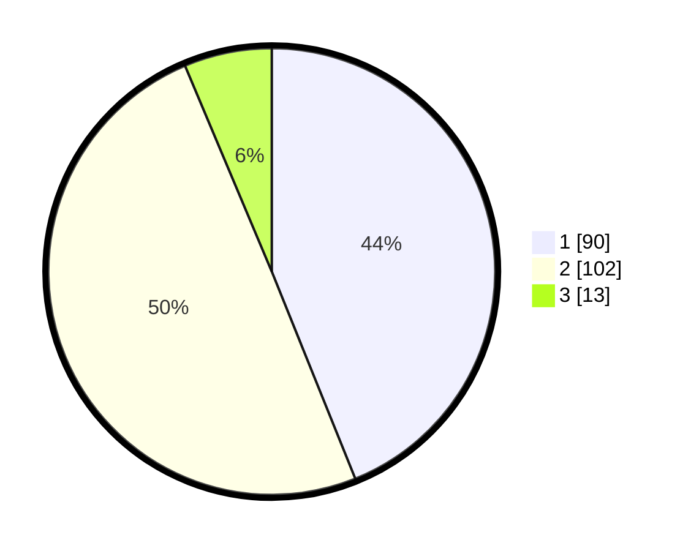

# Hasil

## Grafik

## Tabel

| No. | Nama Paslon    | Suara | Suara (raw) | Persentase |
|:--- |:-------------- | -----:| -----------:| ----------:|
| 1   | ANIES MUHAIMIN | 90    | [90][p-1]   | 43,90      |
| 2   | PRABOWO GIBRAN | 102   | [102][p-2]  | 49,76      |
| 3   | GANJAR MAHFUD  | 13    | [13][p-3]   | 6,34       |

[p-1]: https://github.com/gigit-pemilu/pemilu-2024/blob/main/pilpres/hitung-suara/sub/62-kalimantan-tengah/sub/03-kapuas/sub/08-basarang/sub/2001-pangkalan-rekan/sub/003-tps/sub/paslon-1.txt
[p-2]: https://github.com/gigit-pemilu/pemilu-2024/blob/main/pilpres/hitung-suara/sub/62-kalimantan-tengah/sub/03-kapuas/sub/08-basarang/sub/2001-pangkalan-rekan/sub/003-tps/sub/paslon-2.txt
[p-3]: https://github.com/gigit-pemilu/pemilu-2024/blob/main/pilpres/hitung-suara/sub/62-kalimantan-tengah/sub/03-kapuas/sub/08-basarang/sub/2001-pangkalan-rekan/sub/003-tps/sub/paslon-3.txt

## Foto C Plano

https://sirekap-obj-formc.kpu.go.id/c994/pemilu/ppwp/62/03/08/20/01/6203082001003-20240214-221347--bf4dd52e-3af6-48ca-9dbf-c1925aae421e.jpg

https://sirekap-obj-formc.kpu.go.id/c994/pemilu/ppwp/62/03/08/20/01/6203082001003-20240214-223048--92e13997-1603-4861-8aa8-1d3b46bfdb71.jpg

https://sirekap-obj-formc.kpu.go.id/c994/pemilu/ppwp/62/03/08/20/01/6203082001003-20240214-224421--27433253-93d3-4e0e-8e66-24a2e94e9fc8.jpg

## Metadata

| Key        | Value               |
| ---------- | ------------------- |
| Time Stamp | 2024-02-15 15:00:29 |

