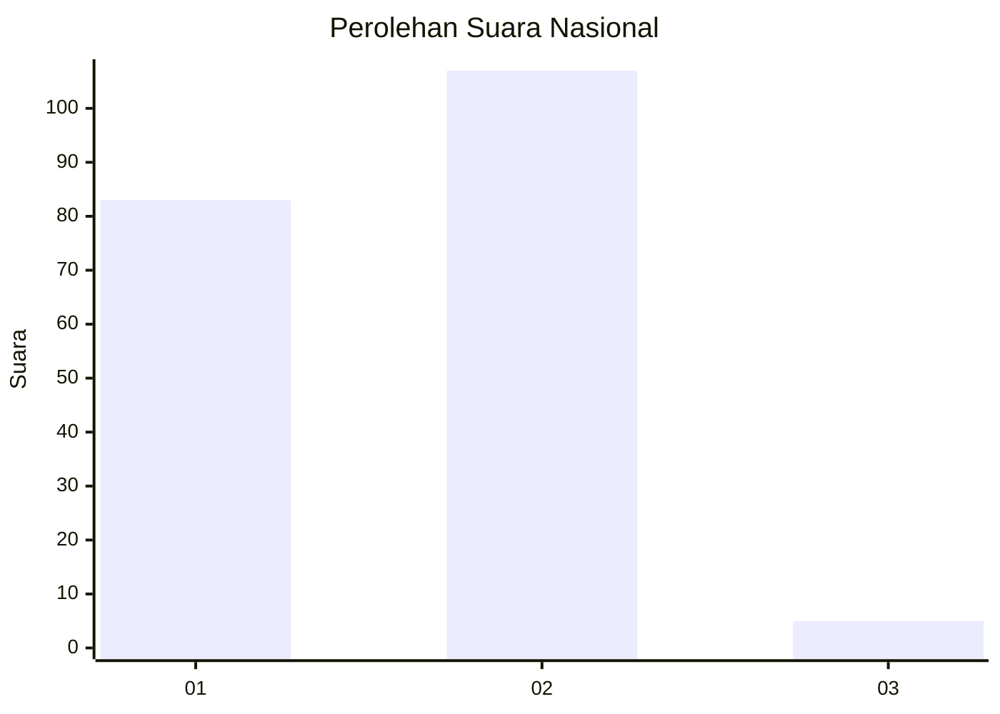
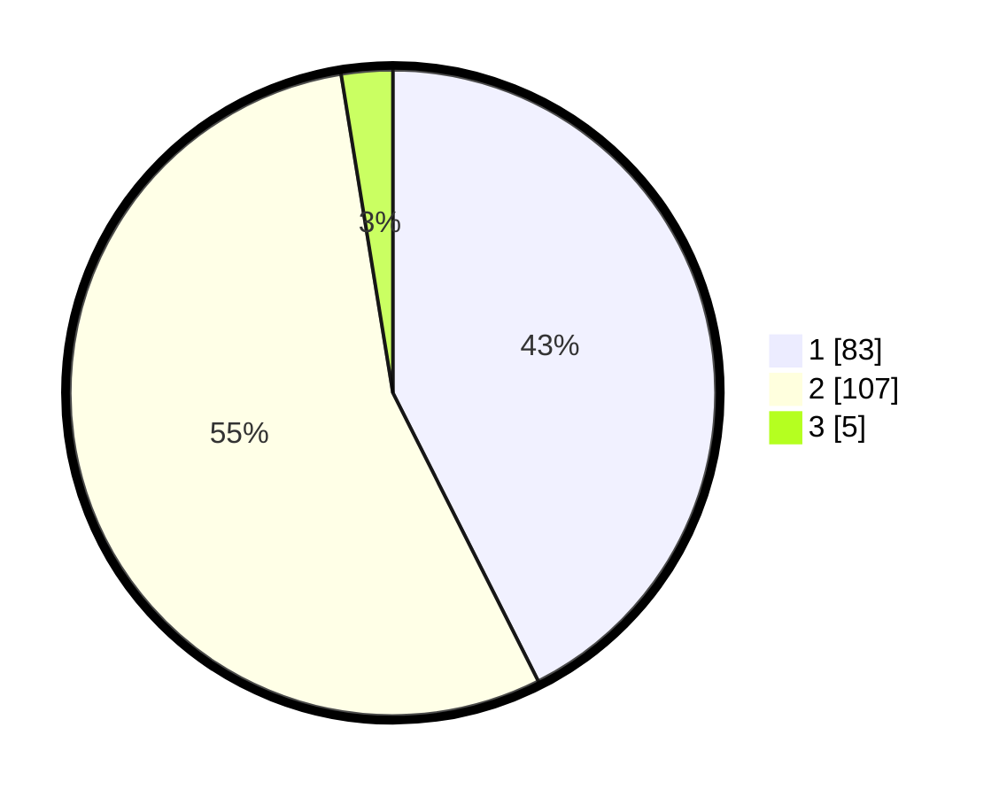

# Hasil

## Grafik

## Tabel

| No. | Nama Paslon    | Suara | Suara (raw) | Persentase |
|:--- |:-------------- | -----:| -----------:| ----------:|
| 1   | ANIES MUHAIMIN | 83    | [83][p-1]   | 42,56      |
| 2   | PRABOWO GIBRAN | 107   | [107][p-2]  | 54,87      |
| 3   | GANJAR MAHFUD  | 5     | [5][p-3]    | 2,56       |

[p-1]: https://github.com/gigit-pemilu/pemilu-2024/blob/main/pilpres/hitung-suara/sub/62-kalimantan-tengah/sub/03-kapuas/sub/08-basarang/sub/2001-pangkalan-rekan/sub/004-tps/sub/paslon-1.txt
[p-2]: https://github.com/gigit-pemilu/pemilu-2024/blob/main/pilpres/hitung-suara/sub/62-kalimantan-tengah/sub/03-kapuas/sub/08-basarang/sub/2001-pangkalan-rekan/sub/004-tps/sub/paslon-2.txt
[p-3]: https://github.com/gigit-pemilu/pemilu-2024/blob/main/pilpres/hitung-suara/sub/62-kalimantan-tengah/sub/03-kapuas/sub/08-basarang/sub/2001-pangkalan-rekan/sub/004-tps/sub/paslon-3.txt

## Foto C Plano

https://sirekap-obj-formc.kpu.go.id/6118/pemilu/ppwp/62/03/08/20/01/6203082001004-20240214-220403--78bb9699-1894-4437-a682-1a61be2b5f58.jpg

https://sirekap-obj-formc.kpu.go.id/6118/pemilu/ppwp/62/03/08/20/01/6203082001004-20240214-221059--0cc371e9-b7f5-4398-b817-062b3a63bc65.jpg

https://sirekap-obj-formc.kpu.go.id/6118/pemilu/ppwp/62/03/08/20/01/6203082001004-20240214-221228--fd87449f-0600-4c6e-bc23-3c50117d86cc.jpg

## Metadata

| Key        | Value               |
| ---------- | ------------------- |
| Time Stamp | 2024-02-15 21:01:18 |

