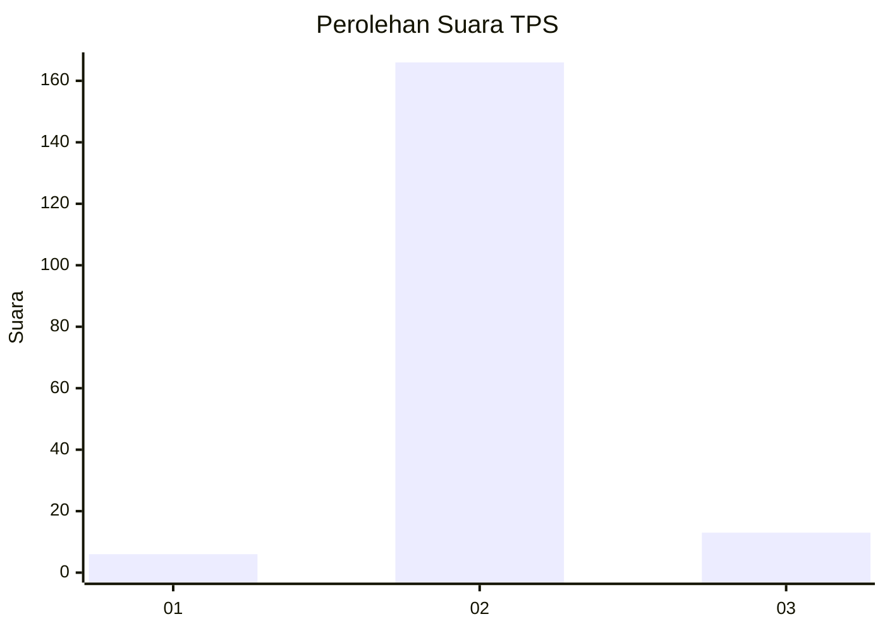
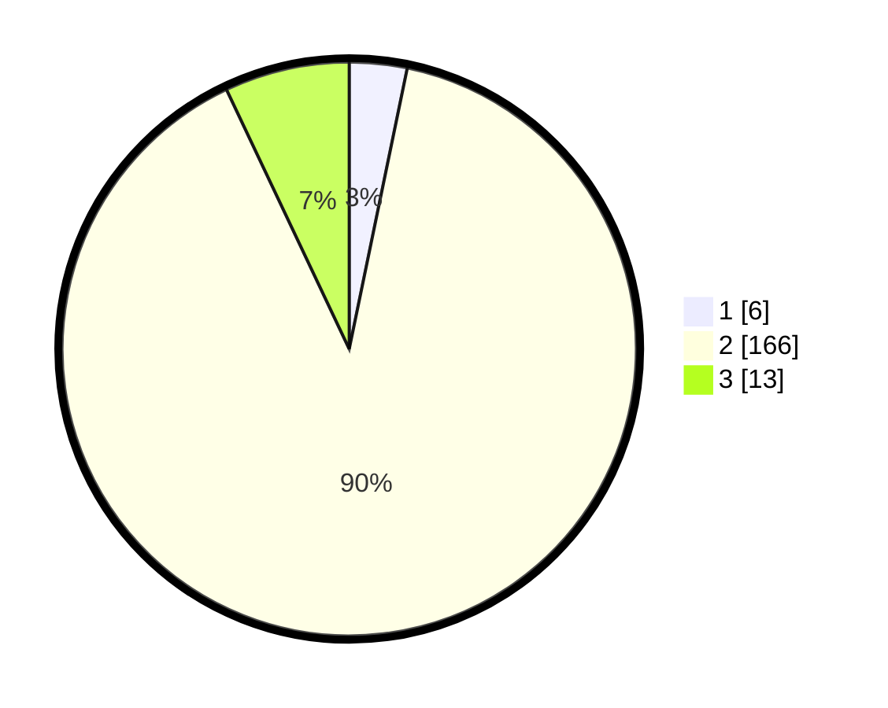

# Hasil

## Grafik

## Tabel

| No. | Nama Paslon    | Suara | Suara (raw) | Persentase |
|:--- |:-------------- | -----:| -----------:| ----------:|
| 1   | ANIES MUHAIMIN | 6     | [6][p-1]    | 3,24       |
| 2   | PRABOWO GIBRAN | 166   | [166][p-2]  | 89,73      |
| 3   | GANJAR MAHFUD  | 13    | [13][p-3]   | 7,03       |

[p-1]: https://github.com/gigit-pemilu/pemilu-2024-62-kalimantan-tengah/blob/main/pilpres/hitung-suara/sub/62-kalimantan-tengah/sub/03-kapuas/sub/08-basarang/sub/2007-lunuk-ramba/sub/002-tps/sub/paslon-1.txt
[p-2]: https://github.com/gigit-pemilu/pemilu-2024-62-kalimantan-tengah/blob/main/pilpres/hitung-suara/sub/62-kalimantan-tengah/sub/03-kapuas/sub/08-basarang/sub/2007-lunuk-ramba/sub/002-tps/sub/paslon-2.txt
[p-3]: https://github.com/gigit-pemilu/pemilu-2024-62-kalimantan-tengah/blob/main/pilpres/hitung-suara/sub/62-kalimantan-tengah/sub/03-kapuas/sub/08-basarang/sub/2007-lunuk-ramba/sub/002-tps/sub/paslon-3.txt

## Foto C Plano

https://sirekap-obj-formc.kpu.go.id/c217/pemilu/ppwp/62/03/08/20/07/6203082007002-20240214-205940--8a8a18a9-1cb4-46d2-ade7-7bba9951cf0a.jpg

https://sirekap-obj-formc.kpu.go.id/c217/pemilu/ppwp/62/03/08/20/07/6203082007002-20240214-205947--8d0bebb3-bf49-4983-ba5d-cb8615047592.jpg

https://sirekap-obj-formc.kpu.go.id/c217/pemilu/ppwp/62/03/08/20/07/6203082007002-20240214-205953--42424437-3072-4716-bd09-4068c9b8405b.jpg

## Metadata

| Key        | Value               |
| ---------- | ------------------- |
| Time Stamp | 2024-02-15 21:30:27 |

