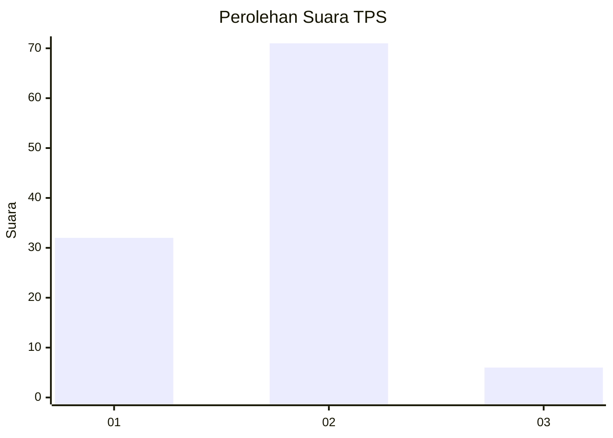
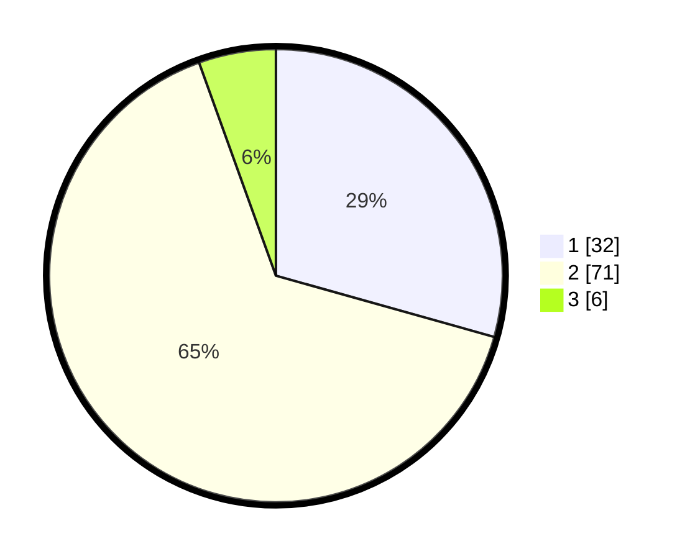

# Hasil

## Grafik

## Tabel

| No. | Nama Paslon    | Suara | Suara (raw) | Persentase |
|:--- |:-------------- | -----:| -----------:| ----------:|
| 1   | ANIES MUHAIMIN | 32    | [32][p-1]   | 29,36      |
| 2   | PRABOWO GIBRAN | 71    | [71][p-2]   | 65,14      |
| 3   | GANJAR MAHFUD  | 6     | [6][p-3]    | 5,50       |

[p-1]: https://github.com/gigit-pemilu/pemilu-2024-62-kalimantan-tengah/blob/main/pilpres/hitung-suara/sub/62-kalimantan-tengah/sub/03-kapuas/sub/08-basarang/sub/2014-naning/sub/002-tps/sub/paslon-1.txt
[p-2]: https://github.com/gigit-pemilu/pemilu-2024-62-kalimantan-tengah/blob/main/pilpres/hitung-suara/sub/62-kalimantan-tengah/sub/03-kapuas/sub/08-basarang/sub/2014-naning/sub/002-tps/sub/paslon-2.txt
[p-3]: https://github.com/gigit-pemilu/pemilu-2024-62-kalimantan-tengah/blob/main/pilpres/hitung-suara/sub/62-kalimantan-tengah/sub/03-kapuas/sub/08-basarang/sub/2014-naning/sub/002-tps/sub/paslon-3.txt

## Foto C Plano

https://sirekap-obj-formc.kpu.go.id/8f98/pemilu/ppwp/62/03/08/20/14/6203082014002-20240214-194655--37fcc823-8201-488d-9456-de14c6f05336.jpg

https://sirekap-obj-formc.kpu.go.id/8f98/pemilu/ppwp/62/03/08/20/14/6203082014002-20240214-194718--5771ea7e-3cc0-4e32-8b0f-ac3ef3f56569.jpg

https://sirekap-obj-formc.kpu.go.id/8f98/pemilu/ppwp/62/03/08/20/14/6203082014002-20240214-194740--910bf34f-1fdc-469d-8ba9-a5487f023765.jpg

## Metadata

| Key        | Value               |
| ---------- | ------------------- |
| Time Stamp | 2024-02-15 17:00:25 |

