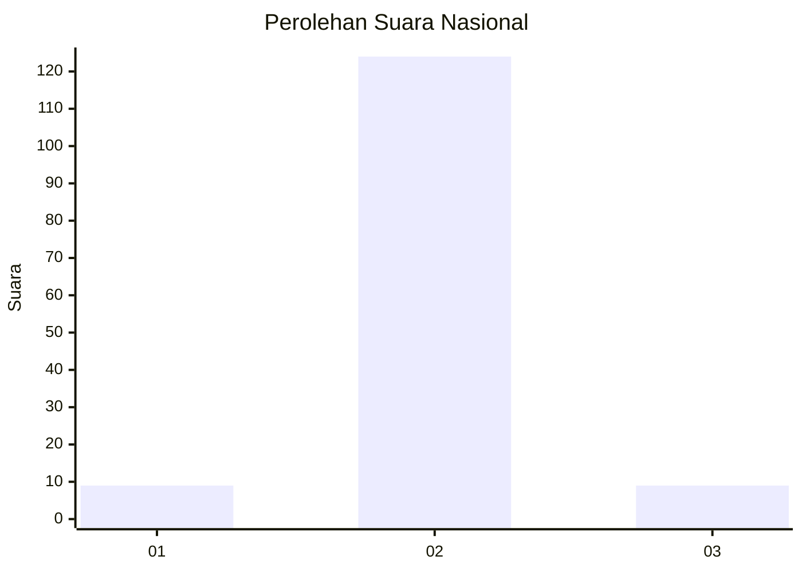
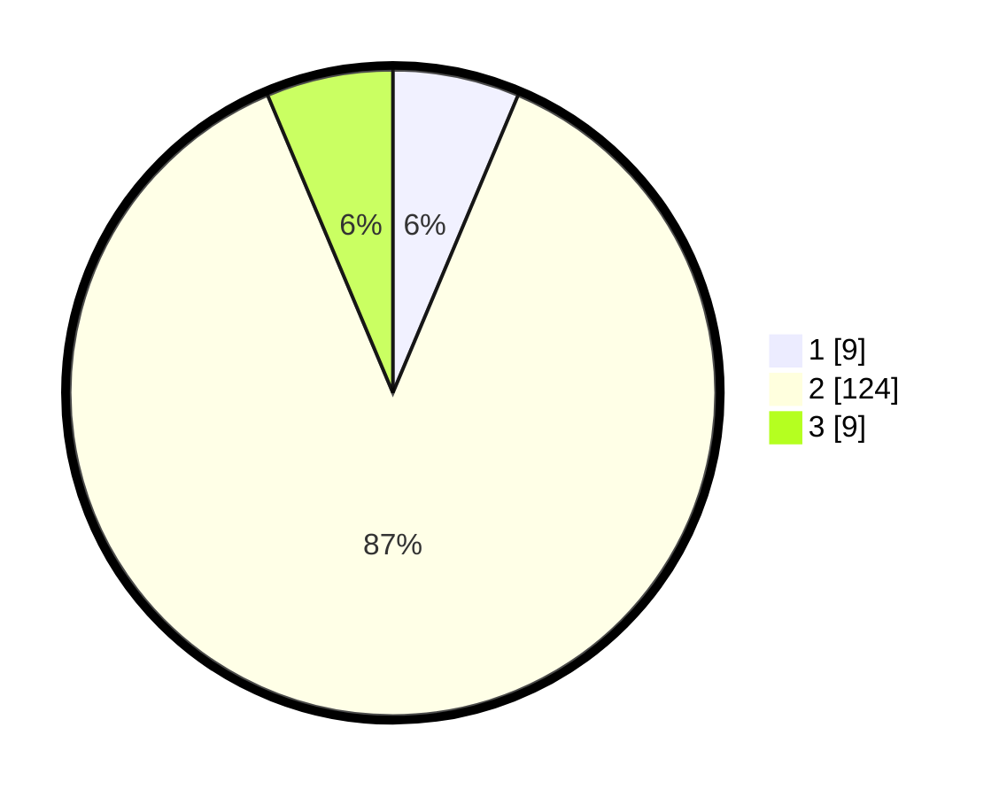

# Hasil

## Grafik

## Tabel

| No. | Nama Paslon    | Suara | Suara (raw) | Persentase |
|:--- |:-------------- | -----:| -----------:| ----------:|
| 1   | ANIES MUHAIMIN | 9     | [9][p-1]    | 6,34       |
| 2   | PRABOWO GIBRAN | 124   | [124][p-2]  | 87,32      |
| 3   | GANJAR MAHFUD  | 9     | [9][p-3]    | 6,34       |

[p-1]: https://github.com/gigit-pemilu/pemilu-2024/blob/main/pilpres/hitung-suara/sub/62-kalimantan-tengah/sub/03-kapuas/sub/09-mantangai/sub/2002-sei-kapar/sub/003-tps/sub/paslon-1.txt
[p-2]: https://github.com/gigit-pemilu/pemilu-2024/blob/main/pilpres/hitung-suara/sub/62-kalimantan-tengah/sub/03-kapuas/sub/09-mantangai/sub/2002-sei-kapar/sub/003-tps/sub/paslon-2.txt
[p-3]: https://github.com/gigit-pemilu/pemilu-2024/blob/main/pilpres/hitung-suara/sub/62-kalimantan-tengah/sub/03-kapuas/sub/09-mantangai/sub/2002-sei-kapar/sub/003-tps/sub/paslon-3.txt

## Foto C Plano

https://sirekap-obj-formc.kpu.go.id/0c01/pemilu/ppwp/62/03/09/20/02/6203092002003-20240215-070333--e0c33fa5-752c-484a-82a2-3fe31f1fe907.jpg

https://sirekap-obj-formc.kpu.go.id/0c01/pemilu/ppwp/62/03/09/20/02/6203092002003-20240215-070858--db023a76-4b68-48d0-9016-60e17d0b3c9b.jpg

https://sirekap-obj-formc.kpu.go.id/0c01/pemilu/ppwp/62/03/09/20/02/6203092002003-20240215-070913--9c244d35-c6ea-4d13-b61a-500719dddd27.jpg

## Metadata

| Key        | Value               |
| ---------- | ------------------- |
| Time Stamp | 2024-02-15 22:40:13 |

