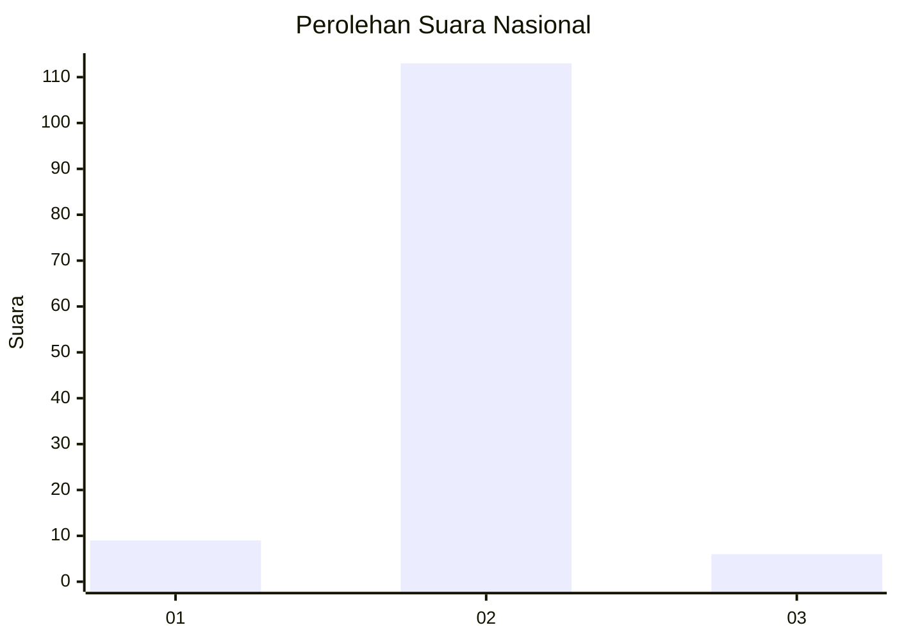
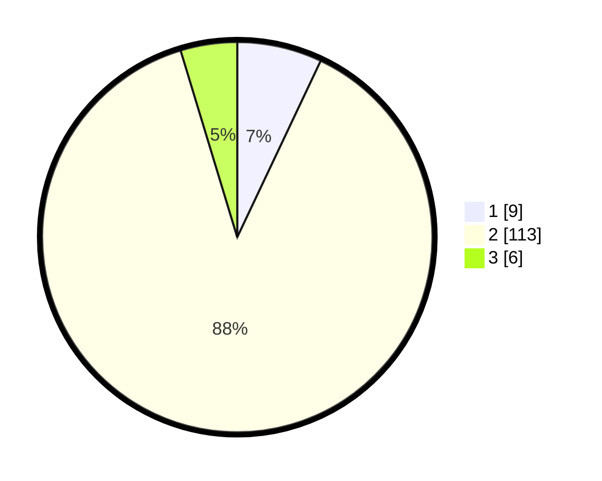

# Hasil

## Grafik

## Tabel

| No. | Nama Paslon    | Suara | Suara (raw) | Persentase |
|:--- |:-------------- | -----:| -----------:| ----------:|
| 1   | ANIES MUHAIMIN | 9     | [9][p-1]    | 7,03       |
| 2   | PRABOWO GIBRAN | 113   | [113][p-2]  | 88,28      |
| 3   | GANJAR MAHFUD  | 6     | [6][p-3]    | 4,69       |

[p-1]: https://github.com/gigit-pemilu/pemilu-2024/blob/main/pilpres/hitung-suara/sub/62-kalimantan-tengah/sub/03-kapuas/sub/09-mantangai/sub/2006-mantangai-hilir/sub/002-tps/sub/paslon-1.txt
[p-2]: https://github.com/gigit-pemilu/pemilu-2024/blob/main/pilpres/hitung-suara/sub/62-kalimantan-tengah/sub/03-kapuas/sub/09-mantangai/sub/2006-mantangai-hilir/sub/002-tps/sub/paslon-2.txt
[p-3]: https://github.com/gigit-pemilu/pemilu-2024/blob/main/pilpres/hitung-suara/sub/62-kalimantan-tengah/sub/03-kapuas/sub/09-mantangai/sub/2006-mantangai-hilir/sub/002-tps/sub/paslon-3.txt

## Foto C Plano

https://sirekap-obj-formc.kpu.go.id/a239/pemilu/ppwp/62/03/09/20/06/6203092006002-20240215-031109--ec804cb4-a85f-4d16-b2f0-ed8e9e2ba2f5.jpg

https://sirekap-obj-formc.kpu.go.id/a239/pemilu/ppwp/62/03/09/20/06/6203092006002-20240215-031506--5d474889-3c6e-4036-84dc-f4e2dd08794c.jpg

https://sirekap-obj-formc.kpu.go.id/a239/pemilu/ppwp/62/03/09/20/06/6203092006002-20240215-033007--7da4450b-b672-4d05-b40d-24a914f361a6.jpg

## Metadata

| Key        | Value               |
| ---------- | ------------------- |
| Time Stamp | 2024-02-15 20:30:46 |

