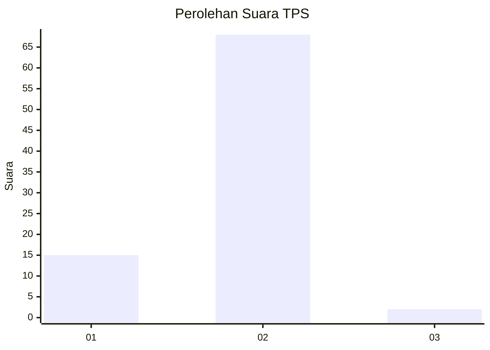
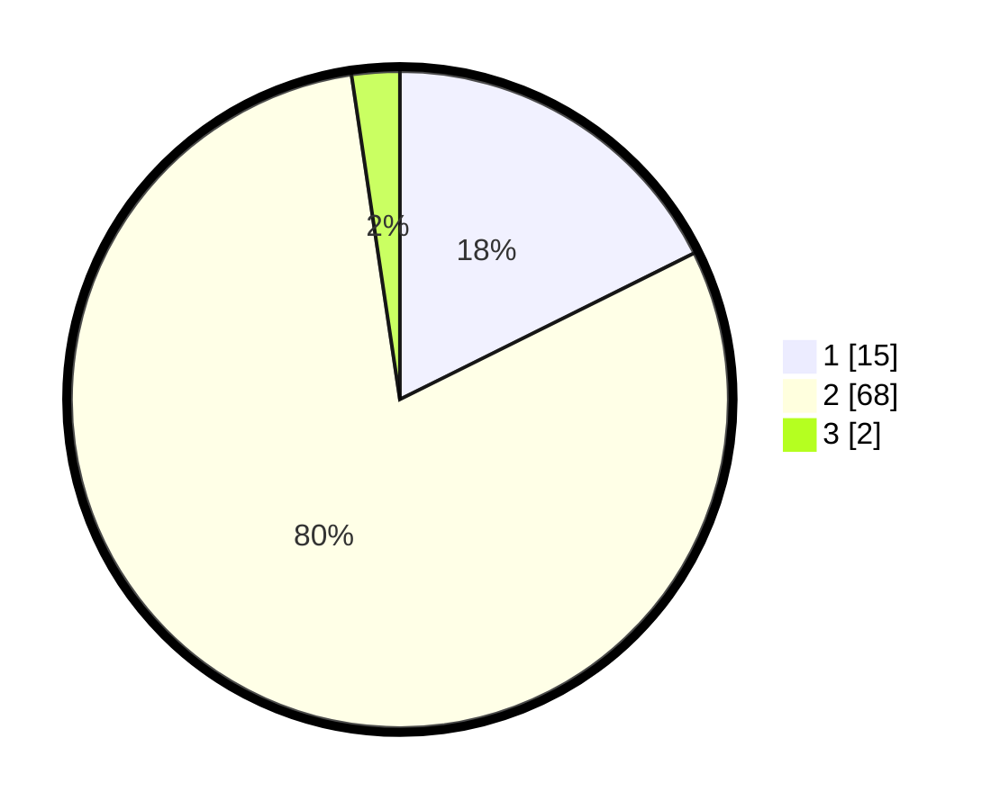

# Hasil

## Grafik

## Tabel

| No. | Nama Paslon    | Suara | Suara (raw) | Persentase |
|:--- |:-------------- | -----:| -----------:| ----------:|
| 1   | ANIES MUHAIMIN | 15    | [15][p-1]   | 17,65      |
| 2   | PRABOWO GIBRAN | 68    | [68][p-2]   | 80,00      |
| 3   | GANJAR MAHFUD  | 2     | [2][p-3]    | 2,35       |

[p-1]: https://github.com/gigit-pemilu/pemilu-2024-62-kalimantan-tengah/blob/main/pilpres/hitung-suara/sub/62-kalimantan-tengah/sub/03-kapuas/sub/09-mantangai/sub/2014-danau-rawah/sub/009-tps/sub/paslon-1.txt
[p-2]: https://github.com/gigit-pemilu/pemilu-2024-62-kalimantan-tengah/blob/main/pilpres/hitung-suara/sub/62-kalimantan-tengah/sub/03-kapuas/sub/09-mantangai/sub/2014-danau-rawah/sub/009-tps/sub/paslon-2.txt
[p-3]: https://github.com/gigit-pemilu/pemilu-2024-62-kalimantan-tengah/blob/main/pilpres/hitung-suara/sub/62-kalimantan-tengah/sub/03-kapuas/sub/09-mantangai/sub/2014-danau-rawah/sub/009-tps/sub/paslon-3.txt

## Foto C Plano

https://sirekap-obj-formc.kpu.go.id/a850/pemilu/ppwp/62/03/09/20/14/6203092014009-20240215-132615--bea5200a-bfda-431e-b4b1-4a6f732e5398.jpg

https://sirekap-obj-formc.kpu.go.id/a850/pemilu/ppwp/62/03/09/20/14/6203092014009-20240215-132705--fd606b44-426f-4c3d-83a7-fa012db02fa5.jpg

https://sirekap-obj-formc.kpu.go.id/a850/pemilu/ppwp/62/03/09/20/14/6203092014009-20240215-132759--3df3a45f-a37a-4d1f-8679-af1f2b0dbcf7.jpg

## Metadata

| Key        | Value               |
| ---------- | ------------------- |
| Time Stamp | 2024-02-15 23:29:50 |

