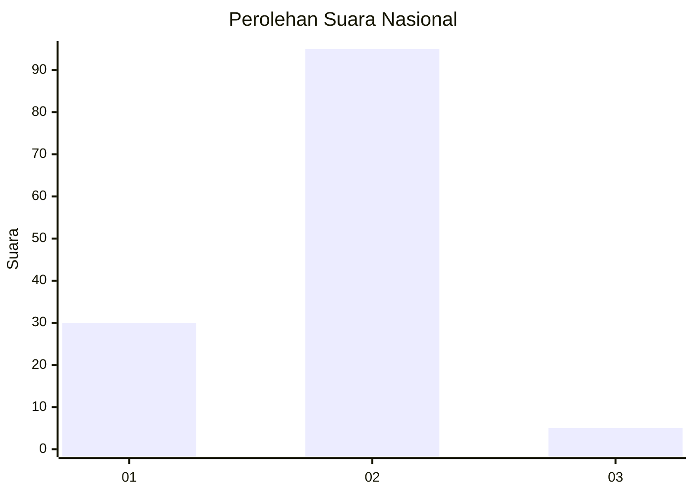

# Hasil

## Grafik

## Tabel

| No. | Nama Paslon    | Suara | Suara (raw) | Persentase |
|:--- |:-------------- | -----:| -----------:| ----------:|
| 1   | ANIES MUHAIMIN | 30    | [30][p-1]   | 23,08      |
| 2   | PRABOWO GIBRAN | 95    | [95][p-2]   | 73,08      |
| 3   | GANJAR MAHFUD  | 5     | [5][p-3]    | 3,85       |

[p-1]: https://github.com/gigit-pemilu/pemilu-2024/blob/main/pilpres/hitung-suara/sub/62-kalimantan-tengah/sub/03-kapuas/sub/09-mantangai/sub/2016-katimpun/sub/002-tps/sub/paslon-1.txt
[p-2]: https://github.com/gigit-pemilu/pemilu-2024/blob/main/pilpres/hitung-suara/sub/62-kalimantan-tengah/sub/03-kapuas/sub/09-mantangai/sub/2016-katimpun/sub/002-tps/sub/paslon-2.txt
[p-3]: https://github.com/gigit-pemilu/pemilu-2024/blob/main/pilpres/hitung-suara/sub/62-kalimantan-tengah/sub/03-kapuas/sub/09-mantangai/sub/2016-katimpun/sub/002-tps/sub/paslon-3.txt

## Foto C Plano

https://sirekap-obj-formc.kpu.go.id/7274/pemilu/ppwp/62/03/09/20/16/6203092016002-20240215-190418--f2754c54-1231-4ce1-9367-f0e14665a9f6.jpg

https://sirekap-obj-formc.kpu.go.id/7274/pemilu/ppwp/62/03/09/20/16/6203092016002-20240216-131140--35b39733-cfd4-4251-bc9c-b2367b17ddd8.jpg

https://sirekap-obj-formc.kpu.go.id/7274/pemilu/ppwp/62/03/09/20/16/6203092016002-20240216-130714--c64bfc76-1139-44e3-9c6b-b2d5c6ca86d3.jpg

## Metadata

| Key        | Value               |
| ---------- | ------------------- |
| Time Stamp | 2024-02-16 21:01:00 |

