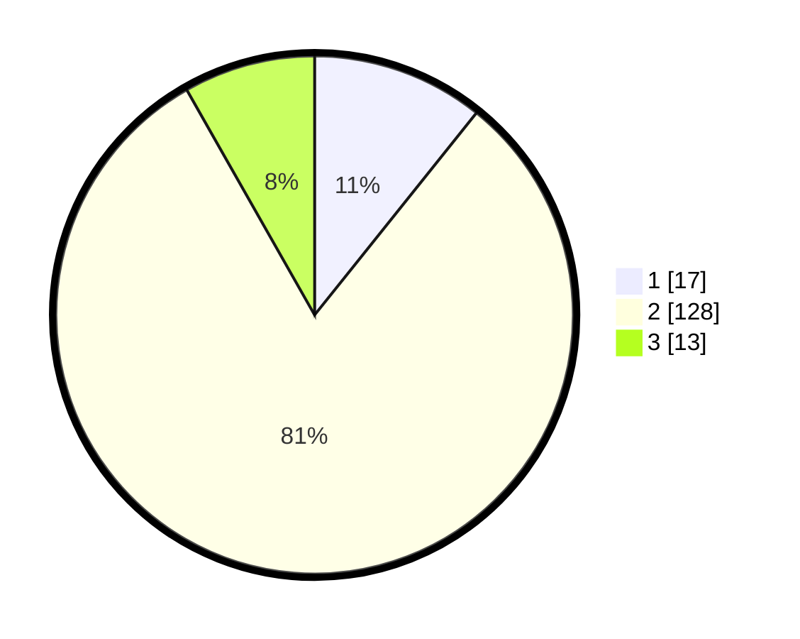

# Hasil

## Grafik

## Tabel

| No. | Nama Paslon    | Suara | Suara (raw) | Persentase |
|:--- |:-------------- | -----:| -----------:| ----------:|
| 1   | ANIES MUHAIMIN | 17    | [17][p-1]   | 10,76      |
| 2   | PRABOWO GIBRAN | 128   | [128][p-2]  | 81,01      |
| 3   | GANJAR MAHFUD  | 13    | [13][p-3]   | 8,23       |

[p-1]: https://github.com/gigit-pemilu/pemilu-2024-62-kalimantan-tengah/blob/main/pilpres/hitung-suara/sub/62-kalimantan-tengah/sub/03-kapuas/sub/10-timpah/sub/2003-lawang-kajang/sub/003-tps/sub/paslon-1.txt
[p-2]: https://github.com/gigit-pemilu/pemilu-2024-62-kalimantan-tengah/blob/main/pilpres/hitung-suara/sub/62-kalimantan-tengah/sub/03-kapuas/sub/10-timpah/sub/2003-lawang-kajang/sub/003-tps/sub/paslon-2.txt
[p-3]: https://github.com/gigit-pemilu/pemilu-2024-62-kalimantan-tengah/blob/main/pilpres/hitung-suara/sub/62-kalimantan-tengah/sub/03-kapuas/sub/10-timpah/sub/2003-lawang-kajang/sub/003-tps/sub/paslon-3.txt

## Foto C Plano

https://sirekap-obj-formc.kpu.go.id/8031/pemilu/ppwp/62/03/10/20/03/6203102003003-20240215-103352--03226fc0-4656-45a8-bb33-6adebe5d0d92.jpg

https://sirekap-obj-formc.kpu.go.id/8031/pemilu/ppwp/62/03/10/20/03/6203102003003-20240215-103459--2b54a4f0-9856-4f14-a97c-b1b4f7e2112c.jpg

https://sirekap-obj-formc.kpu.go.id/8031/pemilu/ppwp/62/03/10/20/03/6203102003003-20240215-103555--cc42bc24-e217-4738-b04b-ed3b433e2ad6.jpg

## Metadata

| Key        | Value               |
| ---------- | ------------------- |
| Time Stamp | 2024-02-15 21:01:18 |

