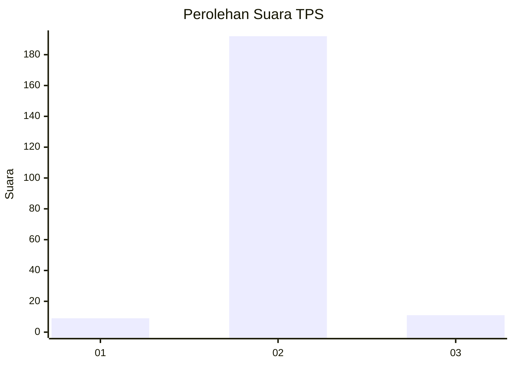
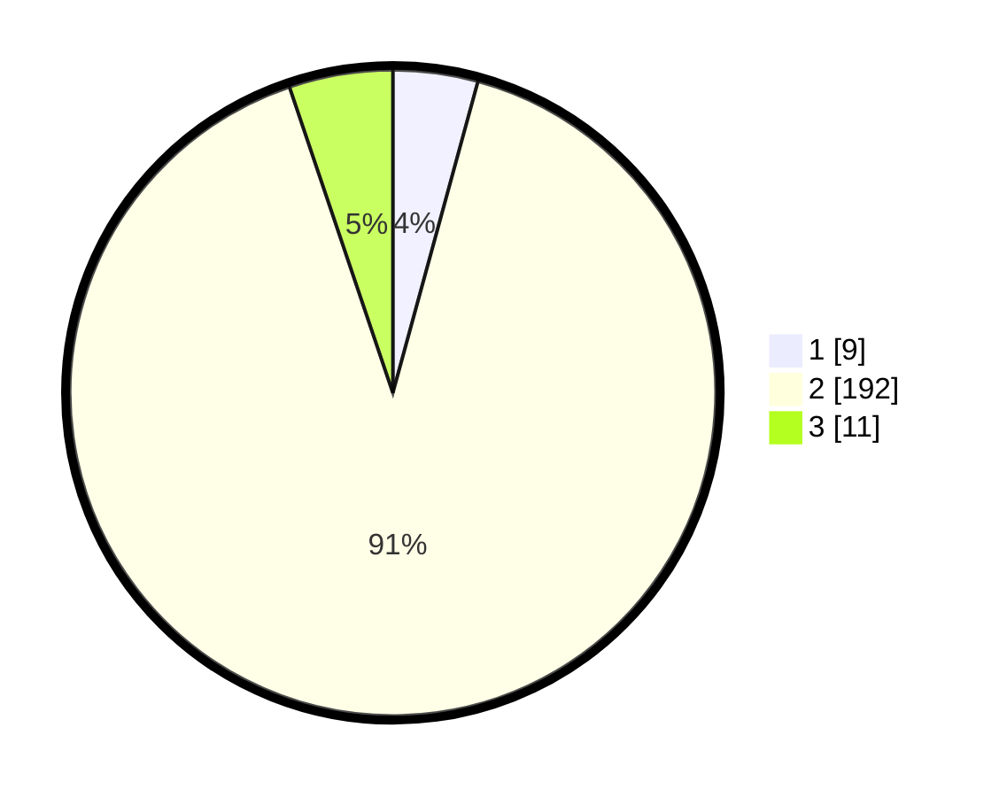

# Hasil

## Grafik

## Tabel

| No. | Nama Paslon    | Suara | Suara (raw) | Persentase |
|:--- |:-------------- | -----:| -----------:| ----------:|
| 1   | ANIES MUHAIMIN | 9     | [9][p-1]    | 4,25       |
| 2   | PRABOWO GIBRAN | 192   | [192][p-2]  | 90,57      |
| 3   | GANJAR MAHFUD  | 11    | [11][p-3]   | 5,19       |

[p-1]: https://github.com/gigit-pemilu/pemilu-2024-62-kalimantan-tengah/blob/main/pilpres/hitung-suara/sub/62-kalimantan-tengah/sub/03-kapuas/sub/10-timpah/sub/2006-lawang-kamah/sub/003-tps/sub/paslon-1.txt
[p-2]: https://github.com/gigit-pemilu/pemilu-2024-62-kalimantan-tengah/blob/main/pilpres/hitung-suara/sub/62-kalimantan-tengah/sub/03-kapuas/sub/10-timpah/sub/2006-lawang-kamah/sub/003-tps/sub/paslon-2.txt
[p-3]: https://github.com/gigit-pemilu/pemilu-2024-62-kalimantan-tengah/blob/main/pilpres/hitung-suara/sub/62-kalimantan-tengah/sub/03-kapuas/sub/10-timpah/sub/2006-lawang-kamah/sub/003-tps/sub/paslon-3.txt

## Foto C Plano

https://sirekap-obj-formc.kpu.go.id/8a9e/pemilu/ppwp/62/03/10/20/06/6203102006003-20240215-081953--44ddac22-3da7-40f6-b6f8-ba5d98acb184.jpg

https://sirekap-obj-formc.kpu.go.id/8a9e/pemilu/ppwp/62/03/10/20/06/6203102006003-20240215-082124--4a61f7a0-c8cd-4746-a85a-d91f2e8b9ead.jpg

https://sirekap-obj-formc.kpu.go.id/8a9e/pemilu/ppwp/62/03/10/20/06/6203102006003-20240215-082256--e34eaa1d-ef43-4ba9-8112-527187442f03.jpg

## Metadata

| Key        | Value               |
| ---------- | ------------------- |
| Time Stamp | 2024-02-15 16:00:26 |

