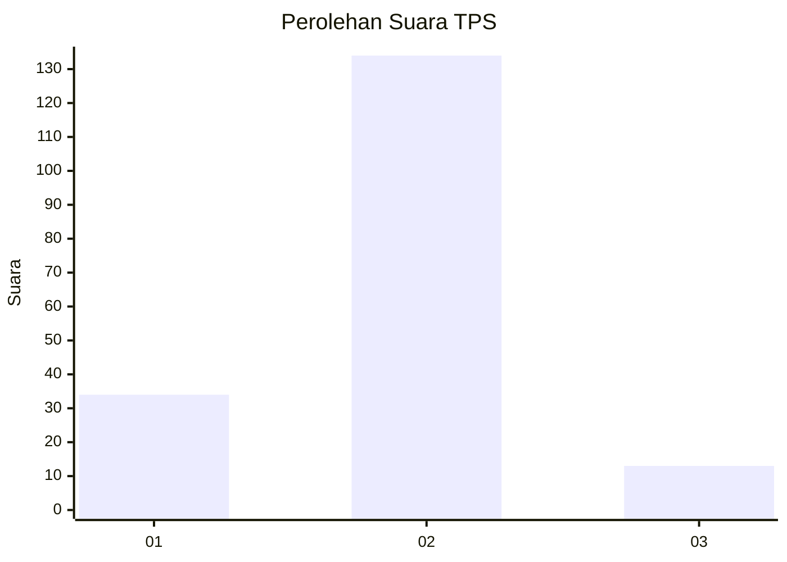
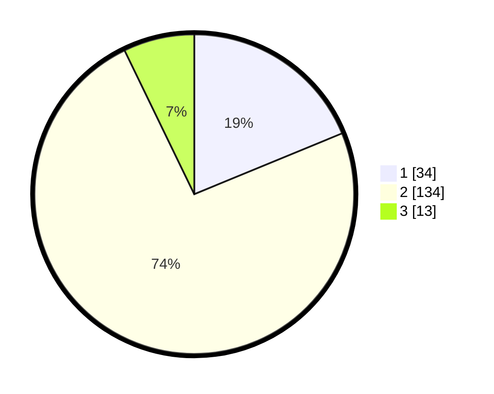

# Hasil

## Grafik

## Tabel

| No. | Nama Paslon    | Suara | Suara (raw) | Persentase |
|:--- |:-------------- | -----:| -----------:| ----------:|
| 1   | ANIES MUHAIMIN | 34    | [34][p-1]   | 18,78      |
| 2   | PRABOWO GIBRAN | 134   | [134][p-2]  | 74,03      |
| 3   | GANJAR MAHFUD  | 13    | [13][p-3]   | 7,18       |

[p-1]: https://github.com/gigit-pemilu/pemilu-2024-62-kalimantan-tengah/blob/main/pilpres/hitung-suara/sub/62-kalimantan-tengah/sub/03-kapuas/sub/12-kapuas-hulu/sub/2001-sei-hanyo/sub/004-tps/sub/paslon-1.txt
[p-2]: https://github.com/gigit-pemilu/pemilu-2024-62-kalimantan-tengah/blob/main/pilpres/hitung-suara/sub/62-kalimantan-tengah/sub/03-kapuas/sub/12-kapuas-hulu/sub/2001-sei-hanyo/sub/004-tps/sub/paslon-2.txt
[p-3]: https://github.com/gigit-pemilu/pemilu-2024-62-kalimantan-tengah/blob/main/pilpres/hitung-suara/sub/62-kalimantan-tengah/sub/03-kapuas/sub/12-kapuas-hulu/sub/2001-sei-hanyo/sub/004-tps/sub/paslon-3.txt

## Foto C Plano

https://sirekap-obj-formc.kpu.go.id/ba36/pemilu/ppwp/62/03/12/20/01/6203122001004-20240215-141813--5e7eaebf-5c01-450f-97f0-fac5c0cf3be0.jpg

https://sirekap-obj-formc.kpu.go.id/ba36/pemilu/ppwp/62/03/12/20/01/6203122001004-20240215-111851--d6e1e299-fc0a-48de-ba8e-d043b0a22e15.jpg

https://sirekap-obj-formc.kpu.go.id/ba36/pemilu/ppwp/62/03/12/20/01/6203122001004-20240215-135443--47b0420c-a107-4588-a7c4-570140820b7b.jpg

## Metadata

| Key        | Value               |
| ---------- | ------------------- |
| Time Stamp | 2024-02-15 18:00:26 |

