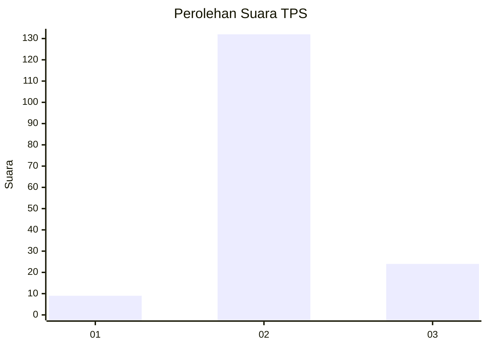

# Hasil

## Grafik

## Tabel

| No. | Nama Paslon    | Suara | Suara (raw) | Persentase |
|:--- |:-------------- | -----:| -----------:| ----------:|
| 1   | ANIES MUHAIMIN | 9     | [9][p-1]    | 5,45       |
| 2   | PRABOWO GIBRAN | 132   | [132][p-2]  | 80,00      |
| 3   | GANJAR MAHFUD  | 24    | [24][p-3]   | 14,55      |

[p-1]: https://github.com/gigit-pemilu/pemilu-2024-62-kalimantan-tengah/blob/main/pilpres/hitung-suara/sub/62-kalimantan-tengah/sub/03-kapuas/sub/12-kapuas-hulu/sub/2003-rahung-bungai/sub/001-tps/sub/paslon-1.txt
[p-2]: https://github.com/gigit-pemilu/pemilu-2024-62-kalimantan-tengah/blob/main/pilpres/hitung-suara/sub/62-kalimantan-tengah/sub/03-kapuas/sub/12-kapuas-hulu/sub/2003-rahung-bungai/sub/001-tps/sub/paslon-2.txt
[p-3]: https://github.com/gigit-pemilu/pemilu-2024-62-kalimantan-tengah/blob/main/pilpres/hitung-suara/sub/62-kalimantan-tengah/sub/03-kapuas/sub/12-kapuas-hulu/sub/2003-rahung-bungai/sub/001-tps/sub/paslon-3.txt

## Foto C Plano

https://sirekap-obj-formc.kpu.go.id/5d0e/pemilu/ppwp/62/03/12/20/03/6203122003001-20240215-011807--04d5e0b8-7892-43a2-b436-5d3d5f126803.jpg

https://sirekap-obj-formc.kpu.go.id/5d0e/pemilu/ppwp/62/03/12/20/03/6203122003001-20240215-012922--03849839-d202-4952-a071-084dba3a0084.jpg

https://sirekap-obj-formc.kpu.go.id/5d0e/pemilu/ppwp/62/03/12/20/03/6203122003001-20240215-013331--86add421-126c-4344-982e-fce4c6d79fd3.jpg

## Metadata

| Key        | Value               |
| ---------- | ------------------- |
| Time Stamp | 2024-02-15 20:30:46 |

