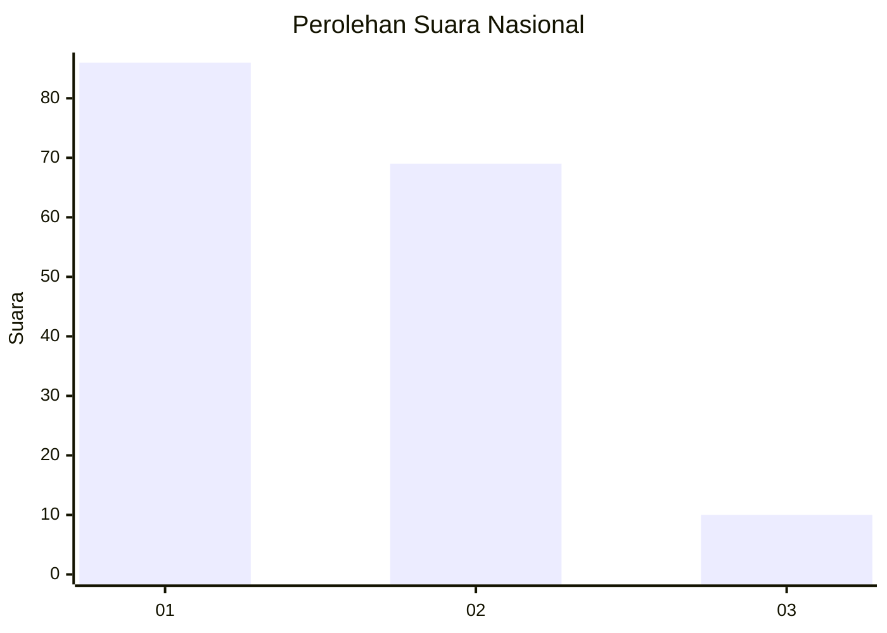
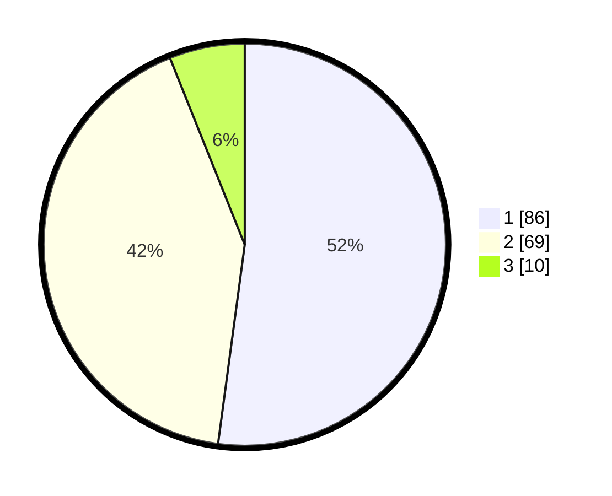

# Hasil

## Grafik

## Tabel

| No. | Nama Paslon    | Suara | Suara (raw) | Persentase |
|:--- |:-------------- | -----:| -----------:| ----------:|
| 1   | ANIES MUHAIMIN | 86    | [86][p-1]   | 52,12      |
| 2   | PRABOWO GIBRAN | 69    | [69][p-2]   | 41,82      |
| 3   | GANJAR MAHFUD  | 10    | [10][p-3]   | 6,06       |

[p-1]: https://github.com/gigit-pemilu/pemilu-2024/blob/main/pilpres/hitung-suara/sub/62-kalimantan-tengah/sub/03-kapuas/sub/13-tamban-catur/sub/2002-tamban-baru-tengah/sub/003-tps/sub/paslon-1.txt
[p-2]: https://github.com/gigit-pemilu/pemilu-2024/blob/main/pilpres/hitung-suara/sub/62-kalimantan-tengah/sub/03-kapuas/sub/13-tamban-catur/sub/2002-tamban-baru-tengah/sub/003-tps/sub/paslon-2.txt
[p-3]: https://github.com/gigit-pemilu/pemilu-2024/blob/main/pilpres/hitung-suara/sub/62-kalimantan-tengah/sub/03-kapuas/sub/13-tamban-catur/sub/2002-tamban-baru-tengah/sub/003-tps/sub/paslon-3.txt

## Foto C Plano

https://sirekap-obj-formc.kpu.go.id/abce/pemilu/ppwp/62/03/13/20/02/6203132002003-20240214-200559--ce94367e-7e31-4dd8-b6d9-c00dc4ecc292.jpg

https://sirekap-obj-formc.kpu.go.id/abce/pemilu/ppwp/62/03/13/20/02/6203132002003-20240214-200459--e82564f1-3684-4898-9ebd-23618b155879.jpg

https://sirekap-obj-formc.kpu.go.id/abce/pemilu/ppwp/62/03/13/20/02/6203132002003-20240214-200631--1e52b465-7b18-4e84-a1d5-4d42ff6f3b68.jpg

## Metadata

| Key        | Value               |
| ---------- | ------------------- |
| Time Stamp | 2024-02-15 12:00:28 |

## DATA PEMILIH TETAP

Jumlah pemilih dalam DPT: **263**.
 * L: **652**.
 * P: **684**.

## DATA PENGGUNA HAK PILIH

Jumlah pengguna hak pilih dalam DPT: **165**.
 * L: **76**.
 * P: **85**.

Jumlah pengguna hak pilih dalam DPTb: **8**.
 * L: **0**.
 * P: **880**.

Jumlah pengguna hak pilih dalam DPK: **0**.
 * L: **88**.
 * P: **808**.

Jumlah pengguna hak pilih: **465**.
 * L: **876**.
 * P: **889**.

## JUMLAH SUARA SAH DAN TIDAK SAH

JUMLAH SELURUH SUARA SAH: **165**.

JUMLAH SUARA TIDAK SAH: **0**.

JUMLAH SELURUH SUARA SAH DAN SUARA TIDAK SAH: **165**.

