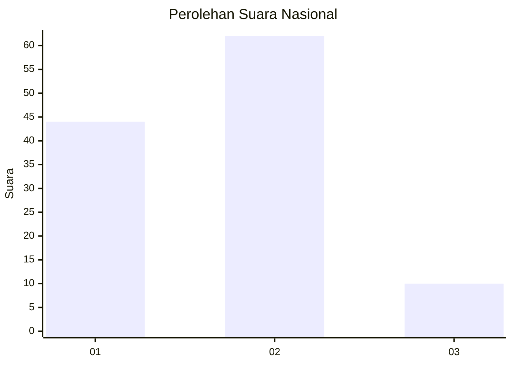
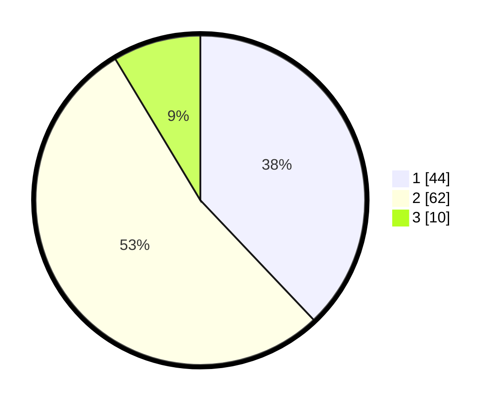

# Hasil

## Grafik

## Tabel

| No. | Nama Paslon    | Suara | Suara (raw) | Persentase |
|:--- |:-------------- | -----:| -----------:| ----------:|
| 1   | ANIES MUHAIMIN | 44    | [44][p-1]   | 37,93      |
| 2   | PRABOWO GIBRAN | 62    | [62][p-2]   | 53,45      |
| 3   | GANJAR MAHFUD  | 10    | [10][p-3]   | 8,62       |

[p-1]: https://github.com/gigit-pemilu/pemilu-2024/blob/main/pilpres/hitung-suara/sub/62-kalimantan-tengah/sub/03-kapuas/sub/13-tamban-catur/sub/2008-tamban-makmur/sub/001-tps/sub/paslon-1.txt
[p-2]: https://github.com/gigit-pemilu/pemilu-2024/blob/main/pilpres/hitung-suara/sub/62-kalimantan-tengah/sub/03-kapuas/sub/13-tamban-catur/sub/2008-tamban-makmur/sub/001-tps/sub/paslon-2.txt
[p-3]: https://github.com/gigit-pemilu/pemilu-2024/blob/main/pilpres/hitung-suara/sub/62-kalimantan-tengah/sub/03-kapuas/sub/13-tamban-catur/sub/2008-tamban-makmur/sub/001-tps/sub/paslon-3.txt

## Foto C Plano

https://sirekap-obj-formc.kpu.go.id/ce05/pemilu/ppwp/62/03/13/20/08/6203132008001-20240215-080104--7187b43c-ebb2-491c-b24a-951a2a5884f1.jpg

https://sirekap-obj-formc.kpu.go.id/ce05/pemilu/ppwp/62/03/13/20/08/6203132008001-20240215-075958--24626c9c-3211-454a-af33-9aa0ea03c059.jpg

https://sirekap-obj-formc.kpu.go.id/ce05/pemilu/ppwp/62/03/13/20/08/6203132008001-20240215-080143--dd253be7-aceb-4a55-bdbf-01224ecfbdc9.jpg

## Metadata

| Key        | Value               |
| ---------- | ------------------- |
| Time Stamp | 2024-02-15 23:29:50 |

