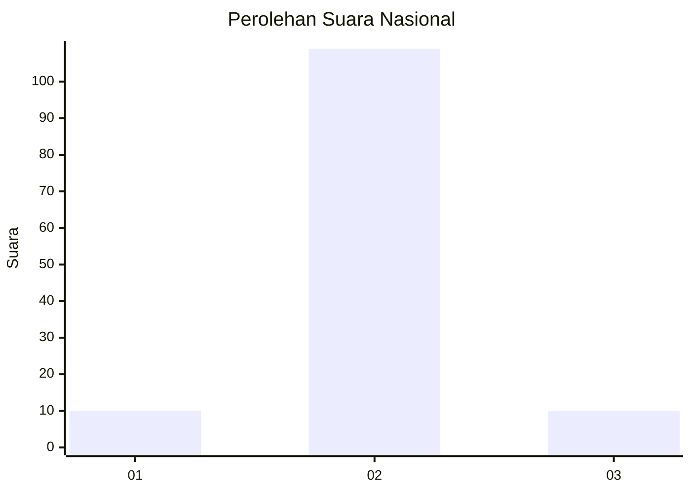
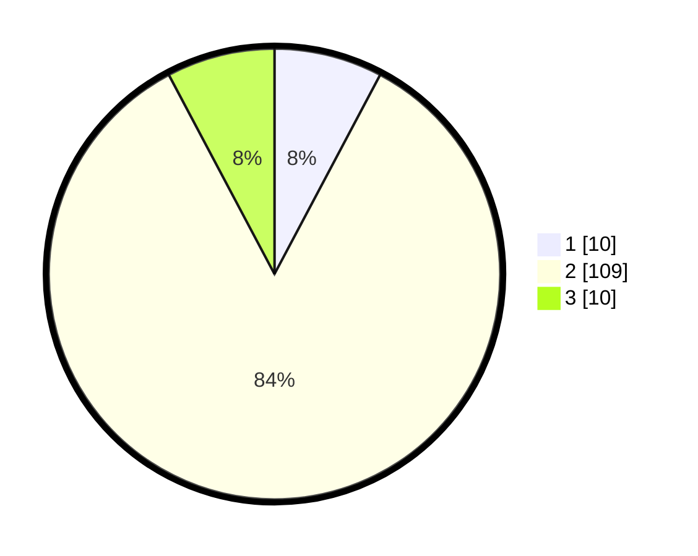

# Hasil

## Grafik

## Tabel

| No. | Nama Paslon    | Suara | Suara (raw) | Persentase |
|:--- |:-------------- | -----:| -----------:| ----------:|
| 1   | ANIES MUHAIMIN | 10    | [10][p-1]   | 7,75       |
| 2   | PRABOWO GIBRAN | 109   | [109][p-2]  | 84,50      |
| 3   | GANJAR MAHFUD  | 10    | [10][p-3]   | 7,75       |

[p-1]: https://github.com/gigit-pemilu/pemilu-2024/blob/main/pilpres/hitung-suara/sub/62-kalimantan-tengah/sub/03-kapuas/sub/13-tamban-catur/sub/2009-sidomulyo/sub/003-tps/sub/paslon-1.txt
[p-2]: https://github.com/gigit-pemilu/pemilu-2024/blob/main/pilpres/hitung-suara/sub/62-kalimantan-tengah/sub/03-kapuas/sub/13-tamban-catur/sub/2009-sidomulyo/sub/003-tps/sub/paslon-2.txt
[p-3]: https://github.com/gigit-pemilu/pemilu-2024/blob/main/pilpres/hitung-suara/sub/62-kalimantan-tengah/sub/03-kapuas/sub/13-tamban-catur/sub/2009-sidomulyo/sub/003-tps/sub/paslon-3.txt

## Foto C Plano

https://sirekap-obj-formc.kpu.go.id/e510/pemilu/ppwp/62/03/13/20/09/6203132009003-20240215-103210--3d9def10-6fee-4979-9210-a80d8e65a899.jpg

https://sirekap-obj-formc.kpu.go.id/e510/pemilu/ppwp/62/03/13/20/09/6203132009003-20240215-103319--1702b87e-51c4-4168-ab09-f65fb8acd93a.jpg

https://sirekap-obj-formc.kpu.go.id/e510/pemilu/ppwp/62/03/13/20/09/6203132009003-20240215-103418--b10faea8-eb65-4fd2-9ad4-a65b7438f8ba.jpg

## Metadata

| Key        | Value               |
| ---------- | ------------------- |
| Time Stamp | 2024-02-15 23:29:50 |

