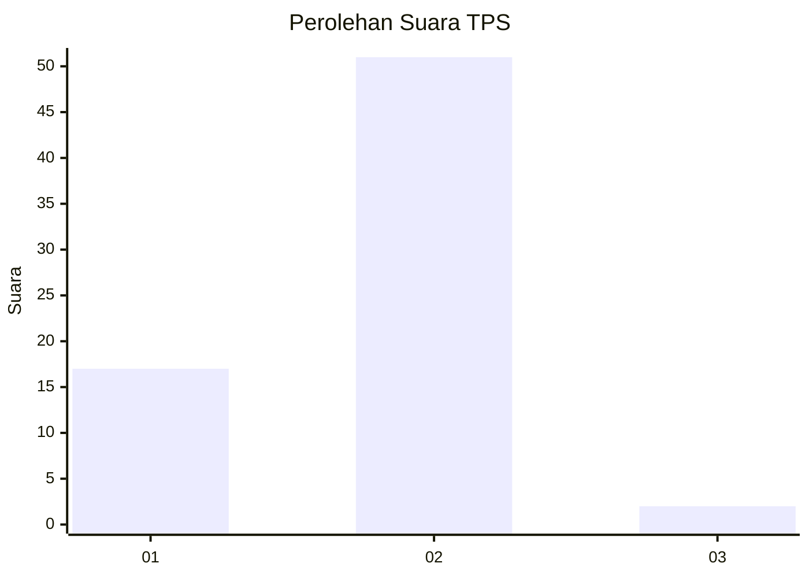
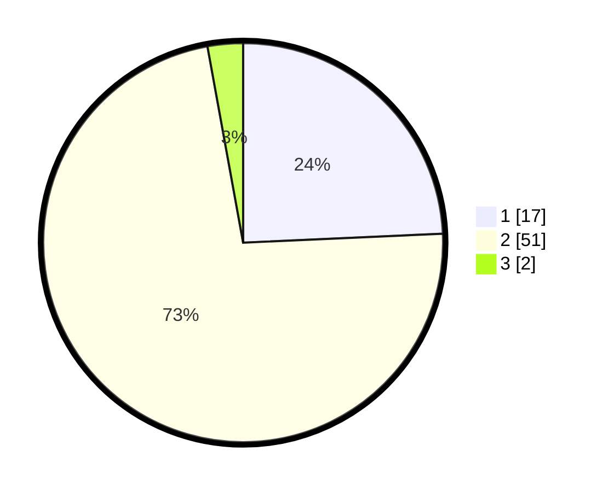

# Hasil

## Grafik

## Tabel

| No. | Nama Paslon    | Suara | Suara (raw) | Persentase |
|:--- |:-------------- | -----:| -----------:| ----------:|
| 1   | ANIES MUHAIMIN | 17    | [17][p-1]   | 24,29      |
| 2   | PRABOWO GIBRAN | 51    | [51][p-2]   | 72,86      |
| 3   | GANJAR MAHFUD  | 2     | [2][p-3]    | 2,86       |

[p-1]: https://github.com/gigit-pemilu/pemilu-2024-62-kalimantan-tengah/blob/main/pilpres/hitung-suara/sub/62-kalimantan-tengah/sub/03-kapuas/sub/16-dadahup/sub/2005-bentuk-jaya/sub/004-tps/sub/paslon-1.txt
[p-2]: https://github.com/gigit-pemilu/pemilu-2024-62-kalimantan-tengah/blob/main/pilpres/hitung-suara/sub/62-kalimantan-tengah/sub/03-kapuas/sub/16-dadahup/sub/2005-bentuk-jaya/sub/004-tps/sub/paslon-2.txt
[p-3]: https://github.com/gigit-pemilu/pemilu-2024-62-kalimantan-tengah/blob/main/pilpres/hitung-suara/sub/62-kalimantan-tengah/sub/03-kapuas/sub/16-dadahup/sub/2005-bentuk-jaya/sub/004-tps/sub/paslon-3.txt

## Foto C Plano

https://sirekap-obj-formc.kpu.go.id/9bb1/pemilu/ppwp/62/03/16/20/05/6203162005004-20240215-081421--0fab9678-f032-43b3-b073-e4f4244c4f53.jpg

https://sirekap-obj-formc.kpu.go.id/9bb1/pemilu/ppwp/62/03/16/20/05/6203162005004-20240215-081551--2fc5f537-0891-476e-a214-0dfb05ea3439.jpg

https://sirekap-obj-formc.kpu.go.id/9bb1/pemilu/ppwp/62/03/16/20/05/6203162005004-20240215-081736--ab154b80-247b-44fd-bdb3-6dd67a30da67.jpg

## Metadata

| Key        | Value               |
| ---------- | ------------------- |
| Time Stamp | 2024-02-15 16:30:25 |

