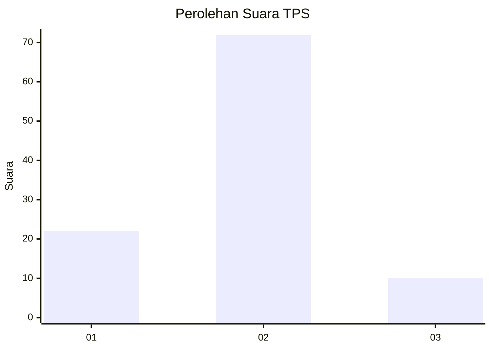

# Hasil

## Grafik

## Tabel

| No. | Nama Paslon    | Suara | Suara (raw) | Persentase |
|:--- |:-------------- | -----:| -----------:| ----------:|
| 1   | ANIES MUHAIMIN | 22    | [22][p-1]   | 21,15      |
| 2   | PRABOWO GIBRAN | 72    | [72][p-2]   | 69,23      |
| 3   | GANJAR MAHFUD  | 10    | [10][p-3]   | 9,62       |

[p-1]: https://github.com/gigit-pemilu/pemilu-2024-62-kalimantan-tengah/blob/main/pilpres/hitung-suara/sub/62-kalimantan-tengah/sub/03-kapuas/sub/16-dadahup/sub/2007-petak-batuah/sub/003-tps/sub/paslon-1.txt
[p-2]: https://github.com/gigit-pemilu/pemilu-2024-62-kalimantan-tengah/blob/main/pilpres/hitung-suara/sub/62-kalimantan-tengah/sub/03-kapuas/sub/16-dadahup/sub/2007-petak-batuah/sub/003-tps/sub/paslon-2.txt
[p-3]: https://github.com/gigit-pemilu/pemilu-2024-62-kalimantan-tengah/blob/main/pilpres/hitung-suara/sub/62-kalimantan-tengah/sub/03-kapuas/sub/16-dadahup/sub/2007-petak-batuah/sub/003-tps/sub/paslon-3.txt

## Foto C Plano

https://sirekap-obj-formc.kpu.go.id/c655/pemilu/ppwp/62/03/16/20/07/6203162007003-20240215-075239--54c78365-25af-4b14-ad6c-891c1a0ddb6c.jpg

https://sirekap-obj-formc.kpu.go.id/c655/pemilu/ppwp/62/03/16/20/07/6203162007003-20240215-074919--3b31ac5a-db7b-47ee-841a-80c3c1d0c19e.jpg

https://sirekap-obj-formc.kpu.go.id/c655/pemilu/ppwp/62/03/16/20/07/6203162007003-20240215-075057--d6ed766c-73dd-4ef8-ae11-883c769f4f2c.jpg

## Metadata

| Key        | Value               |
| ---------- | ------------------- |
| Time Stamp | 2024-02-15 17:00:25 |

