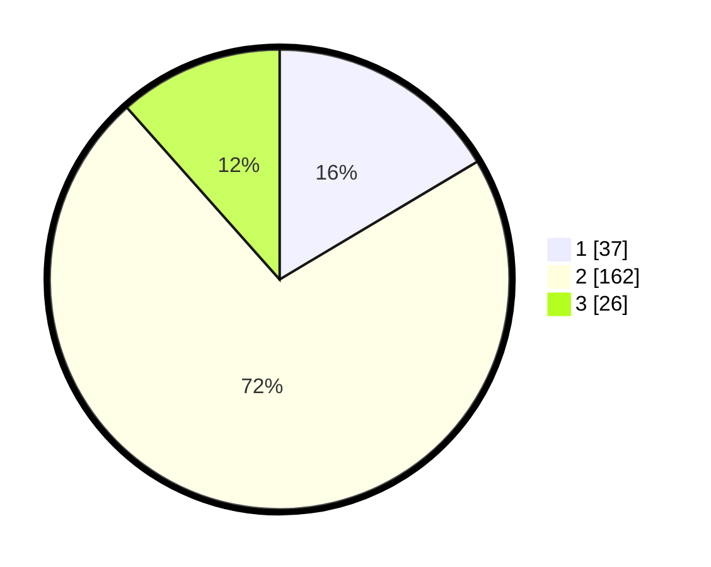

# Hasil

## Grafik

## Tabel

| No. | Nama Paslon    | Suara | Suara (raw) | Persentase |
|:--- |:-------------- | -----:| -----------:| ----------:|
| 1   | ANIES MUHAIMIN | 37    | [37][p-1]   | 16,44      |
| 2   | PRABOWO GIBRAN | 162   | [162][p-2]  | 72,00      |
| 3   | GANJAR MAHFUD  | 26    | [26][p-3]   | 11,56      |

[p-1]: https://github.com/gigit-pemilu/pemilu-2024/blob/main/pilpres/hitung-suara/sub/62-kalimantan-tengah/sub/03-kapuas/sub/16-dadahup/sub/2009-sumber-alaska/sub/002-tps/sub/paslon-1.txt
[p-2]: https://github.com/gigit-pemilu/pemilu-2024/blob/main/pilpres/hitung-suara/sub/62-kalimantan-tengah/sub/03-kapuas/sub/16-dadahup/sub/2009-sumber-alaska/sub/002-tps/sub/paslon-2.txt
[p-3]: https://github.com/gigit-pemilu/pemilu-2024/blob/main/pilpres/hitung-suara/sub/62-kalimantan-tengah/sub/03-kapuas/sub/16-dadahup/sub/2009-sumber-alaska/sub/002-tps/sub/paslon-3.txt

## Foto C Plano

https://sirekap-obj-formc.kpu.go.id/674c/pemilu/ppwp/62/03/16/20/09/6203162009002-20240215-131729--ff15d9f1-9f89-4647-931e-205914af03ea.jpg

https://sirekap-obj-formc.kpu.go.id/674c/pemilu/ppwp/62/03/16/20/09/6203162009002-20240214-214834--d52d5c05-f2bd-461f-a9f8-a85e03468e5c.jpg

https://sirekap-obj-formc.kpu.go.id/674c/pemilu/ppwp/62/03/16/20/09/6203162009002-20240214-214833--483a17c3-2cc7-41dd-850f-25c85fe547fc.jpg

## Metadata

| Key        | Value               |
| ---------- | ------------------- |
| Time Stamp | 2024-02-15 17:00:25 |

