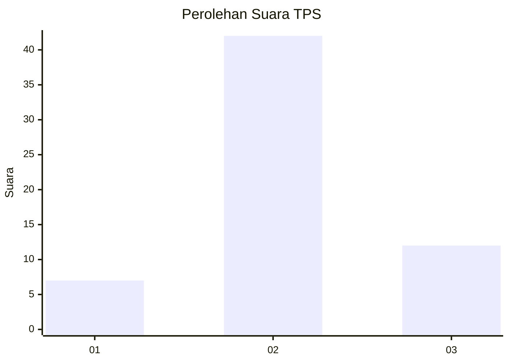
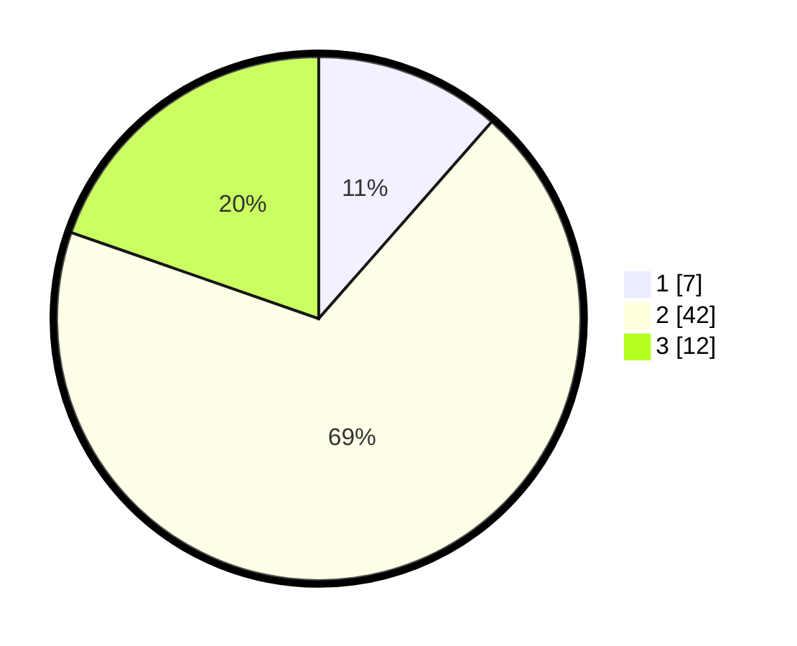

# Hasil

## Grafik

## Tabel

| No. | Nama Paslon    | Suara | Suara (raw) | Persentase |
|:--- |:-------------- | -----:| -----------:| ----------:|
| 1   | ANIES MUHAIMIN | 7     | [7][p-1]    | 11,48      |
| 2   | PRABOWO GIBRAN | 42    | [42][p-2]   | 68,85      |
| 3   | GANJAR MAHFUD  | 12    | [12][p-3]   | 19,67      |

[p-1]: https://github.com/gigit-pemilu/pemilu-2024-62-kalimantan-tengah/blob/main/pilpres/hitung-suara/sub/62-kalimantan-tengah/sub/03-kapuas/sub/16-dadahup/sub/2009-sumber-alaska/sub/005-tps/sub/paslon-1.txt
[p-2]: https://github.com/gigit-pemilu/pemilu-2024-62-kalimantan-tengah/blob/main/pilpres/hitung-suara/sub/62-kalimantan-tengah/sub/03-kapuas/sub/16-dadahup/sub/2009-sumber-alaska/sub/005-tps/sub/paslon-2.txt
[p-3]: https://github.com/gigit-pemilu/pemilu-2024-62-kalimantan-tengah/blob/main/pilpres/hitung-suara/sub/62-kalimantan-tengah/sub/03-kapuas/sub/16-dadahup/sub/2009-sumber-alaska/sub/005-tps/sub/paslon-3.txt

## Foto C Plano

https://sirekap-obj-formc.kpu.go.id/44ac/pemilu/ppwp/62/03/16/20/09/6203162009005-20240215-181604--48432281-b2eb-437b-8bae-5423448baee5.jpg

https://sirekap-obj-formc.kpu.go.id/44ac/pemilu/ppwp/62/03/16/20/09/6203162009005-20240215-154026--d4fa8141-7a8d-4be4-a2bb-080c411be3a2.jpg

https://sirekap-obj-formc.kpu.go.id/44ac/pemilu/ppwp/62/03/16/20/09/6203162009005-20240215-184845--f3533e6a-0527-4f0f-b6bd-2709346e042a.jpg

## Metadata

| Key        | Value               |
| ---------- | ------------------- |
| Time Stamp | 2024-02-17 16:36:25 |

