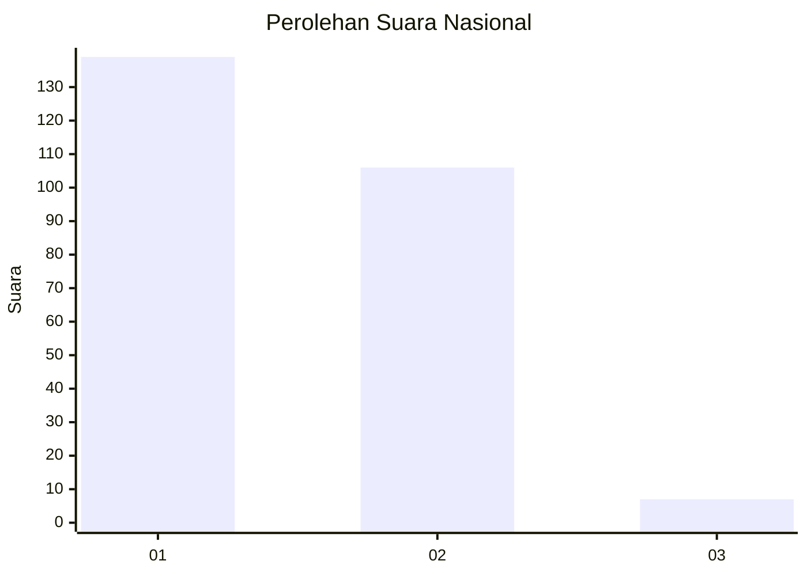
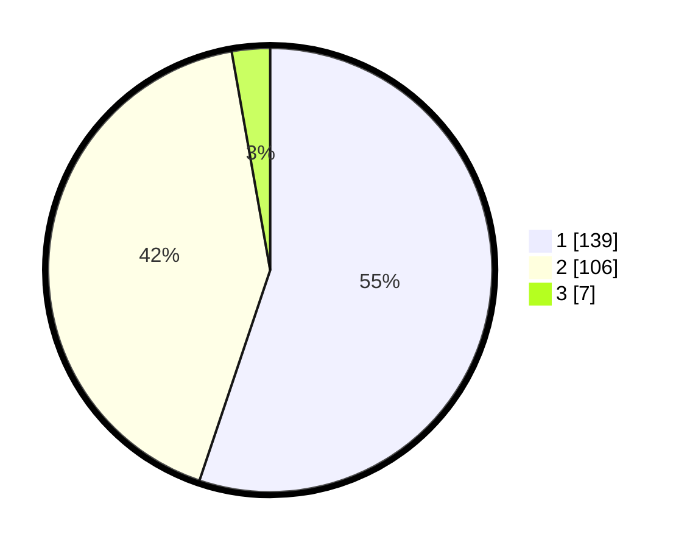

# Hasil

## Grafik

## Tabel

| No. | Nama Paslon    | Suara | Suara (raw) | Persentase |
|:--- |:-------------- | -----:| -----------:| ----------:|
| 1   | ANIES MUHAIMIN | 139   | [139][p-1]  | 55,16      |
| 2   | PRABOWO GIBRAN | 106   | [106][p-2]  | 42,06      |
| 3   | GANJAR MAHFUD  | 7     | [7][p-3]    | 2,78       |

[p-1]: https://github.com/gigit-pemilu/pemilu-2024/blob/main/pilpres/hitung-suara/sub/62-kalimantan-tengah/sub/03-kapuas/sub/17-bataguh/sub/1001-pulau-kupang/sub/016-tps/sub/paslon-1.txt
[p-2]: https://github.com/gigit-pemilu/pemilu-2024/blob/main/pilpres/hitung-suara/sub/62-kalimantan-tengah/sub/03-kapuas/sub/17-bataguh/sub/1001-pulau-kupang/sub/016-tps/sub/paslon-2.txt
[p-3]: https://github.com/gigit-pemilu/pemilu-2024/blob/main/pilpres/hitung-suara/sub/62-kalimantan-tengah/sub/03-kapuas/sub/17-bataguh/sub/1001-pulau-kupang/sub/016-tps/sub/paslon-3.txt

## Foto C Plano

https://sirekap-obj-formc.kpu.go.id/0d3c/pemilu/ppwp/62/03/17/10/01/6203171001016-20240215-141758--c02c9788-6001-403d-900a-e30eaca0dc71.jpg

https://sirekap-obj-formc.kpu.go.id/0d3c/pemilu/ppwp/62/03/17/10/01/6203171001016-20240215-142425--677fe3c6-b0ca-4c5c-9406-21d0a62fc3db.jpg

https://sirekap-obj-formc.kpu.go.id/0d3c/pemilu/ppwp/62/03/17/10/01/6203171001016-20240215-141957--e51ad59a-f8d4-4847-bbac-5fe7494129c1.jpg

## Metadata

| Key        | Value               |
| ---------- | ------------------- |
| Time Stamp | 2024-02-15 23:29:50 |

